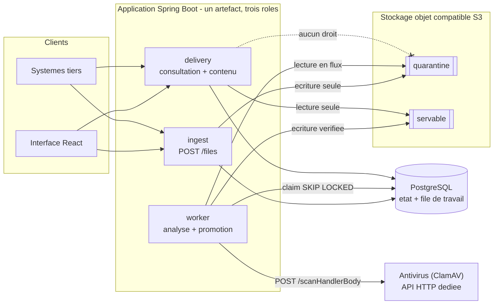

# Architecture du back-end

> **Statut : livré.** Écrit le 2026-09-26 comme proposition d'exécution
> (analyse : Claude, Opus 5), tenu à jour à chaque lot, relu contre le code le
> 02/10. Les arbitrages du porteur du projet sont regroupés au §16 : tous sont
> rendus.
>
> **À lire après** [`../AGENTS.md`](../AGENTS.md) (nature du projet : test
> technique, pas projet client) et [`AGENTS.md`](AGENTS.md) (contexte back,
> règles `B-1` à `B-12`).
>
> `AGENTS.md` dit **ce qui est vrai** du back-end. Ce document dit **comment on
> le construit** : il tranche ce que `AGENTS.md` laissait ouvert, fixe les
> versions, la structure du code, le schéma exact et les protocoles. Le plan
> d'exécution, lot par lot, est dans [`PLAN.md`](PLAN.md).

---

## 0. Ce que ce document tranche

`backend/AGENTS.md` laissait dix points ouverts ou approximatifs. Ils sont
tranchés ici, avec la raison.

| Sujet | État avant | Tranché ici | Conséquence |
|---|---|---|---|
| Version de Spring Boot | « à épingler » | **4.1.1** (dernier GA au 26/09/2026), Java 21 | `spring-boot-starter-webmvc` — `-web` est **déprécié** en 4.1 ; Jackson 3 ; Testcontainers 2 (§2) |
| Persistance | « requêtes critiques en `JdbcClient` » — donc JPA ailleurs | **JPA pour les lectures, SQL pour les trois statements qui garantissent** — décision du porteur du projet, 27/09, après contradiction | Les transitions renvoient une nouvelle instance : le *dirty checking* ne peut pas écrire un statut (§6.1) |
| Accès à l'antivirus | Protocole `clamd` en TCP, client écrit à la main | **API HTTP** d'un conteneur antivirus dédié (`POST /scanHandlerBody`) — **décision du porteur du projet, 26/09** | L'énoncé dit « antivirus disponible via une **API** » : on le prend au mot. L'adaptateur devient un client HTTP ; le port `AntivirusScanner` ne bouge pas (§5.2) |
| Double de test de l'antivirus | « WireMock » | **WireMock**, puisque l'antivirus parle désormais HTTP | Le double suit le protocole : il aurait fallu un faux serveur TCP avec `clamd`, WireMock convient à une API HTTP (§14.3) |
| Découpage du build | Quatre modules Maven | **Un seul module**, couches en paquets — **décision du porteur du projet, 27/09** : l'application est petite. La frontière passe du classpath à ArchUnit (§3.1) |
| Nommage | `ecluse-*` dans l'infrastructure, Praxedo dans le front | **`praxedo` partout** — décision du porteur du projet, 26/09 | Paquet `com.praxedo.securefiles`, conteneurs, identités de stockage, realm et métriques (§16) |
| Promotion | « copie vers `servable/.tmp/…` » | **Relecture en flux par le worker**, écrite **directement sous sa clé finale**, SHA-256 recalculé au passage — pas de zone temporaire | Une copie serveur-à-serveur ne rendrait **pas** l'empreinte. Et le point de validation est la **ligne**, pas l'objet : un objet servable n'est jamais servi tant que sa ligne n'est pas `AVAILABLE`, ce qui rend la zone temporaire inutile (§7.4) |
| Téléchargement | « lien signé : jeton HMAC **ou** URL présignée » | **Ni l'un ni l'autre : l'identité de l'appelant, contenu servi par le service** — décision du porteur du projet, 29/09 (ADR-0013, remplace ADR-0007) | Avec la session par cookie, un lien HMAC doublait l'authentification ; l'URL présignée court-circuite la revérification d'état et publie l'adresse du stockage (§8.5) |
| Détection du type de contenu | « sur les premiers octets » | **Renifleur interne** sur les 512 premiers octets, ~40 lignes | Évite une dépendance (Tika) pour une donnée qui n'est que **descriptive** : on sert toujours en `application/octet-stream` (§8.2) |
| Contraintes `CHECK` | annoncées « totales » | **Écrites** au §6.3, chaque prédicat vérifié total | Un `CHECK` ne rejette que `FALSE`, jamais `UNKNOWN` (règle `B-8`) |

Tranchés en cours de réalisation (27/09), chacun après une mesure ou un
test :

| Sujet | Décision | Raison |
|---|---|---|
| **Ordre des limites de l'antivirus** | `MAX_FILE_SIZE` (2000M) **strictement supérieur** à `MAX_SCAN_SIZE` (1024M), garde au démarrage de l'image | **Mesuré** : à 512M/1024M, une entrée d'archive de 600 Mo était tronquée sans alerte et l'archive déclarée saine — un faux négatif. Détail en `docs/prompts/B-008` et §5.2 |
| **Authentification** | **Toujours exigée** (29/09, ADR-0014) : Keycloak, sans réglage pour la couper ; plus de mode `none` ni d'utilisateur `anonymous` | Non indispensable selon le cadrage ; le porteur du projet la livre quand même, et ne livre pas de configuration qui ouvre l'API à tous (§13.3) |
| **Session du navigateur** (28/09) | Le service est le **client confidentiel** de Keycloak (client OAuth2 de Spring Security) ; cookie `HttpOnly` seul côté navigateur ; session HTTP dans PostgreSQL par **Spring Session JDBC** ; `Bearer` sans état pour les systèmes tiers | Aucun jeton lisible par un script, rien en mémoire d'un nœud, et le protocole n'est pas réécrit : une première version maison (session hachée, connexion scellée, *refresh* écrit à la main) a été remplacée par les briques standard (§13.3, ADR-0012) |
| **Journal d'audit** | Les transitions sont écrites **par un trigger**, les téléchargements par l'application ; ajout seul imposé par la base | Aucun chemin de code ne peut changer un statut sans trace, pas même un bug (§6.3, §13.4) |
| **Métriques de l'antivirus** | Un **décorateur** du port `AntivirusScanner` | Ni l'adaptateur ni le worker n'ont à savoir que les métriques existent ; la couche application reste sans framework (§12) |

Et deux décisions que personne n'avait posées :

| Sujet | Décision | Raison |
|---|---|---|
| Déduplication de verdict par SHA-256 (`D-08`) | **Non en v1**, documentée en piste | Elle n'est correcte que conditionnée à la version des signatures et à l'âge du verdict. Mal faite, c'est une faille ; bien faite, c'est une journée de travail. Le cœur passe d'abord |
| Verrouillage inter-nœuds des tâches planifiées (ShedLock) | **Non** | Le *reaper* et les balayages sont écrits en transitions conditionnelles : les exécuter partout à la fois est sans effet de bord. Une dépendance de moins (`B-11`) |

---

## 1. Vue d'ensemble



Quatre principes gouvernent tout le reste.

1. **L'invariant est porté par trois couches indépendantes, pas par un `if`.**
   Le domaine (un état servable ne s'atteint que par une transition légale), la
   base (contraintes `CHECK` totales, §6.3) et le stockage (le rôle `delivery`
   n'a **aucun droit** sur la quarantaine, §13.1). Pour servir un fichier non
   analysé, il faudrait défaire les trois.
2. **Rien n'est jamais en mémoire.** Ni à l'entrée, ni à l'analyse, ni à la
   promotion, ni à la sortie. Un fichier de 500 Mo ne coûte qu'un tampon de
   taille fixe (64 Kio au dépôt), quelle que soit sa taille.
3. **La base est la file.** Créer le fichier et créer le travail sont la même
   écriture, dans la même transaction. Il n'y a donc rien à réconcilier — c'est
   ce qui rend un courtier de messages inutile à cette échelle.
4. **Le serveur décide, le client affiche.** `downloadable` et `terminal` sont
   calculés côté serveur ; l'API ne publie qu'une projection de l'automate.

---

## 2. Stack et versions

Relevé le **2026-09-26** sur les sources officielles (start.spring.io,
docs.spring.io, dépôts GitHub), ajusté le 01/10 par l'analyse des dépendances
([`../docs/33-analyse-des-dependances.md`](../docs/33-analyse-des-dependances.md)).
Les versions sont figées dans le [`pom.xml`](pom.xml).

| Brique | Choix | Version | Pourquoi |
|---|---|---|---|
| JDK | Temurin | **21** | Installé sur la machine ; threads virtuels matures. Boot 4.1 accepte 17 à 27 |
| Framework | Spring Boot | **4.1.1** | Dernier GA (défaut de start.spring.io au 26/09). La ligne 3.5 n'est plus la ligne courante |
| Web | `spring-boot-starter-webmvc` | — | ⚠️ `spring-boot-starter-web` est **déprécié en 4.1** au profit de `-webmvc`. MVC + threads virtuels, **pas WebFlux** |
| Accès base | `spring-boot-starter-data-jpa` (lectures) **+** `spring-boot-starter-jdbc` (`JdbcClient`, trois statements) | — | Le partage est justifié au §6.1 |
| Migrations | Flyway | gérée par le BOM (12.x) | Migrations versionnées, compatibles ascendantes |
| Base | PostgreSQL + pilote officiel | 17 (conteneur) / 42.7.x | `FOR UPDATE SKIP LOCKED`, index partiels, `pg_trgm` |
| Stockage objet | AWS SDK v2 — `software.amazon.awssdk:s3` et son client HTTP `apache5-client` | 2.55.6 (BOM AWS) | Client S3 standard ; l'implémentation locale est SeaweedFS. Le client HTTP est déclaré pour poser explicitement les délais de connexion et de lecture |
| Antivirus | **API HTTP** d'un conteneur dédié (ClamAV derrière `ajilaag/clamav-rest`, épinglée par digest) ; adaptateur = client `RestClient` | image `0.6.6` | L'énoncé impose « un antivirus disponible via une API ». Le corps est **relayé en flux** (§5.2) |
| Validation | aucune bibliothèque | — | Chaque réglage et chaque paramètre est vérifié par le constructeur de son record : une configuration invalide arrête le démarrage. `spring-boot-starter-validation`, prévu au départ, n'a jamais servi : retiré le 01/10 |
| Documentation d'API | `contracts/openapi.yaml` | — | Écrit à la main, il fait foi ; un test vérifie le service contre lui. `springdoc-openapi`, prévu au départ pour le servir, n'a pas été retenu |
| Sondes et métriques | `spring-boot-starter-actuator` + Micrometer, export Prometheus | — | Sondes de vie et de disponibilité, métriques métier, sur un port de management distinct (§12) |
| Authentification | `spring-boot-starter-security-oauth2-resource-server`, `-oauth2-client`, `spring-boot-starter-session-jdbc` | — | Jetons `Bearer` des systèmes tiers, connexion du navigateur, session partagée en base (§13.3, ADR-0012) |
| Tests | JUnit 5, Testcontainers **2.0.5**, AssertJ, ArchUnit **1.5.1**, **WireMock 3.13.2** | versions épinglées dans le `pom.xml` | PostgreSQL, stockage objet et ClamAV réels ; pannes de l'antivirus et Keycloak simulés en HTTP ; architecture vérifiée par le build |
| Qualité | `maven-enforcer-plugin` | — | Verrouille la version du JDK et celle de Maven (par le wrapper) |

### Écartés, avec la raison

| Écarté | Raison |
|---|---|
| **JPA pour écrire les transitions d'état** | JPA sert les lectures (§6.1) ; les transitions, non : chacune est un statement conditionnel écrit à la main. La première position — « aucun JPA du tout » — a été révisée le 27/09 par le porteur du projet |
| **WebFlux** | Les threads virtuels donnent le même bénéfice sur des E/S bloquantes, avec un modèle lisible et des piles d'appel exploitables. Le seul point où WebFlux aurait gagné — la contre-pression de bout en bout — est traité par la limite d'admission des dépôts et par le nombre fixe de boucles d'analyse |
| **Courtier de messages** (Kafka, Artemis, RabbitMQ) | ~5 000 fichiers/jour. La table **est** la file, avec `SKIP LOCKED`. Un courtier ajouterait une seconde source de vérité à réconcilier, pour zéro gain à cette échelle. Le cadrage du 21/09 l'a confirmé : Spring Boot, React et une base suffisent |
| **Resilience4j** | Réessais et backoff sont **persistés en colonnes** : ils survivent au redémarrage, ce qu'une politique en mémoire ne fait pas. Deux politiques concurrentes seraient un défaut, pas une sécurité |
| **ShedLock** | Les tâches planifiées sont idempotentes par construction (transitions conditionnelles, `SKIP LOCKED`) |
| **Apache Tika** | 40 lignes de reniflage suffisent pour une donnée descriptive, jamais utilisée pour servir (§8.2) |
| **Client `clamd` en TCP écrit à la main** | L'antivirus est consommé par son API HTTP. Le protocole TCP reste un repli documenté : le conteneur écoute aussi sur 3310, et l'adaptateur est derrière le port (§5.2) |
| **Lombok, MapStruct** | Records Java et *mappers* explicites. Sur ce volume de code, le gain ne paie pas l'opacité |
| **Spring Cloud AWS** | Une couche d'abstraction de plus sur un SDK déjà encapsulé derrière notre propre port |

---

## 3. Structure du code

### 3.1 Un seul module, des couches en paquets

> **Décision du porteur du projet (27/09)** : pas de multi-module Maven.
> L'application est petite, tout tient dans un module. Ce qui suit explique ce
> que cela change — et ce qui compense.

```
backend/
├── pom.xml                  un seul module, un seul artefact exécutable
├── mvnw / mvnw.cmd / .mvn/  wrapper : Maven est absent de la machine
└── src/main/java/com/praxedo/securefiles/
    ├── SecureFilesApplication.java   main()
    ├── config/                       composition : quelle implémentation derrière quel port
    ├── domain/                       automate, règles, objets valeur
    ├── application/                  ports d'entrée, services, ports de sortie
    └── infrastructure/               ADAPTATEURS : pilotants (web, planification, métriques)
                                      et pilotés (base, stockage, antivirus, fournisseur d'identité)
```

**Ce que le multi-module apportait, et comment on le remplace.** Séparé en
modules, le paquet `domain` n'avait pas Spring au *classpath* : il ne *pouvait*
pas en dépendre, même par accident. En module unique, rien n'empêche plus un
`import org.springframework…` dans le domaine — sinon **`LayeringRulesTest`**
(§14.4), qui fait échouer la construction sur exactement ces imports.

La garantie change donc de nature : d'**impossible** elle devient **interdite et
vérifiée**. C'est plus faible en théorie — une règle peut être affaiblie d'un
`@ArchIgnore`, un `pom.xml` beaucoup moins — et équivalent en pratique tant que
la règle tourne à chaque `./mvnw verify`. Le gain est réel : un seul `pom.xml`, un seul cycle
de construction, un seul conteneur PostgreSQL pour toute la suite de tests.

**C'est pour cela que les règles ArchUnit du §14.4 ne sont pas décoratives** :
elles sont désormais la frontière.

### 3.2 Architecture hexagonale

```
   ADAPTATEURS PILOTANTS              LE CŒUR                         ADAPTATEURS PILOTÉS
   (ils appellent le cœur)                                             (le cœur les appelle)

   web ──────────┐        ┌── port/in ──▶ service ──▶ port/out ──┐        ┌── persistence
   scheduling ───┼──────▶ │   (cas d'usage) (implémente)  (besoin)  │ ◀──────┼── storage
   metrics ──────┘        └─────────────── domain ────────────────┘        ├── antivirus
                                                                           └── security
```

| Port d'entrée | Ce qu'il permet | Appelé par | Implémenté par |
|---|---|---|---|
| `UploadFileUseCase` | Déposer un fichier | `FileUploadController` | `UploadFileService` |
| `QueryFilesUseCase` | Lister, consulter, compter | `FileQueryController` | `FileQueryService` |
| `DownloadFileUseCase` | Servir le contenu d'un fichier disponible | `FileDownloadController` | `FileDownloadService` |
| `ScanFilesUseCase` | Analyser la file, rendre les baux à l'arrêt | `ScanWorkerPool` | `FileScanService` (+ `FilePromotionService`) |
| `MaintainFilesUseCase` | *Reaper*, balayage, purge d'idempotence | `MaintenanceScheduler` | `FileMaintenanceService` (+ `QuarantineSweeper`) |
| `MonitorFilesUseCase` | Profondeur de file, âge, invariant | `OperationalMetrics`, `InvariantHealthIndicator` | `FileMonitoringService` |

Les **ports de sortie** (`FileCatalog`, `FileWorkQueue`, `QuarantineWriter`,
`ServableReader`, `WorkerStorage`, `AntivirusScanner`, `IdempotencyStore`,
`DownloadAudit`, `OperationalReadings`,
`TransactionRunner`) sont implémentés par les adaptateurs pilotés.

**La racine de composition est un paquet : `config`** (relecture du 30/09,
R-006). `UseCaseConfiguration` y est la seule classe à connaître les services,
et publie chacun **sous son port d'entrée** ; `StorageConfiguration` et
`AntivirusConfiguration` y construisent les adaptateurs qui demandent un choix
— une identité de stockage, un mode, un décorateur. Pour savoir ce qui répond
à un port, on ouvre ce paquet ; sa `package-info` en tient l'index. Les
adaptateurs de persistance, qui n'ont rien à choisir, se déclarent eux-mêmes
(`@Repository`, qui leur apporte aussi la traduction d'exceptions de Spring).
Ce qui reste dans le `common/config` de chaque adaptateur ne câble aucun port :
pools de connexions, chaînes de sécurité, connecteur HTTP, propriétés typées,
fabriques de clients (`S3Clients`, `AntivirusClients`).

**Vérifié, pas déclaré** — `HexagonalArchitectureTest` fait échouer la
construction si :

- un adaptateur pilotant appelle un service ou un port de sortie ;
- un adaptateur piloté appelle un cas d'usage ;
- deux adaptateurs dépendent l'un de l'autre ;
- un port n'est pas une interface, ou un port d'entrée n'a pas de service qui
  l'implémente ;
- un service dépend d'autre chose que de ports, du domaine et du JDK ;
- une méthode `@Bean` qui fournit un port est déclarée hors de `config`.

Une sonde volontaire (un contrôleur qui appelle un service, un port de sortie et
un autre adaptateur) a été attrapée par trois règles avant d'être retirée.

### 3.3 Arborescence : par concept, puis par nature

```
com.praxedo.securefiles
├── SecureFilesApplication                     main() — à la racine, pour que le scan couvre tout
├── config/             UseCaseConfiguration, StorageConfiguration, AntivirusConfiguration,
│                       ServiceProperties — composition : le câblage des ports, en un seul endroit
├── domain/
│   ├── file/
│   │   ├── model/          StoredFile, FileStatus, PublicStatus, StatusReason, StorageArea, Lease,
│   │   │                   ScanVerdict, ScanResult
│   │   ├── valueobject/    FileId, FileName, ContentType, ObjectKey, LeaseToken, Sha256
│   │   └── exception/      IllegalTransitionException
│   └── owner/
│       └── valueobject/    OwnerId
├── application/
│   ├── file/
│   │   ├── port/in/        les 6 cas d'usage (tableau ci-dessus)
│   │   ├── port/out/       FileCatalog, FileWorkQueue, QuarantineWriter, ServableReader, WorkerStorage,
│   │   │                   AntivirusScanner, DownloadAudit, OperationalReadings
│   │   ├── service/        UploadFileService, FileQueryService, FileDownloadService, FileScanService,
│   │   │                   FilePromotionService, FileMaintenanceService, FileMonitoringService,
│   │   │                   QuarantineSweeper, ContentSniffer, UploadAdmission, PendingFileCountCache
│   │   ├── model/          UploadCommand, UploadLimits, FileQuery, PageQuery, PageResult, FileSort,
│   │   │                   FileCounters, ByteRange, ContentStream, FileDownload, WorkerSettings, LeaseTerms
│   │   └── exception/      UploadRefusedException, DownloadRefusedException, StorageUnavailableException,
│   │                       ObjectMissingException, RangeNotSatisfiableException, ScannerUnavailableException,
│   │                       WorkQueueUnavailableException
│   ├── idempotency/
│   │   └── port/out/       IdempotencyStore — sa table, son cycle de vie, son expiration
│   └── common/
│       ├── port/out/       TransactionRunner
│       └── io/             InspectingInputStream (SHA-256 + comptage en un passage),
│                           DeadlineInputStream (échéance d'un transfert)
└── infrastructure/
    ├── web/                                          PILOTANT
    │   ├── file/           controller/ (upload, consultation, téléchargement) · dto/ · mapper/
    │   │                   header/ (Content-Disposition, Range, Retry-After) · exception/
    │   ├── session/        controller/ (qui est connecté) · dto/ · filter/ (revalidation auprès de Keycloak)
    │   │                   signin/ (connexion, retour, déconnexion du navigateur)
    │   └── common/         config/ (sécurité HTTP, OIDC, session, connecteur) · identity/ (CurrentOwner)
    │                       error/ (RFC 9457) · exception/ · filter/ (X-Request-Id) · io/
    ├── scheduling/                                   PILOTANT
    │   ├── file/scheduler/ ScanWorkerPool, MaintenanceScheduler
    │   └── common/config/  SchedulingConfiguration
    ├── metrics/                                      PILOTANT
    │   └── file/           binder/ (jauges Prometheus) · health/ (invariant)
    ├── persistence/                                  PILOTÉ
    │   ├── file/           adapter/ (JPA et SQL) · entity/ (StoredFileEntity) · repository/ · mapper/ · projection/
    │   ├── idempotency/    adapter/ (JdbcIdempotencyStore)
    │   └── common/         adapter/ (SpringTransactionRunner) · config/ (les deux pools, délais vers la base)
    ├── storage/                                      PILOTÉ
    │   ├── file/adapter/   S3QuarantineWriter, S3ServableReader, S3WorkerStorage
    │   └── common/         config/ (clients, propriétés) · support/ (erreurs, flux à usage unique)
    ├── antivirus/                                    PILOTÉ
    │   ├── file/adapter/   HttpAntivirusScanner, MeteredAntivirusScanner (décorateur),
    │   │                   InstantCleanAntivirusScanner (essais de capacité, profil `capacity` seulement)
    │   └── common/config/  AntivirusClients (fabrique des clients HTTP), AntivirusProperties
    └── security/                                     PILOTÉ (fournisseur d'identité)
        └── common/config/  IdentityProviderConfiguration, OidcClientProperties
```

Le **concept** dit de quoi parle le code (`file` aujourd'hui, `owner` dans le
domaine, `common` pour ce que tous partagent) ; la **nature** dit ce qu'il est.
Un nouveau sujet reçoit son dossier, avec les mêmes natures en dessous.
`CodeLayoutRulesTest` tient cette disposition : profondeur minimale par couche,
contrôleurs dans `controller/`, réponses dans `dto/`, adaptateurs dans
`adapter/`, entités JPA dans `persistence/*/entity/`, configuration dans
`common/config/`, exceptions dans `exception/`…

**Règle de dépendance** : composition (`config`) `→ infrastructure → application → domain`,
et, dans l'infrastructure, jamais d'un adaptateur à un autre.
Aucune flèche en sens inverse. Un adaptateur ne connaît que le port qu'il
implémente.

---

## 4. Le domaine

### 4.1 Les huit états et la projection publique

| État interne | Servable | Travail automatique | Statut public | Raison exposée |
|---|---|---|---|---|
| `AWAITING_SCAN` | non | oui | `PENDING` | — |
| `SCANNING` | non | bail détenu | `SCANNING` | — |
| `RETRY_WAIT` | non | oui, à échéance | `PENDING` | `SCAN_RETRY_SCHEDULED` |
| `PROMOTING` | non | bail détenu | `SCANNING` | — |
| `AVAILABLE` | **oui** | non | `AVAILABLE` | — |
| `INFECTED` | non | non | `INFECTED` | — |
| `UNSCANNABLE` | non | non | `UNSCANNABLE` | `EXCEEDS_SCANNER_SIZE_LIMIT`, `SCANNER_LIMITS_EXCEEDED` (`ENCRYPTED_ARCHIVE` existe au contrat, mais le moteur tel qu'il est configuré ne signale pas les archives chiffrées : §5.2) |
| `FAILED_FINAL` | non | non | `FAILED` | `SCAN_ATTEMPTS_EXHAUSTED` |

```
        dépôt commité
              │
              ▼
      AWAITING_SCAN ──claim(jeton, bail)──▶ SCANNING
              ▲                               │
              │                               ├─ menace ──────────────▶ INFECTED
   échéance   │                               ├─ limite / chiffré ────▶ UNSCANNABLE
              │                               ├─ panne, essais épuisés ▶ FAILED_FINAL
          RETRY_WAIT ◀── panne technique ─────┤
                                              └─ sain ────────────────▶ PROMOTING
                                                                           │
                                                 copie vérifiée + CAS      ▼
                                                                       AVAILABLE
```

**Trois pièges déjà identifiés, et leur parade structurelle :**

1. `CLEAN` est un **verdict**, `AVAILABLE` un **état métier**. Les confondre
   rendrait inexprimable « verdict sain obtenu, copie non terminée » — donc
   irrécupérable après une panne pendant la promotion.
2. `RETRY_WAIT` (transitoire) et `FAILED_FINAL` (terminal) sont **distincts** :
   sans cette séparation, le claim reprend indéfiniment des travaux morts.
3. Une panne technique n'est **pas** un verdict : il n'existe pas de statut
   `SCAN_FAILED`. Une panne produit `RETRY_WAIT`, puis `FAILED_FINAL`.

### 4.2 Ce que le domaine garantit, et comment on le vérifie

```java
// domain/file/model/FileStatus — chaque état se classe lui-même, à la déclaration
public enum FileStatus {
    AWAITING_SCAN(PublicStatus.PENDING,   Servable.NO,  Terminal.NO,  Lease.NONE, Work.EXPECTED),
    SCANNING     (PublicStatus.SCANNING,  Servable.NO,  Terminal.NO,  Lease.HELD, Work.IN_PROGRESS),
    …
    AVAILABLE    (PublicStatus.AVAILABLE, Servable.YES, Terminal.YES, Lease.NONE, Work.NONE),
    …;

    public boolean isDownloadable() { return servable == Servable.YES; }
}
```

Servable ou non, statut publié, terminal ou non, bail détenu ou non, travail
attendu ou non : ce sont des **arguments du constructeur**, pas un `switch`
écrit ailleurs. **Ajouter un état sans le classer ne compile pas.** C'est la
seule forme de garantie qui survit à l'évolution du code.

`FileStatusTest` tient le reste, pour chaque valeur de l'énumération
(`@EnumSource`) : un seul état est téléchargeable et c'est `AVAILABLE`, tout
état publie un statut, un état téléchargeable est terminal, un état qui
détient un bail n'est ni terminal ni réclamable. `PublicStatusTest` vérifie que
la projection vers les six statuts publics est celle du contrat.

Le domaine est **pur** : pas d'horloge (l'instant est un paramètre), pas d'E/S,
pas d'annotation. Il se teste sans contexte Spring, en quelques millisecondes.

---

## 5. Les ports

### 5.1 Stockage de contenu — un port par rôle

```java
public interface QuarantineWriter {          // dépôt : écriture seule, quarantaine
    void write(ObjectKey key, InputStream content, long sizeBytes);
    void discard(ObjectKey key);           // dépôt refusé en cours de route
}

public interface ServableReader {            // livraison : lecture seule, zone servable
    ContentStream open(ObjectKey key, ByteRange range);
}

public interface WorkerStorage {             // worker : les deux zones
    InputStream openQuarantined(ObjectKey key);
    void writeServable(ObjectKey key, InputStream content, long sizeBytes);
    void deleteQuarantined(ObjectKey key);
    void deleteServable(ObjectKey key);
    List<ObjectKey> listQuarantinedBefore(Instant olderThan, ObjectKey after, int limit);   // balayage, repris après la dernière clé
}
```

Un port **par rôle**, chacun adossé à l'identité de stockage du rôle : le code de
livraison ne *peut* pas nommer la quarantaine, et s'il le pouvait, le stockage
refuserait ses identifiants (§13.1). La signature **interdit** la faute : aucune
méthode ne rend un `byte[]`, aucune n'accepte un `File`. La règle `B-1` est
portée par le type, pas par une revue de code.

Implémentations : les adaptateurs S3 (production, développement et tests
d'intégration contre un vrai SeaweedFS), et `InMemoryWorkerStorage` pour les
tests unitaires du worker, avec des points d'injection de panne.

### 5.2 Antivirus

```java
public interface AntivirusScanner {
    ScanOutcome scan(InputStream content, long sizeBytes);   // throws ScannerUnavailableException
    boolean isAvailable();                                     // portillon de santé du worker
}
```

Ce que l'adaptateur rend est **plus étroit qu'un verdict** : il dit ce que le
moteur a conclu et avec quelles signatures, pas *sur quels octets*. C'est le
worker qui hache le flux qu'il envoie et qui lie la conclusion à cette
empreinte : un adaptateur ne peut pas, même par erreur, attester un contenu
qu'il n'a pas mesuré. Une panne n'est **jamais** un résultat : c'est une
exception, pour qu'aucun chemin de code ne confonde « rien n'a été conclu » avec
une conclusion. (`capabilities()`, prévu au départ, a été retiré : à 500 Mo des
deux côtés, c'était une assertion morte ; la version des signatures est lue et
tracée à chaque verdict.)

> ⚠️ **Mesuré le 27/09** (`docs/prompts/B-008`) : `AlertExceedsMax` ne suffit
> pas. Quand `MaxFileSize` ≤ `MaxScanSize`, une entrée d'archive plus grosse que
> `MaxFileSize` est **tronquée en silence** et l'archive déclarée saine. D'où
> `MAX_FILE_SIZE` (2000M) > `MAX_SCAN_SIZE` (1024M), une garde au démarrage de
> l'image, et `AntivirusEngineLimitsTest` contre le vrai moteur. Reste un angle
> mort **du moteur**, quelle que soit la configuration : une entrée compressée
> derrière un en-tête local zip64 n'est pas analysée — caractérisé par un test,
> documenté en risque résiduel dans le README.
>
> ⚠️ **Mesuré le 02/10** : une **archive chiffrée** est déclarée saine. Le
> moteur ne peut pas l'ouvrir et, `AlertEncryptedArchive` n'étant pas activé
> dans l'image, il ne le signale pas : `200`. Le motif `ENCRYPTED_ARCHIVE` du
> domaine et du contrat n'est donc produit par aucune réponse du moteur
> aujourd'hui — et, activé, `Heuristics.Encrypted.*` arriverait en `406`, que la
> table ci-dessous classerait `INFECTED`. Limite connue, avec sa piste
> (README §10).

#### L'adaptateur : une API HTTP, parce que l'énoncé le demande

L'énoncé impose de « déléguer l'analyse à un antivirus **disponible via une
API** ». L'antivirus est donc un **conteneur distinct exposant une API HTTP**
(ClamAV derrière `ajilaag/clamav-rest`, image épinglée par digest et dérivée
pour corriger sa configuration — voir [`../infra/README.md`](../infra/README.md) §3).

```java
// infrastructure/antivirus/file/adapter/HttpAntivirusScanner — l'essentiel
scanClient.post().uri("/scanHandlerBody")
    .contentType(MediaType.APPLICATION_OCTET_STREAM)
    .contentLength(sizeBytes)                  // taille connue : pas de chunked
    .body(out -> content.transferTo(out))      // relais EN FLUX, jamais de tampon intégral
    .exchange((request, response) -> translate(…));
```

| Appel | Usage | Mesuré le 26/09 |
|---|---|---|
| `POST /scanHandlerBody` | Corps brut, relayé en flux (l'implémentation amont fait `ScanStream(r.Body, …)` : vérifié dans son code avant de retenir l'image) | sain → `200` `{OK   200}` · EICAR → `406` `{FOUND Eicar-Test-Signature  406}` |
| `GET /version` | `engine`, `engineVersion`, `signatureVersion` du verdict, en cache une minute | `{ "Clamav": "1.4.6", "Signature": "28098", "Signature_date": "Thu Aug 20 08:24:22 2026" }` |
| `GET /` | Portillon de santé du worker | Conteneur sain en ~20 s (signatures pré-embarquées) |

⚠️ **Le corps de réponse du scan annonce `application/json` mais n'en est pas.**
C'est le rendu par défaut d'une structure Go : `{FOUND Eicar-Test-Signature  406}`.
Conséquences pour l'adaptateur, mesurées et assumées :

1. **le code HTTP est le signal qui fait foi** ; le corps ne sert qu'à deux
   choses : le nom de la menace, et la discrimination `Heuristics.Limits.Exceeded` ;
2. le corps est donc lu **comme du texte**, avec tolérance ;
3. si un `406` ne se laisse pas interpréter, on retient **`INFECTED`** — la
   direction sûre : le fichier est bloqué définitivement, jamais servi.

`POST /v2/scan` (multipart) renvoie, lui, un vrai tableau JSON : c'est le repli
si cette lecture se révélait fragile, au prix d'un encodage supplémentaire.

**Traduction des réponses** — c'est ici que se joue la correction :

| Réponse | Verdict | Pourquoi |
|---|---|---|
| `200` | `CLEAN` | |
| `406`, description **sans** `Heuristics.Limits.Exceeded` | `INFECTED` | La description porte le nom de la menace |
| `406`, description `Heuristics.Limits.Exceeded…` | **`UNSCANNABLE`** | ⚠️ Une limite atteinte remonte comme une détection. La prendre pour une menace serait faux, et la prendre pour un fichier sain serait dangereux |
| `412` | `UNSCANNABLE` | Contenu que le moteur n'a pas su analyser |
| `413` | **Panne technique** → `RETRY_WAIT` | ⚠️ L'implémentation amont renvoie aussi `413` sur une coupure de flux. Comme l'admission plafonne à 500 Mo et le moteur accepte jusqu'à 2000 Mo, un vrai dépassement est impossible : ce code ne peut donc pas être un verdict |
| Timeout, coupure, corps illisible | **Panne technique** → `RETRY_WAIT` | Jamais `CLEAN` |

**Ce que coûte ce choix, et comment on le borde.** On met un composant tiers sur
le chemin critique de sécurité — exactement ce qu'on refusait en parlant
directement à `clamd`. Quatre garde-fous :

1. image **épinglée par digest**, mise à jour explicite ;
2. **chemin de scan lu dans le code source** amont avant adoption : il relaie en
   flux, il ne met pas le corps en tampon ;
3. **`AlertExceedsMax` forcé** par une image dérivée, faute de quoi une limite
   atteinte remonterait en « analyse propre » — le `Dockerfile` échoue à la
   construction s'il ne trouve plus la directive à corriger ;
4. le port `AntivirusScanner` **ne dépend pas de ce choix** : le conteneur
   écoute aussi `clamd` en TCP sur 3310, un adaptateur de repli reste possible
   sans toucher au reste.

---

## 6. Persistance

### 6.1 JPA pour ce qui se lit, SQL pour ce qui garantit

> **Décision du porteur du projet (27/09)**, après contradiction. La position
> initiale — « aucun JPA » — est révisée ; voici pourquoi, et ce qui n'a pas
> bougé.

**L'objection initiale, et ce qu'elle valait.** J'avais écarté JPA parce que le
*dirty checking* permet de changer un statut en affectant un champ, ce que la
règle `B-6` interdit. L'objection du porteur du projet est juste : ce risque se
ferme par **l'encapsulation**, pas par le choix d'une technologie. Un agrégat
sans *setter* public, dont les champs ne changent que par des méthodes de
transition qui valident, n'est pas modifiable « n'importe comment ».

Ici, la fermeture est même plus forte : **les transitions renvoient une nouvelle
instance au lieu de muter**. Hibernate ne persiste que ce qu'il gère, et il ne
gère jamais le résultat d'une transition — donc aucun changement d'état ne peut
partir en base par *flush*. La règle `B-6` tient par construction.

**Depuis la relecture du 30/09 (R-003, [ADR-0015](../docs/adr/0015-domaine-sans-annotation-de-persistance.md)),
l'agrégat n'est plus l'entité.** Tant qu'il l'était, le domaine dépendait de
JPA et d'Hibernate, Hibernate le construisait par réflexion sans passer par son
constructeur — l'invariant au chargement reposait sur un rappel `@PostLoad` — et
ses champs ne pouvaient pas être `final`. `StoredFile` est désormais une classe
sans annotation, aux champs `final`, dont le constructeur vérifie l'invariant
pour **toute** instance ; `StoredFileEntity` porte le mapping, et
`StoredFileEntityMapper` passe par ce constructeur à chaque lecture, comme
`StoredFileRowMapper` le fait pour la file de travail.

**Ce que JPA fait gagner.** Lire — par identifiant, par propriétaire, en page
triée, avec recherche et compteurs — représente la majorité du code d'accès aux
données. Spring Data l'exprime en une ligne par requête là où il fallait un
`SELECT`, un `RowMapper` et une requête de comptage. Sur ce volume, c'est du
code en moins et de la lisibilité en plus, pour aucun risque.

**Ce que JPA ne peut pas faire, et qui reste en SQL.** Trois statements :

| Statement | Pourquoi aucune forme Spring Data n'existe |
|---|---|
| **Le claim** | `UPDATE … FOR UPDATE SKIP LOCKED … RETURNING` : il **modifie et rend la ligne**. Spring Data exige `@Modifying` pour un écrivain, et une méthode `@Modifying` ne peut pas retourner une entité. Même en requête native, l'impasse reste |
| **L'écriture du verdict** | Doit répondre « j'ai gagné » par un **booléen**, conditionnée au **jeton de cette prise**. `@Version` lèverait une exception, et vérifierait un autre critère : il protège d'une écriture concurrente, pas d'un worker gelé qui s'est re-réclamé le même fichier |
| **Le reaper** | `UPDATE` de masse conditionnel, dont le backoff est calculé en SQL — donc persisté, donc capable de survivre à un redémarrage |

**La règle de cohabitation, à ne pas enfreindre.** Les statements JDBC
court-circuitent le contexte de persistance : ils ne déclenchent pas de *flush*
Hibernate et ne rafraîchissent aucune entité chargée. Une entité lue par JPA et
un `UPDATE` exécuté par JDBC **dans la même transaction** seraient en désaccord.
Les deux chemins sont donc séparés par construction — l'API lit par JPA, le
worker réclame et écrit par SQL — et chaque méthode du catalogue est sa propre
transaction. C'est écrit en tête des deux classes concernées.

| Élément | Où |
|---|---|
| `StoredFile` | L'agrégat, dans le domaine, **sans aucune annotation** : champs `final`, aucun *setter*, invariant vérifié par le constructeur — donc pour toute instance, créée, issue d'une transition ou relue |
| `StoredFileEntity` | Le modèle de persistance, dans `persistence/file/entity` : une colonne par champ, aucun comportement, aucun *setter* |
| `StoredFileEntityMapper` | Convertit dans les deux sens ; vers le domaine, par le constructeur de l'agrégat |
| `StoredFileJpaRepository` | Spring Data sur `StoredFileEntity`. Étend `Repository`, pas `JpaRepository` : **lecture seule par construction**, sans `save`, `delete` ni `flush` hérités. L'unique insertion passe par `EntityManager.persist`, dans `JpaFileCatalog` |
| `JpaFileCatalog` | Implémente le port `FileCatalog` |
| `JdbcFileWorkQueue` | Implémente le port `FileWorkQueue` : les trois statements ci-dessus |

Deux détails qui comptent : `open-in-view` est **coupé** (garder une connexion
ouverte pendant le rendu d'une réponse est exactement ce qu'il ne faut pas faire
en servant 500 Mo en flux), et Hibernate ne touche pas au schéma — Flyway en est
propriétaire (`ddl-auto: none`).

### 6.2 Les trois tables

```
┌───────────────────────────────┐
│ stored_file                   │   état métier + file de travail
│ ───────────────────────────── │   (l'outbox est gratuit : même écriture)
│ PK id                         │
│ owner_id                      │
│ status  ◀── l'invariant       │
│ storage_area, object_key      │
│ verdict (8 colonnes)          │
│ file (attempts, next_attempt, │
│       lease_token, …)         │
└───────────┬───────────────────┘
            │ 1..n
            ▼
┌───────────────────────────────┐   ┌───────────────────────────────┐
│ file_audit_event              │   │ idempotency_record            │
│ append-only : qui, quoi, quand│   │ PK (owner_id, key)            │
└───────────────────────────────┘   └───────────────────────────────┘
```

S'y ajoutent les deux tables de **Spring Session** (`spring_session`,
`spring_session_attributes`, migration `V7`) : le schéma publié par Spring
Session JDBC, recopié tel quel, pour les sessions du navigateur (§13.3).

### 6.3 DDL — version définitive

Ce schéma **remplace** celui de [`../docs/23-modele-de-donnees.md`](../docs/23-modele-de-donnees.md),
écrit avant la confrontation (7 états, `CLEAN` confondu avec `AVAILABLE`,
`tenant_id`, contraintes contournables par `NULL`). Les migrations Flyway
(`src/main/resources/db/migration`) font foi ; les extraits ci-dessous en
reprennent l'essentiel.

| Migration | Contenu |
|---|---|
| `V1__extensions.sql` | Extension `pg_trgm` |
| `V2__stored_file.sql` | Les trois types énumérés et la table `stored_file`, avec ses contraintes |
| `V3__indexes.sql` | Index partiels de la file et du *reaper*, index de liste et de recherche |
| `V4__idempotency.sql` | Table `idempotency_record` |
| `V5__idempotency_replays_the_file.sql` | Le rejeu rend le **fichier**, pas un instantané de réponse : colonnes `response_*` retirées |
| `V6__audit.sql` | Table `file_audit_event`, trigger qui la remplit, triggers qui la protègent |
| `V7__browser_session.sql` | Tables de Spring Session |
| `V8__database_roles.sql` | Droits du rôle d'exécution `praxedo_app` (§13.4) |
| `V9__accent_insensitive_search.sql` | Extension `unaccent`, fonction `immutable_unaccent`, index de recherche reconstruit |

```sql
-- V2__stored_file.sql

CREATE TYPE file_status AS ENUM (
    'AWAITING_SCAN', 'SCANNING', 'RETRY_WAIT', 'PROMOTING',
    'AVAILABLE', 'INFECTED', 'UNSCANNABLE', 'FAILED_FINAL');

CREATE TYPE scan_result  AS ENUM ('CLEAN', 'INFECTED', 'UNSCANNABLE');
CREATE TYPE storage_area AS ENUM ('QUARANTINE', 'SERVABLE');

CREATE TABLE stored_file (
    id                      uuid         PRIMARY KEY,
    owner_id                text         NOT NULL,      -- sub du jeton

    -- Déclaré par l'appelant (donnée non fiable, métadonnée seulement)
    original_filename       text         NOT NULL,

    -- Établi par le serveur (donnée fiable)
    detected_content_type   text         NOT NULL DEFAULT 'application/octet-stream',
    size_bytes              bigint       NOT NULL,
    content_sha256          char(64)     NOT NULL,

    -- Emplacement physique. object_key est un UUID, jamais le nom fourni (B-3)
    storage_area            storage_area NOT NULL DEFAULT 'QUARANTINE',
    object_key              text         NOT NULL,

    -- ═══ L'INVARIANT ═══
    status                  file_status  NOT NULL DEFAULT 'AWAITING_SCAN',
    status_reason           text,                       -- StatusReasonCode du contrat

    -- Verdict d'analyse
    scan_result             scan_result,
    scan_threat_name        text,
    scan_engine             text,
    scan_engine_version     text,
    scan_signature_version  text,
    scanned_sha256          char(64),                   -- lie l'attestation AU CONTENU
    scanned_at              timestamptz,
    scan_duration_ms        integer,

    -- File de travail (il n'y a pas d'autre file)
    attempts                integer      NOT NULL DEFAULT 0,
    next_attempt_at         timestamptz  NOT NULL DEFAULT clock_timestamp(),
    lease_token             uuid,                       -- ⚠ par PRISE, pas par worker
    lease_holder            text,
    lease_expires_at        timestamptz,
    last_error              text,

    -- Traçabilité
    uploaded_at             timestamptz  NOT NULL DEFAULT clock_timestamp(),
    status_changed_at       timestamptz  NOT NULL DEFAULT clock_timestamp(),
    updated_at              timestamptz  NOT NULL DEFAULT clock_timestamp(),
    version                 bigint       NOT NULL DEFAULT 0,

    -- Une convention dans le code n'est pas une contrainte.
    CONSTRAINT uq_stored_file_object_key UNIQUE (object_key),

    CONSTRAINT size_is_positive   CHECK (size_bytes > 0),
    CONSTRAINT attempts_positive  CHECK (attempts >= 0),
    CONSTRAINT sha256_is_hex      CHECK (content_sha256 ~ '^[0-9a-f]{64}$'),
    CONSTRAINT scanned_sha256_is_hex CHECK (
        scanned_sha256 IS NULL OR scanned_sha256 ~ '^[0-9a-f]{64}$'),

    -- ═══ C1 — un fichier disponible porte une attestation complète, liée à SON contenu
    CONSTRAINT available_requires_attestation CHECK (
        status <> 'AVAILABLE' OR (
                scan_result            IS NOT DISTINCT FROM 'CLEAN'
            AND scanned_sha256         IS NOT DISTINCT FROM content_sha256
            AND storage_area           IS NOT DISTINCT FROM 'SERVABLE'
            AND scanned_at             IS NOT NULL
            AND scan_engine            IS NOT NULL
            AND scan_signature_version IS NOT NULL)),

    -- ═══ C2 — rien d'autre qu'un fichier disponible ne vit dans la zone servable
    CONSTRAINT servable_area_requires_available CHECK (
        storage_area <> 'SERVABLE' OR status IS NOT DISTINCT FROM 'AVAILABLE'),

    -- ═══ C3 — les états terminaux non servables portent le verdict correspondant
    CONSTRAINT infected_requires_verdict CHECK (
        status <> 'INFECTED'    OR scan_result IS NOT DISTINCT FROM 'INFECTED'),
    CONSTRAINT unscannable_requires_verdict CHECK (
        status <> 'UNSCANNABLE' OR scan_result IS NOT DISTINCT FROM 'UNSCANNABLE'),

    -- ═══ C4 — un verdict est daté, et un verdict daté existe
    CONSTRAINT verdict_is_dated CHECK ((scan_result IS NULL) = (scanned_at IS NULL)),

    -- ═══ C5 — un bail existe SI ET SEULEMENT SI un travail est en cours
    CONSTRAINT lease_matches_status CHECK (
        (status IN ('SCANNING', 'PROMOTING')) = (lease_token IS NOT NULL)),
    CONSTRAINT lease_fields_together CHECK (
            (lease_token IS NULL) = (lease_holder IS NULL)
        AND (lease_token IS NULL) = (lease_expires_at IS NULL))
);
```

**Pourquoi `IS NOT DISTINCT FROM` et pas `=`.** En SQL, une contrainte `CHECK`
rejette `FALSE` et **accepte `UNKNOWN`**. Avec `scan_result = 'CLEAN'`, une
ligne `status = 'AVAILABLE'` dont `scan_result` vaut `NULL` évalue à `UNKNOWN`
— et **passe**. `IS NOT DISTINCT FROM` rend le prédicat total : il vaut `FALSE`
sur `NULL`. Chacune des cinq contraintes ci-dessus a été relue sous cet angle ;
le §14.2 décrit le test qui le prouve, colonne par colonne.

**Pourquoi `scanned_sha256`.** Sans elle, l'attestation dit « un fichier a été
analysé et déclaré sain » ; avec elle, elle dit « **ce contenu-ci** a été analysé
et déclaré sain ». C'est la différence entre une garantie et une croyance : elle
ferme le scénario où l'objet aurait été réécrit entre l'analyse et la promotion.

**Pourquoi `clock_timestamp()` et non `now()`.** `now()` rend l'heure de début de
transaction : deux tentatives dans la même transaction auraient la même échéance,
et une transaction longue calculerait une expiration de bail dans le passé.

```sql
-- V1__extensions.sql
CREATE EXTENSION IF NOT EXISTS pg_trgm;

-- V3__indexes.sql
-- ① File de travail : index PARTIEL. Quelques dizaines de lignes, quel que soit
--    l'historique — c'est ce qui rend l'interrogation régulière gratuite.
CREATE INDEX idx_file_queue ON stored_file (next_attempt_at, uploaded_at, id)
    WHERE status IN ('AWAITING_SCAN', 'RETRY_WAIT');

-- ② Reaper : baux expirés, les deux états qui en détiennent un.
CREATE INDEX idx_file_lease ON stored_file (lease_expires_at)
    WHERE status IN ('SCANNING', 'PROMOTING');

-- ③ Liste paginée (tri par défaut du contrat), et compteurs par statut.
CREATE INDEX idx_file_owner_listing ON stored_file (owner_id, uploaded_at DESC, id DESC);
CREATE INDEX idx_file_owner_status  ON stored_file (owner_id, status);

-- ④ Recherche « contient » insensible à la casse et aux accents, sans balayage
--    de table. V3 l'écrivait sur lower(original_filename) ; V9 l'a reconstruit
--    sur l'expression exacte que la recherche emploie (§8.3).
CREATE INDEX idx_file_name_trgm ON stored_file
    USING gin (immutable_unaccent(lower(original_filename)) gin_trgm_ops);

-- ⑤ Balayage des orphelins de la quarantaine.
CREATE INDEX idx_file_uploaded_at ON stored_file (uploaded_at);
```

```sql
-- V4__idempotency.sql, tel que V5 l'a laissé
CREATE TABLE idempotency_record (
    owner_id            text        NOT NULL,
    idempotency_key     text        NOT NULL,
    request_fingerprint char(64)    NOT NULL,   -- hash(nom + taille annoncée)
    state               text        NOT NULL,
    file_id             uuid        REFERENCES stored_file(id) ON DELETE CASCADE,
    created_at          timestamptz NOT NULL DEFAULT clock_timestamp(),
    expires_at          timestamptz NOT NULL,   -- 24 h
    PRIMARY KEY (owner_id, idempotency_key),
    CONSTRAINT state_is_known CHECK (state IN ('IN_PROGRESS', 'COMPLETED')),
    CONSTRAINT completed_names_its_file CHECK (
        state <> 'COMPLETED' OR file_id IS NOT NULL)
);
CREATE INDEX idx_idempotency_expiry ON idempotency_record (expires_at);

-- V6__audit.sql — plus le trigger qui la remplit et ceux qui la protègent
CREATE TABLE file_audit_event (
    id          bigserial   PRIMARY KEY,
    file_id     uuid        NOT NULL,
    owner_id    text        NOT NULL,
    event_type  text        NOT NULL,   -- UPLOADED, CLAIMED, VERDICT, PROMOTED,
                                        -- LEASE_EXPIRED, DOWNLOAD_SERVED, …
    from_status file_status,
    to_status   file_status,
    actor       text        NOT NULL,   -- sujet du jeton, ou identifiant de worker
    details     jsonb,
    occurred_at timestamptz NOT NULL DEFAULT clock_timestamp()
);
CREATE INDEX idx_audit_file ON file_audit_event (file_id, occurred_at);
```

La table d'audit est **en ajout seul**, et c'est la base qui l'impose (§13.4).
Les transitions d'état y sont écrites **par un trigger** sur `stored_file`, dans
la transaction même qui change l'état : `UPLOADED`, `CLAIMED`, `VERDICT` (avec
la menace et les versions de moteur et de signatures), `PROMOTED`,
`TECHNICAL_FAILURE`, `LEASE_EXPIRED` (attribué au *reaper*), `RELEASED`. Les
téléchargements (`DOWNLOAD_SERVED`, avec l'acteur et la plage) sont écrits par
l'application, **avant** le premier octet envoyé. Pas de
clé étrangère : l'audit survit à la purge du fichier qu'il décrit.

⚠️ **Piège Flyway / PostgreSQL** : `ALTER TYPE … ADD VALUE` ne peut pas être
utilisé dans la même transaction que la valeur ajoutée. Ajouter un état demande
donc une migration dédiée — ce qui est une bonne chose : cela force à traiter le
nouvel état partout.

### 6.4 La requête d'assertion de l'invariant

```sql
SELECT count(*) FROM stored_file
 WHERE (status = 'AVAILABLE') IS DISTINCT FROM (storage_area = 'SERVABLE');
```

Elle doit **toujours** rendre zéro. Elle est exposée comme sonde et comme
métrique (§12) : si elle bouge, il y a une faille active, et on le sait avant le
client.

---

## 7. Les quatre protocoles critiques

Ce sont eux qui portent les garanties. Ils s'écrivent à la main, se testent en
concurrence, et chacun se justifie.

### 7.1 Ingestion — l'ordre est la garantie

```
1. valider les en-têtes            (taille, nom, Content-Length), puis l'admission
2. réserver la clé d'idempotence   (INSERT … ON CONFLICT DO NOTHING)
3. écrire l'objet en quarantaine   (flux ; SHA-256, taille et type au passage)
4. commiter en UNE transaction     { ligne stored_file + clé d'idempotence complétée }
5. répondre 202
```

Une panne entre 3 et 4 laisse un **objet orphelin** : invisible, non référencé,
en quarantaine, ramassé par balayage. L'ordre inverse laisserait une **référence
brisée visible** — une ligne en base pointant sur un objet inexistant, donc un
fichier « en attente d'analyse » pour toujours.

> **Principe** : en panne partielle, préférer l'orphelin invisible à la
> référence brisée.

### 7.2 Claim atomique

```sql
WITH candidate AS (
    SELECT id FROM stored_file
     WHERE status IN ('AWAITING_SCAN', 'RETRY_WAIT')
       AND next_attempt_at <= clock_timestamp()
       AND attempts < :maxAttempts
     ORDER BY next_attempt_at, uploaded_at, id
     FOR UPDATE SKIP LOCKED
     LIMIT 1)
UPDATE stored_file f
   SET status            = 'SCANNING',
       lease_token       = :claimToken,          -- UUID neuf À CHAQUE PRISE
       lease_holder      = :workerId,
       -- bail proportionnel à la taille, connue une fois la ligne prise
       lease_expires_at  = clock_timestamp() + make_interval(
           secs => :leaseMinSeconds + f.size_bytes / 1048576.0 * :leasePerMibSeconds),
       attempts          = f.attempts + 1,
       status_reason     = NULL,
       status_changed_at = clock_timestamp(),
       updated_at        = clock_timestamp(),
       version           = version + 1
  FROM candidate
 WHERE f.id = candidate.id
RETURNING f.*;
```

Une seule requête réalise quatre choses : sélection du plus urgent, exclusion
mutuelle entre workers (`SKIP LOCKED` : chacun prend une ligne **différente**,
sans attendre), prise de bail, comptage de la tentative. **C'est le cœur
technique du système**, et il ne demande aucun composant supplémentaire.

⚠️ `attempts < :maxAttempts` est **obligatoire** : sans lui, un travail dont les
tentatives sont épuisées est repris à l'infini.

### 7.3 Écriture du verdict — le jeton de bail, pas l'identifiant du worker

```sql
UPDATE stored_file
   SET status = :newStatus, scan_result = :result, …,
       -- verdict sain → PROMOTING : la même prise garde son bail, avec une
       -- échéance neuve pour la copie ; verdict terminal : bail rendu (NULL)
       lease_token = :keptLease, lease_holder = …, lease_expires_at = …,
       status_changed_at = clock_timestamp(), version = version + 1
 WHERE id          = :fileId
   AND status      = 'SCANNING'
   AND lease_token = :claimToken                 -- ⚠ le jeton de CETTE prise
   AND lease_expires_at > clock_timestamp();
```

Le contrôle porte sur le **jeton de la prise**, pas sur l'identifiant du worker.
La raison est un scénario réel : un worker gelé (pause du ramasse-miettes, gel de
machine virtuelle) voit son bail expirer, le *reaper* remet le travail en file,
le **même** worker le reprend — et son ancien thread, en se réveillant, écraserait
un verdict légitime par un verdict périmé. Avec un jeton par prise, l'écriture du
thread zombie affecte zéro ligne et se journalise comme telle.

Zéro ligne modifiée n'est donc pas une erreur : c'est une information. Elle est
comptée en métrique (`praxedo.scan.verdict.rejected`).

### 7.4 Promotion — reprenable, et vérifiée

La promotion **relit le contenu**. Une copie serveur-à-serveur (`CopyObject`)
serait plus rapide, mais elle ne rendrait pas l'empreinte de ce qui a été copié :
on promouvrait sans vérifier. Le surcoût est une lecture de la quarantaine — la
même que celle de l'analyse.

```
1. lire  quarantine/<id>  et écrire  servable/<id>  (clé finale, directement)
   en recalculant SHA-256 et taille au passage
2. refuser si l'un des deux diffère de l'attestation → objet servable supprimé,
   panne technique tracée, jamais AVAILABLE
3. PROMOTING → AVAILABLE par écriture conditionnée au jeton de bail
4. supprimer la source ; un échec est sans gravité (le balayage la retrouve)
```

**Pourquoi pas de zone temporaire** (`servable/.tmp/…`, prévue au départ) : S3
n'a pas de renommage atomique, et la zone ne protégeait rien que la base ne
protège déjà. Le **point de validation est la ligne** : un objet présent dans la
zone servable n'est jamais servi tant que sa ligne n'est pas `AVAILABLE` avec une
attestation `CLEAN` de sa propre empreinte — ce que les contraintes `CHECK`
rendent impossible à contourner.

**Les cinq points d'interruption** (testés un par un dans
`FilePromotionServiceTest`) : avant la copie (source illisible), à mi-copie,
copie non conforme à l'attestation, bail perdu après la copie et avant le
`CAS`, source impossible à supprimer après le `CAS`. Dans tous les cas, une reprise converge,
sans fichier servable non vérifié ni ligne bloquée. Deux workers qui se
croiraient propriétaires du même travail écrivent le **même contenu vérifié**
sous la même clé, et un seul gagne le `CAS` final.

### 7.5 Reaper et balayages

| Tâche | Période | Action |
|---|---|---|
| Baux expirés | 30 s | `SCANNING`/`PROMOTING` dont le bail a expiré → `RETRY_WAIT` (ou `FAILED_FINAL` si tentatives épuisées), backoff exponentiel avec *jitter* |
| Orphelins de quarantaine | 10 min | Objets de plus de deux heures sans ligne en base, et sources de fichiers déjà `AVAILABLE` ; chaque passage reprend après la dernière clé du précédent, pour que les fichiers bloqués gardés comme preuve ne masquent pas les orphelins rangés après eux |
| Clés d'idempotence | 10 min | `expires_at` dépassé ; `IN_PROGRESS` abandonnées depuis deux heures (panne pendant l'envoi) |

Les deux délais de deux heures dépassent le dépôt le plus lent accepté
(≈ 68 min pour 500 Mio, `transfer-deadline`) ; le service refuse de démarrer
s'ils ne le dépassent pas (`ServiceProperties`).

Toutes sont écrites en transitions conditionnelles : les lancer sur plusieurs
nœuds simultanément est sans effet de bord. C'est pour cela qu'aucun verrou
distribué n'est nécessaire.

Le backoff est calculé **en SQL**, donc persisté :

```sql
next_attempt_at = clock_timestamp()
                + least(:baseDelay * power(2, attempts), :maxDelay)
                * (0.8 + random() * 0.4)      -- jitter ±20 %
```

Il survit au redémarrage — ce qu'une politique en mémoire ne fait pas.

---

## 8. La couche HTTP

Le contrat [`../contracts/openapi.yaml`](../contracts/openapi.yaml)
(`1.10.0-draft`) fait foi. Rien n'est ajouté, rien n'est omis. Les trois routes
de session du navigateur (`/api/v1/auth/login`, `/callback`, `/logout`) et
`GET /api/v1/auth/session` sont décrites au §13.3.

| Opération | Contrôleur | Rôle | Points durs |
|---|---|---|---|
| `POST /api/v1/files` | `FileUploadController` | ingest | Flux, idempotence, admission, `413`/`411`/`429` |
| `GET /api/v1/files` | `FileQueryController` | delivery | Pagination, tri en liste blanche, recherche trigramme |
| `GET /api/v1/files/summary` | `FileQueryController` | delivery | `GROUP BY` traduit vers les statuts publics |
| `GET /api/v1/files/{id}` | `FileQueryController` | delivery | `ETag`, `304`, `Retry-After` |
| `GET /api/v1/files/{id}/content` | `FileDownloadController` | delivery | L'identité de l'appelant (cookie ou `Bearer`), état relu au moment de servir, plages d'octets, en-têtes de sécurité |

### 8.1 Le dépôt, étape par étape

```java
// infrastructure/web/file/controller/FileUploadController
@PostMapping                                   // /api/v1/files
ResponseEntity<FileDetailResponse> upload(
        @RequestHeader(value = "X-File-Name", required = false) String encodedName,
        @RequestHeader(value = "Idempotency-Key", required = false) String idempotencyKey,
        HttpServletRequest request) { … }      // le flux du servlet, jamais MultipartFile (B-2)
```

Le `Content-Type` de la requête n'est pas contraint : quoi que le client
déclare, c'est ignoré (`B-5`).

1. **`Content-Length` absent → `411`**.
2. **`X-File-Name`** décodé (`percent-encoding` UTF-8), nettoyé (seul le
   dernier segment de chemin est gardé, caractères de contrôle et
   bidirectionnels retirés, longueur bornée à 255) → s'il ne reste rien
   d'utilisable, `400 INVALID_FILE_NAME`. Le nom n'est **jamais** une clé.
   Une `Idempotency-Key` mal formée (8 à 128 caractères imprimables) →
   `400 INVALID_PARAMETER`.
3. **Taille annoncée** : nulle → `400 EMPTY_FILE`, au-delà de 500 Mo →
   `413 FILE_TOO_LARGE` — avant d'avoir lu un seul octet.
4. **Admission** : nœud déjà occupé par 50 dépôts → `429
   TOO_MANY_CONCURRENT_UPLOADS` (`Retry-After: 1`) ; 500 fichiers déjà en
   attente d'analyse → `429 TOO_MANY_PENDING_FILES` + `Retry-After`
   (contre-pression, §11.1 et §11.2).
5. **Idempotence** : réservation de la clé (§9).
6. **Écriture en flux** : le corps traverse une échéance de transfert
   (`DeadlineInputStream`), puis le SHA-256 et un compteur d'octets
   (`InspectingInputStream`), puis part vers le stockage. La taille **réelle**
   est comparée à `Content-Length` : au moindre écart → `400
   CONTENT_LENGTH_MISMATCH`, objet supprimé. Corps encore en cours à
   l'échéance (60 s + 8 s par Mio annoncé) → `408 UPLOAD_TOO_SLOW`, objet
   supprimé (§11.1).
7. **Commit** de la ligne et de la clé d'idempotence, en une transaction.
8. **`202`** + `Location` + `Retry-After`, corps `FileDetail` (`downloadable:
   false`, `scan: null`, `scanAttempts: 0`).

Trois réglages de conteneur comptent ici :

- `spring.servlet.multipart.enabled=false` — aucun analyseur multipart ne doit
  pouvoir se réveiller sur ce chemin ;
- `server.tomcat.max-swallow-size` à **64 Ko** — quand on refuse une requête de
  500 Mo, on ne veut pas en lire le corps par politesse. Le client peut
  recevoir une coupure de connexion plutôt que le statut ; c'est la raison pour
  laquelle le front vérifie la taille **avant** d'envoyer (règle `F-8`) ;
- `continueResponseTiming=onRead` sur le connecteur
  (`HttpConnectorConfiguration`) — un client qui annonce `Expect:
  100-continue` reçoit son refus avant d'envoyer le corps.

### 8.2 Détection du type de contenu

Le type déclaré par le client n'est jamais utilisé (`B-5`). Un renifleur interne
lit les 512 premiers octets du flux (fenêtre conservée, pas de relecture) et
reconnaît une dizaine de signatures (PDF, PNG, JPEG, GIF, ZIP et dérivés, GZIP,
ELF, PE, RTF, XML/texte) ; tout le reste vaut `application/octet-stream`.

Cette valeur est **descriptive** : elle alimente l'icône de l'interface et la
métadonnée. Elle n'est **jamais** renvoyée comme `Content-Type` du contenu — on
sert toujours en `application/octet-stream` avec `nosniff` (§8.5). C'est
précisément ce qui permet de se passer de Tika : l'exactitude de la détection
n'a aucune conséquence de sécurité.

### 8.3 Liste, recherche, compteurs

- Pagination par numéro de page (`page` commence à 0), `size` ramené à 100 au
  plus. Une page qui sauterait plus de 10 000 fichiers (`page × size`) est
  refusée, `400 INVALID_PARAMETER` (audit S-19) : un `OFFSET` profond fait
  travailler la base pour rien.
- Tri en **liste blanche** stricte (`uploadedAt`, `filename`, `sizeBytes`, deux
  sens) — une valeur hors liste donne `400 INVALID_PARAMETER`, jamais une
  concaténation dans la requête SQL. L'ordre est complété par `id` : il est
  total, donc les pages ne se chevauchent jamais.
- Filtre `status` : les statuts **publics** sont traduits vers les ensembles
  d'états internes correspondants (`PENDING` → `{AWAITING_SCAN, RETRY_WAIT}`).
- Recherche `q`, insensible à la casse et aux accents (« releve » trouve
  « Relevé.pdf ») : `immutable_unaccent(lower(original_filename)) LIKE
  immutable_unaccent(lower(:motif))`, servie par l'index trigramme, écrit sur
  cette même expression (`V9`). Les caractères `%` et `_` saisis par
  l'appelant sont échappés : ils se cherchent, ils ne s'interprètent pas.
- `summary` : `GROUP BY status` replié sur les six statuts publics, tous
  présents même à zéro (le contrat l'exige).

### 8.4 Suivi : `ETag` et `304`

`GET /files/{id}` rend `ETag: W/"<id>-<version>"` et `Cache-Control: no-cache`.
La colonne `version` change à chaque transition : un `If-None-Match` identique
signifie « rien n'a changé », et se répond `304` sans corps. `Retry-After`
suggère le rythme de suivi tant que le fichier n'est pas terminal, sur le `200`
**et sur le `304`** — un client qui revalide ne reçoit presque rien d'autre. La
règle est la même qu'au dépôt (`PollingHeaders`, `praxedo.polling`) :

**2 s, plus 0,05 s par Mio, au plus 30 s**, arrondi à la seconde la plus
proche : 1 Mo → 2 s, 50 Mo → 4 s, 500 Mo → 26 s (relecture du 30/09, R-001).

- **Pourquoi la taille** : une analyse avance à ~20 Mo/s, puis la promotion
  recopie les octets (campagnes de capacité). Un fichier de 500 Mo est
  consulté environ deux fois pendant son traitement, au lieu d'une vingtaine
  à 2 s. Et une interrogation n'est pas gratuite : même répondue `304`, elle
  vérifie le jeton et **relit la ligne** — l'`ETag` est sa version — sur le
  pool de l'API, qui compte 10 connexions (§11.1 : « rien ne borne les
  lectures »).
- **Pourquoi c'est sans risque** : le plancher est l'ancienne valeur fixe.
  Sous charge, c'est la file et non la taille qui fait attendre, donc le
  conseil est parfois trop court — jamais plus fréquent qu'avant. Le plafond
  borne le retard avec lequel un client apprend un verdict.
- **Ce qui n'y entre pas** : la profondeur de la file (un nœud ne connaît pas
  le nombre de workers du cluster) ni la progression de l'analyse (inconnue).
- **Qui s'en sert** : les clients de l'API, systèmes tiers en tête.
  L'interface suit la liste — une requête pour tous les fichiers visibles — à
  son propre rythme. Pour les systèmes tiers, un *webhook* supprimerait
  l'interrogation ; il a été écarté du périmètre le 01/10
  ([`../contracts/README.md`](../contracts/README.md) §4).

### 8.5 Téléchargement — l'identité de l'appelant, servie par le service

| | Service, identité de l'appelant (**retenu**, ADR-0013) | Lien HMAC en plus de la session (ADR-0007, remplacé) | URL présignée du stockage |
|---|---|---|---|
| Revérification de l'état au moment de servir | ✅ | ✅ | ❌ le stockage ne connaît pas l'état |
| Adresse du stockage exposée au navigateur | ✅ non | ✅ non | ❌ oui |
| Secret supplémentaire à distribuer et faire tourner | ✅ aucun | ❌ un par déploiement, partagé entre nœuds | ❌ les identifiants du stockage |
| Justificatif dans l'URL (historique, journaux, `Referer`) | ✅ aucun | ❌ 60 s | ❌ jusqu'à expiration |
| Bande passante | ❌ traverse le service | ❌ traverse le service | ✅ directe |
| Journalisation et audit du téléchargement | ✅ centralisés | ✅ centralisés | ❌ côté stockage |

Le contrat exige que l'état soit revérifié **au moment de servir** : une URL
présignée rendrait cette exigence impossible à tenir. Le lien HMAC, lui, était
né quand la v2 prévoyait un jeton dans le navigateur — un lien natif ne porte
pas d'en-tête `Authorization`. Depuis la session par cookie (ADR-0012), le
cookie part tout seul avec la navigation : le lien **doublait**
l'authentification, avec un second secret à gérer. Retiré le 29/09 (décision du
porteur du projet). Un `GET` ne demande pas de jeton CSRF : il ne modifie rien,
et une navigation provoquée par un autre site ne lui rend pas le contenu.

Le coût restant — la bande passante traverse le service — est assumé et
documenté comme piste d'amélioration (délégation à un CDN ou à une URL
présignée **après** revérification, si le débit devenait le facteur limitant).

En-têtes de réponse, systématiquement : `Content-Type:
application/octet-stream`, `Content-Disposition: attachment` avec le nom
nettoyé encodé RFC 8187, `X-Content-Type-Options: nosniff`, `Accept-Ranges:
bytes`, `Cache-Control: private, no-store`, et un `ETag` qui est le SHA-256 du
contenu. Un fichier sain pour l'antivirus peut rester dangereux s'il est
*interprété* par le navigateur (HTML ou SVG porteur de script) : on ne l'affiche
donc jamais.

Les plages d'octets (`Range`) sont relayées au stockage, ce qui rend la reprise
de téléchargement gratuite. **Une seule plage** (`bytes=a-b` ou `bytes=a-`) ;
plusieurs plages, une plage suffixe ou un en-tête malformé sont **ignorés** et le
fichier entier est servi (`200`, ce que RFC 9110 autorise — plusieurs plages
exigeraient un corps `multipart` assemblé en mémoire). Une plage qui commence
au-delà de la fin répond `416` avec `Content-Range: bytes */<taille>`. La
réponse est écrite **à la main** sur le flux du servlet : aucun convertisseur ne
peut bufferiser le corps. Chaque téléchargement est inscrit au journal d'audit
avant le premier octet.

### 8.6 Table de décision des réponses de téléchargement

| Situation | Réponse |
|---|---|
| Sans identité | `401 UNAUTHENTICATED` |
| Fichier inconnu, identifiant mal formé, ou fichier appartenant à un autre | `404 FILE_NOT_FOUND` |
| `HEAD` sur le contenu | `405` : l'objet n'est ni ouvert ni audité |
| `AWAITING_SCAN`, `RETRY_WAIT`, `SCANNING`, `PROMOTING` | `409 FILE_NOT_READY` + `Retry-After` |
| `INFECTED` | `409 FILE_INFECTED` |
| `UNSCANNABLE` | `409 FILE_UNSCANNABLE` |
| `FAILED_FINAL` | `409 FILE_SCAN_FAILED` |
| `AVAILABLE` mais objet absent ou refusé par le stockage | `503` + alerte : c'est une anomalie d'invariant |
| Base ou stockage injoignable | `503 SERVICE_UNAVAILABLE` + `Retry-After` |

`403` n'apparaît jamais : un verdict n'est pas un refus d'autorisation. Le détail
métier passe par le `code` RFC 9457, stable et exploitable par programme.

### 8.7 Erreurs

Un `@RestControllerAdvice` unique produit tous les `ProblemDetail` (RFC 9457,
`application/problem+json`) avec le champ `code` du contrat. Aucune exception ne
traverse sans être traduite ; aucun message ne contient de détail interne
(chemin, requête SQL, trace). Un test de conformité vérifie que chaque `code`
émis appartient bien à l'énumération du contrat.

---

## 9. Idempotence — les cinq problèmes, un par un

`docs/04-idempotence.md` en identifie cinq. Voici ce qu'on en fait.

| # | Problème | Mécanisme | Où |
|---|---|---|---|
| 1 | Rejeu du dépôt (le client relance après un timeout) | Clé `Idempotency-Key`, unicité en base | §9.1 |
| 2 | Même contenu déposé deux fois | **Rien en v1** : deux fichiers distincts, deux analyses. Dédup de verdict documentée en piste | §0 |
| 3 | Consommation concurrente d'un travail | Claim atomique `SKIP LOCKED` + jeton de bail | §7.2, §7.3 |
| 4 | Analyse rejouée (worker zombie, bail expiré) | Écriture conditionnée au jeton de la prise | §7.3 |
| 5 | Promotion rejouée | Écriture sous la clé finale (le même contenu vérifié), `CAS` final sur le jeton, suppression de la source tolérante à l'absence | §7.4 |

### 9.1 Le protocole d'idempotence du dépôt

```
1. INSERT INTO idempotency_record (…, state='IN_PROGRESS', fingerprint=h(nom,taille))
   ON CONFLICT DO NOTHING
2. 0 ligne insérée ?  →  lire l'enregistrement existant :
      expiré                       → supprimé (suppression conditionnelle), on recommence
      empreinte différente         → 422 IDEMPOTENCY_KEY_REUSED
      même empreinte, IN_PROGRESS  → 409 IDEMPOTENCY_REQUEST_IN_PROGRESS + Retry-After
      même empreinte, COMPLETED    → 202 avec le fichier du premier dépôt, dans son état COURANT
3. sinon : streamer, puis COMMIT { stored_file + record COMPLETED qui nomme le fichier }
4. échec en cours de route → l'enregistrement est supprimé, la clé redevient utilisable
5. panne du nœud → l'enregistrement IN_PROGRESS est ramassé par le balayage (§7.5)
```

**Le rejeu rend le fichier, pas un instantané de réponse** (migration `V5`) :
un client qui relance son dépôt après une coupure reçoit l'état actuel de son
fichier, pas une photo « en attente » prise avant la fin de l'analyse.

L'empreinte est calculée sur ce qu'on connaît **avant** de lire le corps : le
nom et la taille annoncée, et rien d'autre. **Limite assumée** : un rejeu
portant le même nom et la même taille mais un contenu différent n'est pas
distingué — il faudrait lire tout le corps pour le savoir, alors que le rejeu
répond justement sans le lire. Il ne crée pas de second fichier : le client
reçoit le fichier du premier dépôt, avec son empreinte SHA-256, qu'il peut
comparer à la sienne.

C'est bien l'`INSERT … ON CONFLICT` qui tranche la course, jamais un `SELECT`
suivi d'un `INSERT` — ce dernier étant précisément le bug qu'on cherche à éviter.

---

## 10. Rôles d'exécution, profils et configuration

### 10.1 Un seul processus, trois jeux d'identifiants

> **Décision du porteur du projet (27/09)** : pas trois applications à démarrer.

L'ingestion, l'analyse et la livraison tournent dans **le même processus**. Ce
qui était présenté comme trois rôles de déploiement (trois profils Spring,
trois démarrages) est retiré : c'était de la complexité d'exploitation pour une
séparation qui, en réalité, doit vivre **dans le code**.

Ce qui reste, et qui est la partie qui protège vraiment :

| Composant | Identifiants du stockage objet | Ce qu'il peut faire |
|---|---|---|
| Dépôt | `praxedo-ingest` | **Écriture seule** sur la quarantaine |
| Worker | `praxedo-worker` | Lecture, écriture et liste sur la quarantaine ; **écriture seule** sur la zone servable (il y copie, il n'y relit jamais) |
| Livraison | `praxedo-delivery` | **Lecture seule** sur la zone servable, **aucun accès** à la quarantaine |

Trois clients de stockage distincts, injectés à trois composants distincts. Le
service de téléchargement ne reçoit jamais autre chose que le client
`delivery` : même avec un statut corrompu en base, même si la vérification
applicative disparaissait, **il ne peut pas lire un fichier en quarantaine** —
le stockage refuse. C'est une séparation de capacités, pas de processus.

Si un jour l'analyse devait monter en charge séparément, ce serait un choix de
déploiement — le même artefact, démarré deux fois avec un interrupteur — et non
une raison de compliquer le code aujourd'hui.

### 10.2 Configuration

Tout est typé (`@ConfigurationProperties`), sans valeur secrète dans le dépôt.
La source de vérité est [`src/main/resources/application.yml`](src/main/resources/application.yml),
commentée ; en résumé :

| Préfixe | Ce qu'il règle |
|---|---|
| `praxedo.upload` | 500 Mo maximum (sous le `MAX_SCAN_SIZE` de l'antivirus), `429` au-delà de 500 fichiers en attente (compte relu au plus tous les 250 ms) ou de 50 dépôts simultanés sur le nœud, rejeu d'idempotence 24 h, échéance de réception du corps 60 s + 8 s/Mio (`408` au-delà) |
| `praxedo.storage` | Point d'accès S3, deux zones, **trois identités** (`ingest`, `worker`, `delivery`), timeouts 2 s / 5 min |
| `praxedo.worker` | 4 boucles d'analyse (c'est la borne des analyses simultanées), bail proportionnel à la taille : 30 s + 1,2 s/Mio (promotion : 30 s + 1,8 s/Mio, soit ~10 et ~15 min pour 500 Mo), 5 essais, backoff 10 s → 15 min, drainage à l'arrêt 20 s |
| `praxedo.polling` | `Retry-After` de suivi : 2 s + 0,05 s/Mio, au plus 30 s |
| `praxedo.antivirus` | URL de l'API, timeouts 2 s / 10 min, santé 2 s, cache de version 1 min |
| `praxedo.maintenance`, `praxedo.scheduling` | Balayage des orphelins et purge des clés d'idempotence (toutes les 10 min, objets et réservations de plus de 2 h), *reaper* (30 s) |
| `praxedo.database` | Délais vers PostgreSQL, sur les deux pools : connexion 5 s, requête 15 s (annulée par le serveur), socket 30 s |
| `praxedo.security` | Émetteur attendu, adresse des clés, audience, timeouts, client confidentiel, cookies, revalidation — **aucun** réglage ne coupe l'authentification |

`spring.threads.virtual.enabled: true` ; `server.shutdown: graceful`.

Chaque timeout est **explicite, en connexion et en lecture** (`B-7`), y compris
vers PostgreSQL : le délai du pool ne borne que l'attente d'une connexion
libre, et le pilote attend sans fin par défaut (`DatabaseTimeouts`). Celui de
l'antivirus doit rester **supérieur** au temps d'analyse d'un fichier de 500 Mo,
mesuré au spike : un timeout client plus court que le traitement serveur
produirait des analyses abandonnées côté service mais poursuivies côté
antivirus — du travail perdu et une charge fantôme. La valeur définitive vient
du spike, pas d'une intuition.

---

## 11. Résilience — sans bibliothèque

### 11.1 Les quatre fonctions, et où elles vivent

| Fonction | Mécanisme |
|---|---|
| Timeout | Configuration des clients, connexion **et** lecture (§10.2) — et une **échéance sur le flux lui-même** pour les transferts longs (ci-dessous) |
| Réessai + backoff | Colonnes `attempts` et `next_attempt_at` — **persistées**, donc elles survivent au redémarrage. Le SDK S3 n'en ajoute pas une seconde en dessous : ses réessais sont coupés pour `ingest` et `worker`, qui écrivent des flux lisibles une seule fois (voir ci-dessous) |
| Limite de concurrence | Analyses : **un nombre fixe de boucles** (4 par nœud), chacune menant une analyse à la fois ; dépôts : **`Semaphore` explicite** (50 par nœud, refus immédiat) ; **deux pools de connexions**, l'un pour l'API, l'autre pour la file de travail |
| Coupe-circuit | **Portillon de santé** : le worker ne prend pas de travail quand l'antivirus est dégradé |

**Qui réessaie un appel au stockage — décidé par identité** (`S3Clients.Retries`),
jamais laissé au défaut du SDK. Le défaut réessayait tout, écritures en flux
comprises : en saturation, une copie de promotion refusée (`503`) a été
retentée, le SDK a redemandé un corps déjà consommé, et l'`IllegalStateException`
qui en a résulté, qu'aucun port ne promet, a laissé le fichier en `PROMOTING`
jusqu'à l'expiration de son bail (15 min). Le même défaut aurait répondu `500`
au lieu de `503` à un dépôt refusé par le stockage.

| Identité | Réessais du SDK | Qui réessaie |
|---|---|---|
| `ingest` | aucun | le client, avec sa clé d'idempotence |
| `worker` | aucun | la file, avec son backoff persisté |
| `delivery` | mode standard, 3 tentatives | le SDK : une lecture se rejoue sans risque |

`StorageRetriesTest` a reproduit le défaut avant correction et tient la
politique de chaque identité, prise dans le câblage de production.

**Un délai de lecture ne borne pas un transfert** (relecture du 30/09, R-007).
Le `socketTimeout` des clients S3 (5 min) et le délai d'inactivité du
connecteur mesurent le **silence** entre deux paquets : un pair qui envoie au
compte-gouttes, sans jamais se taire assez longtemps, ne les déclenche jamais.
Le SDK n'offre pas mieux ici : `apiCallTimeout` ne couvre pas la lecture d'un
`ResponseInputStream` une fois la réponse rendue (Javadoc de
`ClientOverrideConfiguration`), donc ni la lecture de la quarantaine ni celle
d'un téléchargement. La borne est donc posée **sur le flux**, par
`DeadlineInputStream`, qui consulte l'horloge avant chaque lecture :

| Transfert | Échéance | Au-delà |
|---|---|---|
| Corps d'un dépôt | 60 s + 8 s par Mio **annoncé** (~1 Mbit/s au plus lent ; ~68 min pour 500 Mo) | `408 UPLOAD_TOO_SLOW`, objet supprimé, place rendue sur le nœud |
| Lecture pour l'analyse | Le bail d'analyse (30 s + 1,2 s/Mio) | Échec technique : `RETRY_WAIT` aussitôt, place d'analyse rendue |
| Copie de promotion | Le bail de promotion (30 s + 1,8 s/Mio) | Échec technique : `RETRY_WAIT` aussitôt |

Côté worker, la correction n'était pas en jeu — un verdict tardif est refusé
par le jeton du claim — mais un transfert qui traîne au-delà du bail occupait
une place d'analyse pour un résultat que personne ne pouvait plus écrire. Côté
dépôt, c'était le constat S-06 de l'audit de sécurité : cinquante clients au
compte-gouttes fermaient les dépôts d'un nœud.

**Refuser doit coûter moins qu'accepter.** Les campagnes de capacité
(`docs/capacity-planning`) ont montré qu'au-delà de la saturation le débit
utile ne plafonnait pas : il s'effondrait, de moitié. Chaque dépôt refusé
comptait la file en base et prenait une connexion aux workers ; Tomcat lisait
en entier son corps ; et rien ne bornait le nombre de dépôts simultanés, le
pool de threads n'en étant plus un avec les threads virtuels. D'où, avant la
lecture du corps (`UploadAdmission`) :

- un **`Semaphore` par nœud** pris sans attendre : 51ᵉ dépôt simultané →
  `429 TOO_MANY_CONCURRENT_UPLOADS`, `Retry-After: 1`, sans base ;
- le **compte des fichiers en attente relu au plus tous les 250 ms**, par une
  seule requête à la fois (`PendingFileCountCache`) : pendant qu'une requête
  rafraîchit le compte, les autres reprennent la mesure précédente **sans
  attendre**, au lieu de faire la queue pour une connexion. La borne de 500
  devient approchée — elle l'était déjà : compter puis insérer n'a jamais été
  atomique entre dépôts concurrents. « En attente » veut dire ici **non
  terminal**, analyses et promotions en cours comprises : plus large que le
  statut public `PENDING` ;
- côté connecteur, `continueResponseTiming=onRead` : un client qui envoie
  `Expect: 100-continue` reçoit son refus **avant** d'envoyer le corps ; les
  autres voient la connexion fermée après 64 Ko (`max-swallow-size`).

**Deux pools de connexions, pas un** (décision du porteur du projet, 28/09).
L'API a le sien (`spring.datasource.hikari`, nommé `api`) ; la file de travail
a le sien (`queue`), dimensionné sur les workers : un par worker, plus deux
pour le *reaper* et une promotion. Même les dépôts bornés, rien ne borne les
lectures, et l'interface interroge chaque fichier jusqu'à son état final : un
pool partagé vidé par elles affamerait les seuls composants qui vident la
file. La séparation est sans risque parce que les instructions de la file ne
s'exécutent jamais dans une transaction. Coût : 10 + workers + 2 connexions
par nœud, à tenir sous le `max_connections` de PostgreSQL (100 par défaut,
soit ~4 nœuds à 8 workers avant PgBouncer). `FilePersistenceTest` prend toutes
les connexions de l'API et vérifie qu'un worker obtient encore son fichier.

**Une base hors d'atteinte ne perd aucun fichier.** Le dépôt de travail
traduit une connexion introuvable ou perdue en `WorkQueueUnavailableException`.
Le worker réécrit alors un résultat déjà acquis (verdict, échec) trois fois,
délai doublé à partir de 250 ms — l'écriture est gardée par le jeton du claim,
la répéter est sans risque —, puis s'en remet au bail. Ce bail est
**proportionnel à la taille** : un fichier de 2 Mio revient dans la file en
~30 s, et non plus en 10 min comme les trois fichiers restés bloqués pendant
la campagne `scale-1cpu-8w`.

⚠️ **Une borne explicite n'est pas facultative — là où rien d'autre ne borne.**
Avec les threads virtuels, la taille d'un pool n'est plus une limite : mille
tâches soumises produisent mille threads. « La taille du pool est le
*bulkhead* » est vrai en threads de plateforme et **faux** ici — c'est une des
erreurs corrigées lors de la confrontation. Les dépôts sont dans ce cas, un
thread par requête : d'où leur `Semaphore`.

Les analyses, **non** : personne ne les soumet, elles sont **tirées** par un
nombre fixe de boucles (`ScanWorkerPool`), dont chacune attend la fin de son
analyse avant de prendre le fichier suivant. Quatre boucles, quatre analyses
au plus, threads virtuels ou pas ; un pic de dépôts allonge la file, il
n'ajoute aucune analyse. Un sémaphore devant l'antivirus, à quatre permis
lui aussi, ne pouvait donc jamais en manquer : il a été retiré (relecture du
30/09). Il était en outre mal placé : pris après le claim, il aurait, s'il
avait dû attendre, consommé le bail du fichier sans rien lire. La borne est
tenue par `ScanWorkerPoolTest`, contre une file qui ne se vide jamais.

Le portillon de santé mérite lui aussi d'être défendu : quand l'API de
l'antivirus ne répond pas, le worker **ne réclame pas** de travail. La différence est
concrète — sans portillon, chaque fichier consommerait ses cinq tentatives
pendant la panne et finirait `FAILED_FINAL` ; avec, la file attend, et tout
repart seul au retour de l'antivirus.

### 11.2 Contre-pression à l'admission

Le nombre de fichiers en attente est la seule ressource réellement bornée : une
file qui s'allonge sans limite finit par saturer la quarantaine. Au-delà du
seuil, l'ingestion répond `429 TOO_MANY_PENDING_FILES` + `Retry-After`. Refuser
tôt et poliment vaut mieux que d'accepter puis de s'effondrer.

### 11.3 Arrêt propre

À la réception de `SIGTERM` : arrêt des prises de travail, attente des analyses
en cours dans la limite du délai de grâce, puis **libération explicite des
baux** — le travail repart immédiatement ailleurs au lieu d'attendre
l'expiration. Une libération propre **ne consomme pas** de tentative (elle
décrémente `attempts`) ; un arrêt brutal, lui, en consomme une — la direction
prudente, qui garde les fichiers empoisonnés bornés.

### 11.4 Ce qui continue quand une dépendance tombe

| Dépendance en panne | Ce qui continue |
|---|---|
| Antivirus | Ingestion (les fichiers s'empilent en attente) **et** téléchargement des fichiers déjà disponibles |
| Stockage objet | Rien pour les contenus ; les métadonnées restent consultables |
| Base | Rien — c'est la source de vérité, et c'est assumé |
| Un nœud worker | Les autres reprennent ses travaux à l'expiration des baux |

---

## 12. Observabilité

**Sondes** — la nuance compte : un antivirus en panne ne doit pas rendre un
nœud « non prêt », sinon un orchestrateur retirerait du service des nœuds
parfaitement capables de servir des fichiers déjà disponibles.

| Adresse (port de management) | Ce qu'elle dit | Ce qui n'y entre pas |
|---|---|---|
| `/actuator/health/liveness` | Le processus est vivant | Aucune dépendance |
| `/actuator/health/readiness` | Le nœud accepte le trafic (état de disponibilité de Spring Boot) | Ni l'antivirus, ni l'invariant |
| `/actuator/health` | Agrégat : base, plus l'indicateur `invariant` (`DOWN` s'il est violé) | L'antivirus, suivi par la jauge `praxedo.antivirus.available` |

Des sondes différenciées par rôle (ingest, delivery, worker) avaient été
prévues quand les trois rôles devaient être trois déploiements ; un seul
processus les porte (§10.1), elles ne le sont donc pas.

**Métriques** (Micrometer, exposées sur `/actuator/prometheus`, sur le **port
de management 8091** — jamais sur celui de l'API, audit S-08) :

Les noms sont ceux du plan de tests de charge
([`../docs/31-plan-de-tests-charge-et-resilience.md`](../docs/31-plan-de-tests-charge-et-resilience.md) §6),
préfixe `ecluse.` remplacé par **`praxedo.`** :

| Métrique | Type | Ce qu'elle sert |
|---|---|---|
| `praxedo.upload.bytes` / `praxedo.download.bytes` | compteur | Débit agrégé |
| `praxedo.queue.depth` | jauge | Taille de la file |
| `praxedo.queue.oldest_pending_age` | jauge | **La métrique d'alerte** : depuis quand le plus vieux fichier attend |
| `praxedo.scan.duration` | histogramme | Durée d'analyse, par verdict |
| `praxedo.scan.inflight` | jauge | Analyses en cours : jamais plus que de boucles d'analyse |
| `praxedo.scan.verdict{result}` | compteur | Sain / infecté / non analysable |
| `praxedo.scan.verdict.rejected` | compteur | Écritures de verdict refusées (worker zombie) — doit rester rare |
| `praxedo.admission.rejected{reason}` | compteur | Contre-pression (`429`) |
| `praxedo.storage.operation.duration{op}` | histogramme | Le stockage est-il le goulot |
| `praxedo.promotion.failures{stage}` | compteur | Échecs de promotion, par étape |
| `praxedo.invariant.violations` | jauge | Résultat de la requête du §6.4 — **doit rester à zéro** |
| `praxedo.antivirus.available` | jauge | État du portillon |

**Ajouté le 28/09 — retard et débit**, lus comme ceux d'un consommateur sur un
broker (tableau de bord Grafana et essai de charge : [`../load/README.md`](../load/README.md)) :

| Métrique | Type | Ce qu'elle sert |
|---|---|---|
| `praxedo.queue.depth.bytes` | jauge | **Le retard en octets** : taille cumulée des fichiers en attente. L'analyse croît avec la taille : c'est elle, divisée par le débit en octets, qui dit le temps pour résorber le retard |
| `praxedo.pipeline.lag{outcome}` | histogramme | **Le lag par fichier** : du dépôt à l'état final (disponible, infecté, non analysable, abandonné), lu sur l'horloge de la base par le `RETURNING` de l'instruction qui clôt le travail. Seuil de 2 min (SLO-6) en bucket |
| `praxedo.pipeline.completed.bytes{outcome}` | compteur | **Le débit par la taille** : octets des fichiers arrivés à leur état final. Son `rate()` et celui du compte de `praxedo.pipeline.lag` donnent octets/s et fichiers/s |
| `praxedo.scan.bytes{result}` | compteur | Débit du moteur : octets lus pour rendre des verdicts |
| `http.server.requests` | histogramme | Centiles HTTP calculables dans Prometheus, agrégés sur plusieurs nœuds |

Toutes les séries portent l'étiquette `application` (`management.metrics.tags`).

**Livré** (`ObservabilityTest`) — toutes les métriques ci-dessus, sauf deux
remplacées :

| Prévu | Livré à la place | Pourquoi |
|---|---|---|
| `praxedo.promotion.failures{stage}` | `praxedo.work.technical_failures` (analyse **et** promotion) + `praxedo.scan.failures` (appels sans verdict) | Les étapes de promotion n'ont pas de nom stable côté port ; compter par étape aurait demandé d'analyser des messages |
| `praxedo.storage.operation.duration{op}` | — | Piste d'amélioration : un décorateur des trois ports de stockage, sur le modèle de celui de l'antivirus |

Les jauges tirées de la base (profondeur de file, âge du plus vieux fichier en
attente, violations d'invariant) sont **calculées à la lecture** et valent `NaN`
si la base ne répond pas — jamais un zéro rassurant. `/actuator/health` inclut
l'invariant (`DOWN` s'il est violé) **hors** du groupe de disponibilité : tous
les nœuds lisent la même base, et retirer tout le service de la rotation
couperait aussi les fichiers sains. Un seul processus portant les trois rôles
(§10.1), les sondes ne sont pas différenciées par rôle ; l'antivirus n'entre pas
dans la sonde de disponibilité (jauge `praxedo.antivirus.available`, informative).

**Journalisation** : identifiant de corrélation par requête (`X-Request-Id`,
repris de l'appelant s'il est bien formé, sinon tiré), `fileId` dans le MDC du
worker ; JSON au format ECS avec le profil `json-logs`. Jamais de contenu de
fichier, jamais de nom de fichier non nettoyé dans un message de journal.

---

## 13. Sécurité

### 13.1 L'isolation vient du stockage, pas du code

C'est la dernière ligne de défense, et la seule qui tienne si tout le reste est
faux. Quatre identités distinctes, déjà en place dans
[`../infra/seaweedfs/s3-identities.json`](../infra/seaweedfs/s3-identities.json) :

| Identité | `quarantine` | `servable` |
|---|---|---|
| `ingest` | **écriture seule** | — |
| `worker` | lecture / écriture | **écriture seule** (écrire, supprimer) |
| `delivery` | **aucun accès** | **lecture seule** |
| `admin` | administration | administration |

**Conséquence** : même avec un statut corrompu en base, même avec la vérification
applicative supprimée, le chemin de téléchargement ne *peut pas* atteindre un
fichier en quarantaine. Un test le prouve (§14.2), et la démonstration tient
en deux commandes.

### 13.2 Surface d'entrée

| Risque | Parade |
|---|---|
| Traversée de chemin par le nom de fichier | Le nom n'est jamais une clé ni un chemin : la clé est un UUID (`B-3`). Le nom est nettoyé et stocké en métadonnée |
| `Content-Length` mensonger | Taille vérifiée **pendant** la lecture, écart → `400`, objet supprimé (`B-4`) |
| Type déclaré par le client | Ignoré ; type **détecté**, et de toute façon jamais servi (`B-5`) |
| Contenu interprété par le navigateur | `attachment` + `nosniff` + `application/octet-stream`, systématiquement |
| Injection SQL dans le tri ou le filtre | Liste blanche stricte ; aucune concaténation |
| Énumération de fichiers | `404` pour ce qui n'appartient pas à l'appelant, jamais `403` |
| Secrets | Variables d'environnement ; aucun secret propre au téléchargement : l'identité de l'appelant suffit (§8.5) |

### 13.3 Authentification — toujours exigée

**Aucun accès anonyme (29/09, ADR-0014).** Jusqu'au 29/09, la propriété
`praxedo.security.mode=none` ouvrait l'API à tous et attribuait chaque fichier
à un utilisateur fictif, `anonymous`. L'audit de sécurité (S-01) a relevé
qu'une seule variable suffisait à couper l'authentification ; le mode a été
**supprimé**, pas gardé derrière un profil. La colonne `owner_id` existait dès
le départ et les requêtes filtraient déjà dessus : le retrait n'a changé ni le
schéma, ni une requête, ni un champ d'API.

**Keycloak (OpenID Connect), sans rôle.** Le service est un serveur de
ressources JWT : vérification de la signature (JWKS), de l'émetteur et de
l'audience. Le `sub` du jeton **est** l'`owner_id`. Chaque utilisateur possède un
espace de fichiers privé ; un fichier d'autrui répond `404`, comme un fichier
inconnu — l'API ne révèle même pas son existence. Aucun `403` d'autorisation,
aucun rôle à vérifier : le seul `403` du contrat est celui du jeton CSRF
(tableau ci-dessous).

Aucune exception, téléchargement compris : le navigateur y va par navigation
native, son cookie de session part tout seul (ADR-0013).

**Livré (lot B8).** L'émetteur attendu
(adresse vue du **navigateur**, `localhost:8081`) et l'adresse des clés (vue du
**service**, `keycloak:8080` en conteneur) sont réglés séparément — les confondre
est la cause classique du refus de tous les jetons. Un `401` conforme au contrat
(`UNAUTHENTICATED`, défi `Bearer`) ; `CurrentOwner` lit le `sub`, et **échoue**
si aucune preuve vérifiée n'est là : il n'existe aucun propriétaire de repli.
Vérifié contre le vrai realm : un utilisateur ne voit rien des fichiers d'un
autre (`OidcSecurityTest` le rejoue à chaque build). Les tests
passent tous par un Keycloak simulé (`TestIdentityProvider`) : ceux du
périmètre fichier agissent comme `test-user`, par le chemin de production.

**Navigateur : le service est le client confidentiel (28/09, ADR-0012).** Deux
chaînes de filtres sur les **mêmes routes** : une requête qui porte un en-tête
`Authorization` va à la chaîne **sans état** (`Bearer`, aucune session, aucun
cookie, aucun CSRF) ; toute autre va à la chaîne du **navigateur**, qui ne voit
jamais de jeton. Tout le protocole est celui du client OAuth2 de Spring
Security ; la session HTTP est gardée par **Spring Session JDBC** dans
PostgreSQL, donc partagée par tous les nœuds :

| Étape | Qui | Ce qui se passe |
|---|---|---|
| `GET /api/v1/auth/login` | Spring `oauth2Login` (`SignInRequestResolver` fixe l'adresse et le retour) | `state`, `nonce`, PKCE `S256`, gardés dans la session — ouverte au besoin, cookie `__Host-praxedo-session` (`HttpOnly`, `Secure`, `SameSite=Lax`) |
| `GET /api/v1/auth/callback` | idem | `state` comparé à la session de *ce* navigateur ; code échangé avec le **secret client** et le vérificateur PKCE ; jeton d'identité vérifié (JWKS, émetteur, audience, échéance, `nonce`) ; **nouvel identifiant de session** (fixation) |
| Jetons | `SessionAuthorizedClients` | rangés dans la session **sans** l'enregistrement du client : le dépôt de Spring y sérialiserait le secret client |
| Chaque requête | `SessionRevalidationFilter` → `OAuth2AuthorizedClientManager` | jeton d'accès échu → *refresh* + secret ; `invalid_grant` → session fermée ; Keycloak muet → session servie sur son dernier verdict, 30 min au plus, réinterrogé toutes les 30 s. Pas de rotation dans le realm : deux nœuds qui renouvellent en même temps réussissent tous les deux |
| Écriture | Spring Security, CSRF « SPA » | `X-XSRF-TOKEN` exigé quand la requête porte le cookie de session, sinon `403 CSRF_TOKEN_INVALID` |
| `POST /api/v1/auth/logout` | Spring `logout` + `OidcClientInitiatedLogoutSuccessHandler` | session supprimée, cookie effacé ; réponse `200` avec l'adresse de fin de session Keycloak (`id_token_hint`, retour vers `/login?signed-out`), que l'interface suit |

Rien de tout cela n'entre dans l'hexagone : c'est du protocole et de la
session HTTP, tenus par l'adaptateur web. Le cœur ne voit que le propriétaire
résolu par `CurrentOwner`.

### 13.4 Droits de la base

`file_audit_event` est en **ajout seul**, imposé par la base : des triggers
refusent `UPDATE`, `DELETE` et `TRUNCATE` à tout rôle, propriétaire compris
(`AuditTrailTest`).

**Un rôle par usage** depuis le 01/10 (audit S-03,
[`infra/postgres/initdb`](../infra/postgres/initdb/01-roles-and-databases.sh),
`V8__database_roles.sql`) :

| Rôle | Utilisé par | Droits |
|---|---|---|
| `praxedo_owner` | Flyway seul (`spring.flyway.user`) | Propriétaire du schéma |
| `praxedo_app` | Le service (`spring.datasource`) | `SELECT`, `INSERT`, `UPDATE`, `DELETE` sur les lignes ; journal d'audit en ajout et lecture seulement ; aucun DDL |
| `keycloak` | Keycloak | Propriétaire de sa seule base ; aucun accès à celle du service |

Le service ne peut donc ni retirer une contrainte `CHECK`, ni couper un
trigger, ni réécrire le journal : l'invariant porté par le schéma ne dépend
plus de la discipline du code. `DatabaseRolesTest` le prouve, et toute la
suite de tests tourne avec `praxedo_app`. Aucun identifiant n'a de valeur par
défaut dans `application.yml` (audit S-02) : ceux du développement sont dans
le profil `local` (`NoSecretDefaultsTest`).

---

## 14. Tests

### 14.1 Principe

Chaque test doit prouver **une propriété nommée**, pas exercer une ligne. La
couverture est un sous-produit, jamais un objectif. On mesure ce qui peut être
faux sans qu'on s'en aperçoive : les `NULL`, les courses, les pannes partielles,
la mémoire.

### 14.2 La matrice

| Famille | Outil | Ce que ça prouve |
|---|---|---|
| Domaine | JUnit seul, sans Spring | Automate exhaustif ; **pour chaque état**, projection et `isDownloadable()` classés — ajouter un état sans le classer casse le build |
| Contraintes SQL | Testcontainers PostgreSQL | Insertion d'un `AVAILABLE` avec **chaque champ de verdict à `NULL`, une combinaison à la fois** : toutes échouent. C'est le test qui prouve que les prédicats sont totaux |
| Requêtes critiques | Testcontainers PostgreSQL | Claim concurrent (N threads, N lignes distinctes, aucune prise double) ; verdict refusé au jeton périmé ; reaper qui reprend et borne les tentatives |
| Parcours nominal | Testcontainers : PostgreSQL, stockage et **antivirus réels** (`ScanPipelineTest`) | Dépôt → analyse → promotion ; la copie servable est octet pour octet le fichier déposé |
| **EICAR** | Conteneur antivirus réel (`ScanPipelineTest`) | Fichier infecté → `INFECTED`, jamais copié dans la zone servable, jamais servi. Chaîne **assemblée à l'exécution**, jamais écrite en clair dans le dépôt |
| Limites du moteur | Conteneur antivirus réel (`AntivirusEngineLimitsTest`) | Entrée d'archive de 600 Mo lue jusqu'au bout ; au-delà du volume analysé → non analysable, jamais sain ; angle mort zip64 caractérisé |
| Mémoire | Test dédié, heap borné (`-Xmx256m`) | Dépôt et téléchargement d'un fichier de 500 Mo sans hausse de la mémoire ; échec du test si un tampon apparaît |
| Cinq interstices de la promotion | Ports en mémoire, pannes injectées | Reprise correcte aux cinq points de panne du §7.4 |
| Antivirus indisponible | Moteur scripté en mémoire (`FileScanServiceTest`), WireMock absent (`HttpAntivirusScannerTest`) | Rien n'est réclamé pendant la panne : **aucune tentative consommée** ; le portillon de santé le dit |
| Modes de panne de l'antivirus | WireMock | Lenteur au-delà du délai de lecture, coupure en cours de réponse, moteur absent, version de signatures manquante, `412`, `413`, erreur serveur, et `406 Heuristics.Limits.Exceeded` → `UNSCANNABLE`, jamais `CLEAN` ni `INFECTED` |
| Isolation du stockage | SeaweedFS en conteneur (`ObjectStorageTest`) | Lecture de la quarantaine avec les identifiants `delivery` → **refusée** ; contre-épreuve : la zone servable se lit |
| Sécurité HTTP | La vraie pile HTTP, sur un port aléatoire (`UploadApiTest`, `DownloadApiTest`, `ReadApiTest`, `OidcSecurityTest`, `BrowserSessionTest`) | Traversée de chemin, `Content-Length` mensonger, jeton forgé ou périmé, plage d'octets invalide, tri hors liste blanche, CSRF |
| Conformité au contrat | `ContractConformanceTest` lit `openapi.yaml` | Statuts, raisons, codes d'erreur, tris, taille de page et champs de chaque réponse sont ceux du contrat : aucune dérive silencieuse |
| Architecture | ArchUnit | §14.4 |

### 14.3 Les doubles, et pourquoi ils sont crédibles

- **Antivirus** : **WireMock**, puisque l'antivirus est consommé par une API
  HTTP. Il sait rendre `200`, `406` (menace), `406 Heuristics.Limits.Exceeded`,
  `412`, `413`, un corps tronqué, une réponse lente, ou ne rien répondre.
  C'est le protocole qui a choisi le double : contre `clamd` en TCP, il aurait
  fallu écrire un faux serveur.
  **Le conteneur antivirus réel reste dans la suite** : `ScanPipelineTest`
  (fichier sain, EICAR) et `AntivirusEngineLimitsTest` (limites du moteur).
- **Stockage** : `InMemoryWorkerStorage` sert les tests unitaires du worker,
  avec des points d'injection de panne ; les adaptateurs S3, eux, sont testés
  contre un vrai SeaweedFS (`ObjectStorageTest`), et les parcours complets
  passent par eux. Le double n'est pas vérifié par une suite de contrat
  commune avec l'adaptateur réel : il ne sert que là où une panne doit être
  provoquée à un instant précis.
- **Keycloak** : `TestIdentityProvider`, un fournisseur d'identité simulé qui
  signe de vrais jetons ; toute la suite passe par le chemin de production.

### 14.4 Règles ArchUnit — la frontière

Depuis l'abandon du multi-module (§3.1), **ces règles ne doublent plus le
classpath : elles le remplacent**. Une règle affaiblie ici est une garantie
supprimée, pas un test assoupli.

| Règle | Ce qu'elle protège |
|---|---|
| Les dépendances vont vers l'intérieur (`config → infrastructure → application → domain`) | Le sens de la conception |
| `domain` n'importe **aucun** framework : ni Spring, ni Jakarta (persistance comprise), ni Hibernate, ni JDBC, ni le SDK AWS, ni Jackson, ni SLF4J. Le mapping JPA vit dans l'adaptateur, `StoredFileEntity` (§6.1, ADR-0015) | Un domaine testable sans infrastructure, et incapable de changer un statut hors de ses transitions |
| `application` n'importe aucun framework | Des cas d'usage qui orchestrent des ports, sans savoir qui les implémente |
| Seul `infrastructure.persistence` touche à `org.springframework.jdbc` | Une seule porte d'écriture des états (règle `B-6`) |
| `java.io.File` et `java.nio.file` interdits partout | Aucun état local, aucun fichier temporaire partagé (règle `B-10`) |
| `ByteArrayInputStream` / `ByteArrayOutputStream` interdits dans `domain` et `application` | Le contenu ne se matérialise jamais en mémoire (règle `B-1`) |

S'y ajoutent deux suites :

| Suite | Ce qu'elle protège |
|---|---|
| `HexagonalArchitectureTest` (9 règles) | L'hexagone (§3.2) : entrée par les ports d'entrée, sortie par les ports de sortie, adaptateurs indépendants, services invisibles hors de la composition, câblage des ports dans `config` seulement |
| `CodeLayoutRulesTest` (12 règles) | La disposition par concept puis par nature (§3.3), entités JPA comprises |

---

## 15. Definition of done du back-end

- [x] `docker compose --profile app up -d --build` puis `./mvnw verify` — et
      `scripts/demo.sh` rejoue le parcours de démonstration
- [x] Parcours de démonstration : fichier sain → disponible → téléchargé à
      l'identique ; EICAR → bloqué, jamais servi (`ScanPipelineTest`, `demo.sh`)
- [x] Antivirus arrêté : l'ingestion et le téléchargement des fichiers déjà
      disponibles fonctionnent toujours, **aucun essai consommé** (`demo.sh --resilience`)
- [x] Worker tué en plein traitement : reprise sans intervention (*reaper*,
      `FilePersistenceTest`, `AuditTrailTest` — attribué au *reaper*)
- [x] Fichier de 500 Mo : heap borné, **mesuré** — dépôt, promotion et
      téléchargement à travers un tas de 256 Mo
- [x] Toutes les contraintes SQL testées en injectant les `NULL`
- [x] Lecture de la quarantaine avec les identifiants `delivery` : refusée
- [x] Conformité au contrat vérifiée par un test
- [x] ArchUnit au vert (`./mvnw verify`) — pas de CI : exercice, décision du porteur du projet (01/10)
- [x] ADR écrits pour les décisions du §0 — statut **Accepté**, signés par le
      porteur du projet le 01/10 (`docs/adr/`)

---

## 16. Points à valider par le porteur du projet

Tous sont tranchés ; la section est gardée pour la trace des arbitrages.

### Tranchés par le porteur du projet le 26/09

| Sujet | Décision | Appliqué |
|---|---|---|
| **Nom du produit** | **Praxedo** partout | Conteneurs, identités de stockage, realm et utilisateurs Keycloak, métriques (`praxedo.*`), paquet Java `com.praxedo.securefiles`. Fait dans `docker-compose.yml` et `infra/**` |
| **Antivirus** | Un moteur **accessible par une API**, la performance important peu | API HTTP d'un conteneur ClamAV dédié (§5.2). Le client TCP écrit à la main est abandonné, WireMock redevient le double de test |

### Ouverts le 26/09, clos depuis

| # | Question | Ce qui a été fait | Enjeu |
|---|---|---|---|
| 1 | **Keycloak** : dans le périmètre de cette itération ? | **Livré, toujours exigé depuis le 29/09** (ADR-0014 : plus de mode sans authentification) | Le cadrage ne l'exigeait pas ; l'ajouter est un choix assumé, pas une obligation |
| 2 | **Devenir des fichiers infectés** (`D-07`) | **Acté le 01/10** : conservés en quarantaine, jamais servis, audit permanent ; purge documentée mais non codée | Auditabilité contre stockage de contenu malveillant |
| 3 | **Journal des prompts** : entrées `B-001`, `B-002`… au fil de l'eau | **Tenu** : `B-000` à `B-019`, chacune avec « ce que j'ai rejeté » | Livrable explicite `EX-13` |

---

## 17. Dérives détectées entre documents

Relevées en préparant ce document. `docs/**` appartient à la session
d'architecture : elles sont **signalées, pas corrigées** ici.

| # | Document | Dérive | Correction proposée |
|---|---|---|---|
| 1 | [`../docs/23-modele-de-donnees.md`](../docs/23-modele-de-donnees.md) | Schéma antérieur à la confrontation : 7 états, `CLEAN` valant disponibilité, `tenant_id`, bail contrôlé par `lease_holder`, contraintes contournables par `NULL` | **Corrigé le 01/10** : bandeau « remplacé par `backend/ARCHITECTURE.md` §6 » |
| 2 | [`AGENTS.md`](AGENTS.md) §7, §10, §11 | Antivirus décrit en protocole `clamd` TCP | **Corrigé le 26/09** : API HTTP (`AGENTS.md` appartient au back) |
| 3 | `docs/30-plan-de-developpement.md` §5 (lot B4), retiré le 01/10 | Mentionne `/limits` | Supprimé du contrat 1.3 (décision du 25/09). **Sans objet** : `docs/30` retiré le 01/10 |
| 4 | [`../infra/README.md`](../infra/README.md), [`../infra/keycloak/`](../infra/keycloak/) | Rôles Keycloak (`file.read`, `file.write`) et compte servant à « démontrer un `403` », realm `ecluse` | **Corrigé le 26/09** : realm `praxedo`, aucun rôle, comptes de démonstration (alors alignés sur ceux du fournisseur simulé du front ; ceux du realm sont aujourd'hui dans `infra/keycloak/realm-praxedo.json`). Ancien realm supprimé le 27/09 ([`docs/prompts/010`](../docs/prompts/010-code-mort-et-duplication.md)) |
| 5 | [`../docs/31-plan-de-tests-charge-et-resilience.md`](../docs/31-plan-de-tests-charge-et-resilience.md) | `TST-2` demande un **faux `clamd` contrôlable** (serveur TCP) ; les métriques sont préfixées `ecluse.` ; l'outillage prévoit un dossier `fakeclamd/` | **Corrigé le 01/10** (bandeau d'écarts en tête de `docs/31`). L'antivirus étant désormais consommé en HTTP : `TST-2` devient **WireMock**, `CHAOS-02` garde ses six variantes mais en HTTP, `PERF-07` mesure le débit à travers l'API, et le préfixe des métriques devient `praxedo.` |
| 6 | [`../docs/12-decisions-ouvertes.md`](../docs/12-decisions-ouvertes.md) | `D-01` à `D-17` encore marquées `OUVERT` alors que les précisions de cadrage, le contrat et l'infrastructure en ont clos la majorité | **Corrigé le 01/10** : registre clos, `D-01` à `D-19` actées, sauf `D-08` reportée en piste |

---

## 18. Les questions clés

Les six questions auxquelles cette architecture répond sans se réfugier
derrière un outil :

1. *« Comment garantissez-vous qu'un fichier non analysé n'est jamais servi ? »*
   → Trois couches indépendantes (§1), dont une que le code applicatif ne peut
   pas contourner.
2. *« Pourquoi pas de courtier de messages ? »* → §2, et le claim du §7.2 qui
   montre que la table fait le travail à cette échelle.
3. *« Que se passe-t-il si un worker gèle pendant l'analyse ? »* → §7.3, le
   jeton par prise, et le test qui le prouve.
4. *« Et si l'antivirus tombe ? »* → §11.1, le portillon, et ce qui continue de
   fonctionner (§11.4).
5. *« Un fichier de 500 Mo, ça tient en mémoire ? »* → §5.1, la signature du
   port l'interdit ; §14.2, le test le mesure.
6. *« Pourquoi JPA pour lire et du SQL écrit à la main pour les transitions ? »*
   → §6.1 : les lectures y gagnent en lisibilité ; les transitions sont des
   écritures conditionnelles qu'aucune forme Spring Data n'exprime, et l'agrégat
   ne peut pas changer d'état par *dirty checking* (règle `B-6`).
