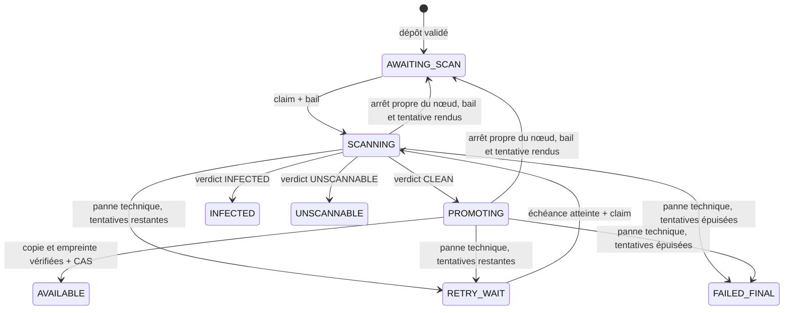

# Vue d'ensemble du back-end

## Ce que garantit le service

Le service accepte un fichier, le conserve en quarantaine, le fait analyser de
manière asynchrone, puis ne le rend téléchargeable qu'après une copie vérifiée
vers une zone servable.

L'invariant central est :

> Au moment d'autoriser un téléchargement, le fichier doit être `AVAILABLE` et
> porter un verdict `CLEAN` lié au SHA-256 de son contenu.

Cette garantie existe à quatre niveaux indépendants :

| Niveau | Mécanisme |
|---|---|
| Domaine | [`StoredFile`](../src/main/java/com/praxedo/securefiles/domain/file/model/StoredFile.java) refuse les transitions incohérentes |
| Application | [`FileDownloadService`](../src/main/java/com/praxedo/securefiles/application/file/service/FileDownloadService.java) relit l'état juste avant chaque ouverture |
| Base de données | Les contraintes de `V2__stored_file.sql` interdisent `AVAILABLE` sans attestation complète |
| Stockage | Les identifiants `delivery` ne peuvent lire que la zone servable, jamais la quarantaine |

La sécurité ne dépend donc pas d'un unique `if` qui pourrait être oublié.

## Les quatre couches

| Couche | Rôle | Exemples |
|---|---|---|
| `domain` | Règles qui doivent rester vraies, automate et objets valeur | `StoredFile`, `FileStatus`, `ScanVerdict`, `FileId` |
| `application` | Cas d'utilisation et ports nécessaires pour les exécuter | `UploadFileService`, `FileDownloadService`, `FileCatalog` |
| `infrastructure` | Traduction HTTP, SQL, S3, antivirus, métriques et planification | Contrôleurs, adaptateurs JDBC/JPA/S3, worker |
| composition (`config`) | Création des services et des adaptateurs qui demandent un choix, injection de leurs ports | `UseCaseConfiguration`, `StorageConfiguration`, `AntivirusConfiguration` |

Un contrôleur ou un planificateur ne connaît qu'un **port d'entrée**. Un
service d'application ne connaît que des **ports de sortie**. Les classes S3,
JDBC, Spring MVC ou ClamAV ne remontent jamais dans le domaine.

## Automate d'états

### Projection publiée par l'API

| État interne | Statut public | Terminal | Téléchargeable |
|---|---|---:|---:|
| `AWAITING_SCAN` | `PENDING` | non | non |
| `RETRY_WAIT` | `PENDING` | non | non |
| `SCANNING` | `SCANNING` | non | non |
| `PROMOTING` | `SCANNING` | non | non |
| `AVAILABLE` | `AVAILABLE` | oui | **oui** |
| `INFECTED` | `INFECTED` | oui | non |
| `UNSCANNABLE` | `UNSCANNABLE` | oui | non |
| `FAILED_FINAL` | `FAILED` | oui | non |

La projection est définie dans
[`FileStatus`](../src/main/java/com/praxedo/securefiles/domain/file/model/FileStatus.java),
pas dans les contrôleurs. Ajouter un état impose donc de dire immédiatement
s'il est terminal, s'il détient un bail et s'il est téléchargeable.

## Une table, deux usages

`stored_file` est à la fois :

- le catalogue des métadonnées consulté par l'API ;
- la file de travail consommée par les workers.

Les lectures ordinaires passent par
[`JpaFileCatalog`](../src/main/java/com/praxedo/securefiles/infrastructure/persistence/file/adapter/JpaFileCatalog.java).
Les transitions concurrentes passent par
[`JdbcFileWorkQueue`](../src/main/java/com/praxedo/securefiles/infrastructure/persistence/file/adapter/JdbcFileWorkQueue.java),
avec des écritures SQL conditionnelles. Les deux chemins ne sont jamais
mélangés dans une même transaction.

## Les trois capacités de stockage

| Capacité | Port | Identité S3 | Droits utiles |
|---|---|---|---|
| Dépôt | `QuarantineWriter` | `ingest` | écrire/supprimer en quarantaine, sans lecture |
| Traitement | `WorkerStorage` | `worker` | lire la quarantaine, écrire la zone servable, nettoyer |
| Livraison | `ServableReader` | `delivery` | lire uniquement la zone servable |

[`StorageConfiguration`](../src/main/java/com/praxedo/securefiles/config/StorageConfiguration.java)
construit un client S3 différent dans chaque adaptateur. Les clients ne sont
volontairement pas exposés comme beans Spring génériques.

## Identité du propriétaire

[`CurrentOwner`](../src/main/java/com/praxedo/securefiles/infrastructure/web/common/identity/CurrentOwner.java)
est l'unique point qui traduit la requête en `OwnerId` : le propriétaire est
le claim `sub` vérifié — celui du jeton `Bearer`, ou celui du jeton d'identité
de la session du navigateur. Sans preuve vérifiée, il échoue : il n'existe
aucun propriétaire de repli, et aucun réglage ne coupe l'authentification
(ADR-0014).

Toutes les lectures destinées à l'utilisateur prennent obligatoirement un
propriétaire. Un identifiant appartenant à quelqu'un d'autre produit le même
`404` qu'un identifiant inconnu.

## Lecture rapide du code

Pour suivre un parcours, lire toujours dans cet ordre :

1. le contrôleur ou le planificateur, qui traduit le déclencheur ;
2. le port d'entrée, qui définit le cas d'utilisation ;
3. le service d'application, qui orchestre ;
4. `StoredFile`, quand une transition d'état intervient ;
5. les ports de sortie appelés ;
6. leurs adaptateurs concrets ;
7. le gestionnaire d'erreurs et les tests du parcours.
