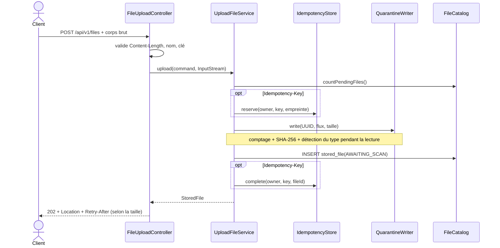

# Cas d'utilisation — déposer un fichier

## Résultat attendu

Le corps HTTP est écrit **en flux** dans la quarantaine. Si et seulement si
l'écriture est complète, une ligne `stored_file` est créée en
`AWAITING_SCAN`. L'API répond `202 Accepted`; l'analyse se fera ensuite.

## Point d'entrée et chaîne d'appel

`POST /api/v1/files`

```text
FileUploadController
  └─ UploadFileUseCase.upload(command, body)
      └─ UploadFileService
          ├─ FileCatalog.countPendingFiles()
          ├─ IdempotencyStore.reserve(...)        [si une clé est fournie]
          ├─ ContentSniffer.detect(...)
          ├─ QuarantineWriter.write(...)
          └─ TransactionRunner.inTransaction(...)
              ├─ FileCatalog.insert(...)
              └─ IdempotencyStore.complete(...)   [si une clé est fournie]
```

Classes principales :

- [`FileUploadController`](../src/main/java/com/praxedo/securefiles/infrastructure/web/file/controller/FileUploadController.java)
- [`UploadFileService`](../src/main/java/com/praxedo/securefiles/application/file/service/UploadFileService.java)
- [`S3QuarantineWriter`](../src/main/java/com/praxedo/securefiles/infrastructure/storage/file/adapter/S3QuarantineWriter.java)
- [`JpaFileCatalog`](../src/main/java/com/praxedo/securefiles/infrastructure/persistence/file/adapter/JpaFileCatalog.java)
- [`JdbcIdempotencyStore`](../src/main/java/com/praxedo/securefiles/infrastructure/persistence/idempotency/adapter/JdbcIdempotencyStore.java)

## Flux de bout en bout



### 1. Validation avant de lire le corps

Le chemin d'admission valide, dans le contrôleur puis dans le service et
toujours avant de lire le corps :

- `Content-Length` présent, strictement positif et au plus égal à la limite ;
- `X-File-Name` présent, encodé en UTF-8 pour l'URL, puis assaini ;
- `Idempotency-Key` optionnel, entre 8 et 128 caractères ASCII imprimables.

Le `Content-Type` déclaré par le client n'est pas utilisé. Le corps est lu
directement depuis le flux Servlet : il n'y a ni `MultipartFile`, ni
`@RequestBody`, ni chargement complet en mémoire.

### 2. Contrôle d'admission

`UploadFileService` refuse le dépôt avant le premier octet, par deux bornes
(`UploadAdmission`) :

- **les dépôts en cours sur ce nœud** : un sémaphore pris sans attendre. Au-delà
  de `praxedo.upload.max-concurrent-uploads` (50), le dépôt reçoit un
  `429 TOO_MANY_CONCURRENT_UPLOADS` avec `Retry-After: 1`, sans toucher à la
  base ;
- **les fichiers en attente** : si `FileCatalog.countPendingFiles()` atteint
  `praxedo.upload.max-pending-files` (500), `429 TOO_MANY_PENDING_FILES`. Le
  compte est relu au plus toutes les 250 ms (`PendingFileCountCache`) : un
  refus ne coûte pas une requête SQL.

Cela protège la taille de la quarantaine et rend la contre-pression visible.

### 3. Réservation d'idempotence

Si une clé est fournie, le service calcule une empreinte à partir du nom et de
la taille déclarée. `JdbcIdempotencyStore.reserve` tente un
`INSERT ... ON CONFLICT DO NOTHING` sur `(owner_id, idempotency_key)` :

| Situation | Comportement |
|---|---|
| Clé libre | la requête obtient la réservation et poursuit |
| Même requête déjà terminée | le fichier initial est relu et retourné dans son état actuel |
| Même requête encore en cours | `409 IDEMPOTENCY_REQUEST_IN_PROGRESS` |
| Même clé, nom ou taille différents | `422 IDEMPOTENCY_KEY_REUSED` |

La clé ne prouve pas que deux corps de même nom et même taille sont identiques :
le corps n'a justement pas encore été lu. C'est une limite assumée.

### 4. Écriture en quarantaine

Le service génère un `FileId` aléatoire. La clé objet est ce UUID, jamais le
nom fourni par l'utilisateur.

Un même passage sur le flux réalise :

- le comptage réel des octets ;
- le SHA-256 ;
- la détection du type à partir des 512 premiers octets ;
- l'écriture S3 par l'identité `ingest`.

Le tampon est de 64 Kio. La mémoire utilisée ne dépend donc pas de la taille du
fichier. Si le corps est plus court ou plus long que `Content-Length`, l'objet
est supprimé et aucun fichier n'est créé.

### 5. Commit des métadonnées

Après l'écriture S3, `StoredFile.received(...)` construit l'unique état
d'entrée de l'automate :

```text
storage_area = QUARANTINE
status       = AWAITING_SCAN
attempts     = 0
sha256       = empreinte calculée sur les octets reçus
```

La ligne et l'achèvement de la clé d'idempotence sont validés dans une même
transaction. L'ordre **objet puis base** est volontaire : une panne entre les
deux laisse un objet invisible que le balayage supprimera. L'ordre inverse
laisserait une ligne visible pointant vers un objet absent.

## Pannes et nettoyage

| Point de panne | Effet | Réparation |
|---|---|---|
| Corps tronqué ou trop long | objet refusé, pas de ligne | suppression immédiate, puis balayage en repli |
| Corps encore en cours à son échéance (60 s + 8 s par Mio annoncé) | `408 UPLOAD_TOO_SLOW`, pas de ligne, place rendue sur le nœud | suppression immédiate, clé d'idempotence libérée |
| Échec S3 | pas de ligne | erreur `503`, réservation d'idempotence libérée |
| Échec DB après l'écriture S3 | objet orphelin invisible | suppression immédiate ou balayage différé |
| Rejeu après une réponse perdue | pas de doublon | la clé rejoue le fichier initial |

Toutes les erreurs HTTP stables sont produites par
[`ApiExceptionHandler`](../src/main/java/com/praxedo/securefiles/infrastructure/web/common/error/ApiExceptionHandler.java).

## Tests qui racontent ce parcours

- [`UploadApiTest`](../src/test/java/com/praxedo/securefiles/infrastructure/web/file/UploadApiTest.java) : contrat HTTP et stockage exact.
- [`UploadAdmissionTest`](../src/test/java/com/praxedo/securefiles/infrastructure/web/file/UploadAdmissionTest.java) et [`UploadAdmissionBoundsTest`](../src/test/java/com/praxedo/securefiles/application/file/service/UploadAdmissionBoundsTest.java) : contre-pression, les deux bornes.
- [`UploadFileServiceTest`](../src/test/java/com/praxedo/securefiles/application/file/service/UploadFileServiceTest.java) : ordre des écritures, idempotence et pannes.
- [`UploadMemoryTest`](../src/test/java/com/praxedo/securefiles/infrastructure/web/file/UploadMemoryTest.java) : flux supérieur à la heap.
- [`JdbcIdempotencyStoreTest`](../src/test/java/com/praxedo/securefiles/infrastructure/persistence/idempotency/JdbcIdempotencyStoreTest.java) : courses concurrentes sur les clés.
