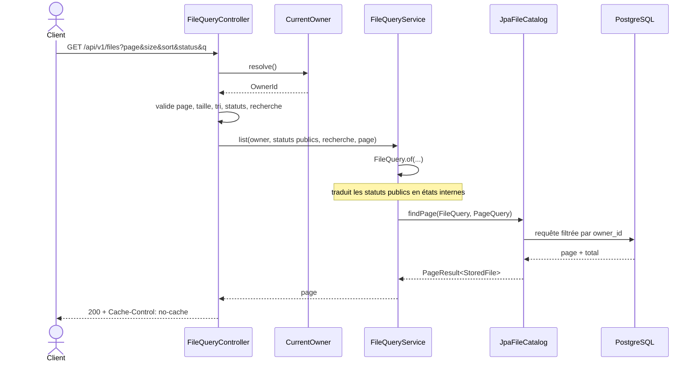

# Cas d'utilisation — consulter les fichiers

## Opérations couvertes

| Besoin | Endpoint | Réponse |
|---|---|---|
| Afficher le tableau | `GET /api/v1/files` | Page filtrée, recherchée et triée |
| Afficher les compteurs | `GET /api/v1/files/summary` | Total pour chaque statut public |
| Suivre un dépôt | `GET /api/v1/files/{fileId}` | Métadonnées et état courant |

Les trois opérations passent par le même port d'entrée
[`QueryFilesUseCase`](../src/main/java/com/praxedo/securefiles/application/file/port/in/QueryFilesUseCase.java)
et le même service
[`FileQueryService`](../src/main/java/com/praxedo/securefiles/application/file/service/FileQueryService.java).

## Chaîne d'appel

```text
FileQueryController
  ├─ CurrentOwner.resolve()
  ├─ validation et conversion des paramètres
  └─ QueryFilesUseCase
      └─ FileQueryService
          └─ FileCatalog
              └─ JpaFileCatalog
                  └─ StoredFileJpaRepository
```

Le contrôleur traduit HTTP vers des types internes. Le service impose le
cloisonnement par propriétaire et la projection des états. L'adaptateur JPA
construit la requête paginée ou agrégée.

## 1. Lister une page



### Paramètres acceptés

- `page` commence à `0` ; une page qui sauterait plus de 10 000 fichiers
  (`page × size`) est refusée par `400 INVALID_PARAMETER` ;
- `size` vaut `20` par défaut et est plafonné à `100` ;
- `sort` appartient à la liste fermée de
  [`FileSort`](../src/main/java/com/praxedo/securefiles/application/file/model/FileSort.java) ;
- `status` est répétable et ne connaît que les statuts publics ;
- `q` est une recherche « contient », insensible à la casse et aux accents,
  limitée à 100 caractères.

Le tri n'est jamais injecté sous forme de texte dans une requête. Le contrôleur
le convertit en enum, puis `JpaFileCatalog` traduit cet enum vers un attribut
JPA connu. Chaque tri est complété par l'identifiant comme second critère afin
d'obtenir un ordre total entre les pages.

La recherche échappe `%`, `_` et `\`. L'expression JPA correspond exactement à
l'index trigramme `immutable_unaccent(lower(original_filename))`, reconstruit
par la migration V9 (V3 l'écrivait sur `lower(original_filename)` seul).

## 2. Traduire les états internes

L'API masque les détails d'exécution :

```text
PENDING   = AWAITING_SCAN + RETRY_WAIT
SCANNING  = SCANNING + PROMOTING
AVAILABLE = AVAILABLE
INFECTED  = INFECTED
UNSCANNABLE = UNSCANNABLE
FAILED    = FAILED_FINAL
```

[`FileQuery.of`](../src/main/java/com/praxedo/securefiles/application/file/model/FileQuery.java)
réalise cette traduction avant l'accès aux données. Sans filtre, il sélectionne
tous les états internes; un ensemble vide ne signifie jamais « aucun résultat ».

## 3. Lire les compteurs

`GET /api/v1/files/summary?q=...` utilise la même recherche et le même
propriétaire que la liste. `JpaFileCatalog.countByStatus` groupe d'abord par
état interne. `FileQueryService.count` fusionne ensuite ces nombres dans les
six statuts publics et complète les statuts absents avec zéro.

Cette séparation garantit que le tableau et ses filtres parlent le même
langage, même si l'automate interne évolue.

## 4. Suivre un fichier

`GET /api/v1/files/{fileId}` relit toujours la ligne. Le fichier est recherché
par `(id, owner_id)` : un fichier inconnu, mal formé ou appartenant à un autre
propriétaire retourne exactement le même `404 FILE_NOT_FOUND`.

La réponse porte un ETag faible construit avec l'identifiant et la version de
ligne :

```text
W/"{fileId}-{version}"
```

Chaque transition incrémente `version`. Le client peut donc renvoyer
`If-None-Match` :

- même version : `304 Not Modified`, sans corps ;
- nouvelle version : `200` avec le nouvel état ;
- état non terminal : en plus, `Retry-After` invite à continuer le polling,
  sur le `200` comme sur le `304` — 2 s, plus 0,05 s par Mio, au plus 30 s ;
- état terminal : pas de `Retry-After`.

Le mapping de `StoredFile` vers les DTO se trouve dans
[`FileResponseMapper`](../src/main/java/com/praxedo/securefiles/infrastructure/web/file/mapper/FileResponseMapper.java).
Le lien vers le contenu n'est exposé que si `file.isDownloadable()` est vrai.

## Cloisonnement et cache

- Toutes les requêtes utilisateur passent par un `OwnerId` non nul.
- Cet identifiant vient du `sub` vérifié : celui du jeton `Bearer`, ou celui
  de la session du navigateur.
- Les réponses utilisent `Cache-Control: no-cache` : elles peuvent être
  revalidées par ETag mais pas réutilisées silencieusement alors que l'état
  avance.

## Tests qui racontent ce parcours

- [`ReadApiTest`](../src/test/java/com/praxedo/securefiles/infrastructure/web/file/ReadApiTest.java) : pagination, filtres, recherche, ETag, polling et DTO.
- [`FileCatalogQueryTest`](../src/test/java/com/praxedo/securefiles/infrastructure/persistence/file/FileCatalogQueryTest.java) : requêtes JPA et cloisonnement.
- [`OidcSecurityTest`](../src/test/java/com/praxedo/securefiles/infrastructure/web/common/config/OidcSecurityTest.java) : identité issue du JWT et fichiers d'autrui invisibles.
- [`PublicStatusTest`](../src/test/java/com/praxedo/securefiles/domain/file/model/PublicStatusTest.java) : projection exhaustive des états.
