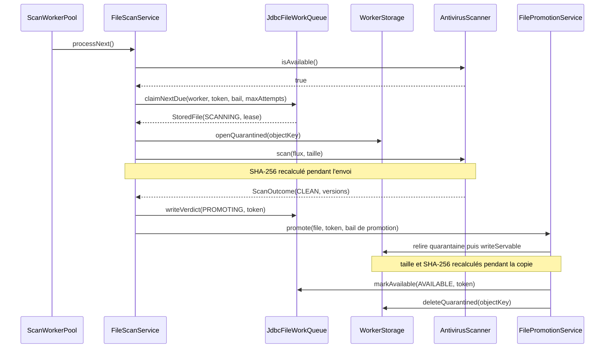

# Cas d'utilisation — analyser et promouvoir un fichier

## Résultat attendu

Un worker prend un fichier en attente, envoie son contenu à l'antivirus en
flux, lie le verdict aux octets réellement lus, puis :

- bloque définitivement un fichier `INFECTED` ou `UNSCANNABLE` ;
- programme un nouvel essai après une panne technique ;
- pour un verdict `CLEAN`, copie et vérifie le contenu dans la zone servable
  avant de passer le fichier à `AVAILABLE`.

## Déclencheur et chaîne d'appel

Ce parcours n'est pas déclenché par HTTP.
[`ScanWorkerPool`](../src/main/java/com/praxedo/securefiles/infrastructure/scheduling/file/scheduler/ScanWorkerPool.java)
démarre `praxedo.worker.concurrency` boucles sur des threads virtuels. Chaque
boucle mène une analyse à la fois : ce nombre est la borne des analyses
simultanées sur le nœud.

```text
ScanWorkerPool
  └─ ScanFilesUseCase.processNext()
      └─ FileScanService
          ├─ AntivirusScanner.isAvailable()
          ├─ FileWorkQueue.claimNextDue(...)
          ├─ WorkerStorage.openQuarantined(...)
          ├─ AntivirusScanner.scan(...)
          ├─ StoredFile.scanned(...)
          ├─ FileWorkQueue.writeVerdict(...)
          └─ FilePromotionService.promote(...)       [si CLEAN]
              ├─ WorkerStorage.openQuarantined(...)
              ├─ WorkerStorage.writeServable(...)
              ├─ StoredFile.promoted(...)
              ├─ FileWorkQueue.markAvailable(...)
              └─ WorkerStorage.deleteQuarantined(...)
```

## Flux nominal d'un fichier sain



## 1. Portillon de santé avant le claim

`FileScanService.processNext()` commence par
`AntivirusScanner.isAvailable()`. Si l'antivirus est indisponible, aucun fichier
n'est réclamé et aucune tentative n'est consommée. Le dépôt et le téléchargement
des fichiers déjà disponibles restent indépendants de cette panne.

## 2. Claim atomique et bail

[`JdbcFileWorkQueue.claimNextDue`](../src/main/java/com/praxedo/securefiles/infrastructure/persistence/file/adapter/JdbcFileWorkQueue.java)
effectue en une requête :

1. la sélection du travail dû dans `AWAITING_SCAN` ou `RETRY_WAIT` ;
2. l'exclusion des autres workers avec `FOR UPDATE SKIP LOCKED` ;
3. la transition vers `SCANNING` ;
4. la création d'un bail avec un jeton aléatoire propre à cette prise ;
5. l'incrément de `attempts`.

`attempts < maxAttempts` empêche de reprendre un travail terminal. L'heure du
bail vient de PostgreSQL, pas de l'horloge du nœud. Sa durée est
proportionnelle à la taille du fichier pris : 30 s, plus 1,2 s par Mio pour
l'analyse (1,8 s par Mio pour la promotion).

## 3. Analyse et attestation

Le worker ouvre la quarantaine avec l'identité S3 `worker`. Un
[`InspectingInputStream`](../src/main/java/com/praxedo/securefiles/application/common/io/InspectingInputStream.java)
compte et hache les octets pendant que
[`HttpAntivirusScanner`](../src/main/java/com/praxedo/securefiles/infrastructure/antivirus/file/adapter/HttpAntivirusScanner.java)
les transmet à `POST /scanHandlerBody`.

Le nombre d'appels antivirus simultanés est limité par le nombre de boucles :
aucun autre appelant n'existe, et une boucle attend la fin de son analyse avant
de prendre le fichier suivant. Les threads virtuels n'y changent rien — ils
retirent la limite d'un pool sur des tâches **soumises**, pas celle d'un nombre
fixe de boucles. Un pic de dépôts allonge la file, il n'ajoute pas d'analyse.
Aucun sémaphore n'est donc posé devant l'antivirus : il ne pourrait jamais
manquer de permis.

L'adaptateur antivirus retourne un `ScanOutcome`, pas encore un verdict. Le
worker crée le [`ScanVerdict`](../src/main/java/com/praxedo/securefiles/domain/file/model/ScanVerdict.java)
en lui ajoutant le SHA-256 des octets réellement envoyés. Si la taille lue ou
l'empreinte diffère du dépôt, le résultat est rejeté et traité comme une panne.

### Traduction des réponses antivirus

| Réponse de l'API antivirus | Résultat métier |
|---|---|
| `200` | `CLEAN` |
| `406` avec une menace | `INFECTED` |
| `406 Heuristics.Limits.Exceeded...` | `UNSCANNABLE` |
| `412` | `UNSCANNABLE` |
| `413`, timeout, coupure, réponse invalide | panne technique, jamais un verdict |

Les versions du moteur et des signatures sont enregistrées. Une attestation
`CLEAN` sans version de signatures est invalide.

## 4. Écriture du verdict avec jeton de cloisonnement

`StoredFile.scanned` produit un nouvel objet, sans modifier l'entité chargée :

- `CLEAN` → `PROMOTING`, bail conservé ;
- `INFECTED` → état terminal sans bail ;
- `UNSCANNABLE` → état terminal sans bail et raison explicite.

`writeVerdict` met à jour la ligne uniquement si elle est encore `SCANNING`, si
le jeton correspond **à cette prise** et si le bail n'a pas expiré. Un worker
gelé qui se réveille après la reprise de son travail ne peut donc rien écrire.

## 5. Promotion vérifiée

Un verdict sain n'autorise pas encore le téléchargement. Le
[`FilePromotionService`](../src/main/java/com/praxedo/securefiles/application/file/service/FilePromotionService.java) :

1. relit l'objet en quarantaine ;
2. l'écrit directement sous la même clé dans la zone servable ;
3. recalcule taille et SHA-256 pendant ce transfert ;
4. compare ces valeurs avec l'attestation du dépôt et du scan ;
5. produit la transition domaine `PROMOTING → AVAILABLE` ;
6. exécute `markAvailable` comme compare-and-set sur le jeton et le bail ;
7. supprime ensuite la source en quarantaine.

Le point de commit est la ligne PostgreSQL, pas l'existence de l'objet S3. Un
objet déjà présent dans la zone servable mais dont la ligne n'est pas
`AVAILABLE` ne peut pas être téléchargé.

## 6. Pannes et réessais

Une panne du stockage, de l'antivirus, une lecture incomplète, une copie non
conforme ou un transfert encore en cours à la fin de son bail
(`DeadlineInputStream`) appelle `StoredFile.technicalFailure` :

- tentatives restantes : `RETRY_WAIT` avec backoff persistant ;
- dernière tentative : `FAILED_FINAL`.

Le backoff est enregistré en base. Il survit aux redémarrages. Une panne n'est
jamais convertie en `INFECTED`, `UNSCANNABLE` ou `CLEAN`.

À l'arrêt propre, le pool attend un court délai puis `releaseInFlight()` rend
les baux restants et restitue la tentative. Après un crash brutal, le reaper
attend l'expiration du bail et conserve la tentative consommée.

## Pourquoi la promotion est reprenable

| Interruption | État observable | Suite |
|---|---|---|
| Avant ou pendant la copie | ligne `PROMOTING`, objet final absent ou incomplet | bail expiré, nouvelle analyse et copie écrasante |
| Après copie, avant `markAvailable` | objet final présent, ligne non servable | jamais livré; un nouveau worker refait et valide |
| Après `markAvailable`, avant suppression source | ligne `AVAILABLE`, deux copies | téléchargement permis; balayage supprime la source |
| Copie avec mauvaise taille/empreinte | ligne non servable | objet final supprimé, travail remis en attente |

## Tests qui racontent ce parcours

- [`FileScanServiceTest`](../src/test/java/com/praxedo/securefiles/application/file/service/FileScanServiceTest.java) : verdicts, panne, bail perdu et arrêt.
- [`FilePromotionServiceTest`](../src/test/java/com/praxedo/securefiles/application/file/service/FilePromotionServiceTest.java) : tous les points d'interruption de la promotion.
- [`ScanWorkerPoolTest`](../src/test/java/com/praxedo/securefiles/infrastructure/scheduling/file/scheduler/ScanWorkerPoolTest.java) : jamais plus d'analyses simultanées que de boucles, contre une file qui ne se vide jamais.
- [`HttpAntivirusScannerTest`](../src/test/java/com/praxedo/securefiles/infrastructure/antivirus/file/adapter/HttpAntivirusScannerTest.java) : table de traduction HTTP.
- [`ScanPipelineTest`](../src/test/java/com/praxedo/securefiles/ScanPipelineTest.java) : parcours complet fichier sain et EICAR.
- [`FilePersistenceTest`](../src/test/java/com/praxedo/securefiles/infrastructure/persistence/file/FilePersistenceTest.java) : exclusion mutuelle et jetons de bail.
