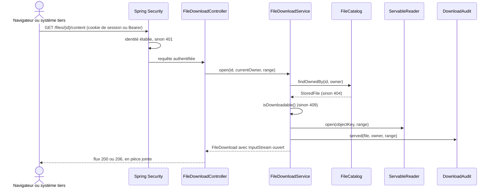

# Cas d'utilisation — télécharger un fichier

## Une entrée, une seule preuve : l'identité de l'appelant

| Client | Appel | Preuve |
|---|---|---|
| Navigateur | navigation native vers `GET /api/v1/files/{id}/content` | cookie de session `HttpOnly`, parti tout seul |
| Système tiers | `GET /api/v1/files/{id}/content` | jeton `Bearer` |

Les deux rejoignent
[`FileDownloadService`](../src/main/java/com/praxedo/securefiles/application/file/service/FileDownloadService.java).
L'état est relu au moment d'ouvrir le contenu, à chaque requête : rien de ce
qui a été répondu avant ne vaut autorisation.

Il n'y a **pas de lien signé** (ADR-0013). Tant que la v2 prévoyait un jeton
dans le navigateur, il en fallait un, puisqu'un lien natif ne porte pas
d'en-tête `Authorization`. Depuis la session par cookie (ADR-0012), il
doublait l'authentification : un second secret à distribuer à chaque nœud et
à faire tourner, pour une preuve que le cookie apporte déjà. Un `GET` ne
demande pas de jeton CSRF : il ne modifie rien.

## Chaîne d'appel

```text
FileDownloadController
  └─ DownloadFileUseCase.open(id, currentOwner, range)
      └─ FileDownloadService
          ├─ FileCatalog.findOwnedBy(id, owner)
          ├─ StoredFile.isDownloadable()
          ├─ ServableReader.open(objectKey, range)
          └─ DownloadAudit.served(...)
```

Adaptateurs concrets :

- [`JpaFileCatalog`](../src/main/java/com/praxedo/securefiles/infrastructure/persistence/file/adapter/JpaFileCatalog.java)
- [`S3ServableReader`](../src/main/java/com/praxedo/securefiles/infrastructure/storage/file/adapter/S3ServableReader.java)
- [`JdbcDownloadAudit`](../src/main/java/com/praxedo/securefiles/infrastructure/persistence/file/adapter/JdbcDownloadAudit.java)

## Parcours



### Côté interface

Au clic, l'interface relit `GET /files/{id}` (`downloadable`,
`links.content`), puis confie `links.content` au gestionnaire de
téléchargement du navigateur. Rien ne passe par la mémoire de l'onglet.
Cette relecture ne sert qu'à l'utilisateur : elle permet d'**expliquer** un
refus ou une session expirée plutôt que de laisser un téléchargement en échec.
La garantie, elle, reste ici, au moment de servir.

### Pourquoi le service sert lui-même le contenu

Une URL présignée du stockage objet contournerait la relecture de l'état : le
stockage ignore l'automate, et un lien émis avant un changement d'état
resterait valable. Elle publierait aussi l'adresse du stockage. En contrepartie,
la bande passante des téléchargements traverse le service (piste
d'amélioration dans le README).

## Les contrôles avant le premier octet

`FileDownloadService.servableFile` :

1. recherche `(fileId, ownerId)` ;
2. refuse les fichiers inconnus ou d'un autre propriétaire par `404` ;
3. appelle `StoredFile.isDownloadable()` ;
4. seul `AVAILABLE` retourne `true`.

`S3ServableReader.open` effectue ensuite un `HEAD` sur la zone servable avant
le `GET`. Cela permet de détecter un objet absent ou une plage impossible avant
d'écrire les en-têtes HTTP.

La défense est cumulative :

```text
identité établie par Spring Security (session ou Bearer)
  + état AVAILABLE dans le domaine
  + contraintes PostgreSQL sur l'attestation CLEAN
  + relecture de l'état à chaque ouverture
  + identité S3 delivery incapable de lire la quarantaine
```

## Streaming et en-têtes de sécurité

Le contrôleur copie l'`InputStream` S3 directement dans l'`OutputStream`
Servlet. Aucun convertisseur de message et aucun `byte[]` n'interviennent.

Chaque réponse de contenu fixe :

- `Content-Type: application/octet-stream` ;
- `Content-Disposition: attachment` avec nom ASCII de repli et nom UTF-8 ;
- `X-Content-Type-Options: nosniff` ;
- `Cache-Control: private, no-store` ;
- `Accept-Ranges: bytes` ;
- `ETag` fort : le SHA-256 du fichier. Le contenu d'un fichier `AVAILABLE`
  est immuable, son empreinte est donc son meilleur ETag.

Même sain au sens antivirus, un HTML ou SVG ne doit jamais être interprété par
le navigateur dans le contexte de l'application.

## Reprise par plage d'octets

[`DownloadHeaders`](../src/main/java/com/praxedo/securefiles/infrastructure/web/file/header/DownloadHeaders.java)
accepte `bytes=first-last` et `bytes=first-` :

- plage valide représentant une partie de l'objet : réponse `206` et
  `Content-Range` ; une plage couvrant finalement tout l'objet produit `200` ;
- fin demandée après la fin réelle : elle est ramenée à la dernière position ;
- début après la fin réelle : `416` avec `Content-Range: bytes */{taille}` ;
- suffixe, multi-range ou syntaxe invalide : en-tête ignoré et objet complet
  servi. Le multi-range nécessiterait une réponse multipart qui n'est pas
  retenue dans ce périmètre.

## Audit et anomalies

Chaque contenu ouvert ajoute `DOWNLOAD_SERVED` au journal append-only, avec
son acteur et sa plage (`{"range": "whole"}` ou `{"range": "bytes=0-9"}`).
L'audit est écrit après l'ouverture S3 mais avant le premier octet HTTP. S'il
échoue, le flux est fermé et rien n'est envoyé. Un refus n'est pas audité :
rien n'a été servi.

Une ligne `AVAILABLE` dont l'objet servable a disparu est une violation
d'exploitation : elle produit `503 SERVICE_UNAVAILABLE`, un log
`INVARIANT ANOMALY` et aucun octet.

## Refus principaux

| Situation | Réponse |
|---|---|
| Sans identité | `401 UNAUTHENTICATED` |
| Inconnu, identifiant mal formé ou autre propriétaire | `404 FILE_NOT_FOUND` |
| `HEAD` sur le contenu | `405` : l'objet n'est ni ouvert ni audité |
| `PENDING` ou `SCANNING` | `409 FILE_NOT_READY` + `Retry-After` |
| `INFECTED` | `409 FILE_INFECTED` |
| `UNSCANNABLE` | `409 FILE_UNSCANNABLE` |
| `FAILED` | `409 FILE_SCAN_FAILED` |
| Objet servable absent / S3 indisponible | `503 SERVICE_UNAVAILABLE` |
| Plage commençant après la fin | `416 RANGE_NOT_SATISFIABLE` |

## Tests qui racontent ce parcours

- [`DownloadApiTest`](../src/test/java/com/praxedo/securefiles/infrastructure/web/file/DownloadApiTest.java) : contenu, en-têtes, plages, chaque refus, audit.
- [`BrowserSessionTest`](../src/test/java/com/praxedo/securefiles/infrastructure/web/session/BrowserSessionTest.java) : le cookie de session seul suffit à télécharger, sans lien ni second justificatif.
- [`OidcSecurityTest`](../src/test/java/com/praxedo/securefiles/infrastructure/web/common/config/OidcSecurityTest.java) : sans identité, `401` ; le fichier d'autrui répond `404`.
- [`DownloadMemoryTest`](../src/test/java/com/praxedo/securefiles/infrastructure/web/file/DownloadMemoryTest.java) : fichier supérieur à la heap servi en flux.
- [`ObjectStorageTest`](../src/test/java/com/praxedo/securefiles/infrastructure/storage/file/adapter/ObjectStorageTest.java) : permissions de l'identité `delivery`.
- [`StoredFileConstraintsTest`](../src/test/java/com/praxedo/securefiles/infrastructure/persistence/file/StoredFileConstraintsTest.java) : impossibilité d'un `AVAILABLE` sans attestation.
