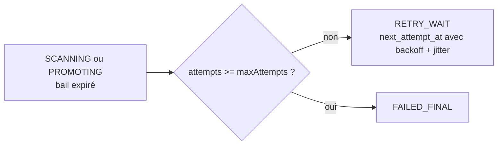

# Cas d'utilisation — maintenance et reprise après panne

## Pourquoi ce parcours existe

Les protocoles critiques préfèrent laisser un état sûr mais incomplet plutôt
que rendre un fichier incorrectement disponible :

- un dépôt interrompu peut laisser un objet S3 sans ligne ;
- un worker mort peut laisser un bail expiré ;
- une promotion validée peut laisser sa source en quarantaine ;
- un processus mort pendant un dépôt peut laisser une réservation
  d'idempotence `IN_PROGRESS`.

Le parcours de maintenance répare ces états sans intervention humaine.

## Déclencheur et chaîne d'appel

[`MaintenanceScheduler`](../src/main/java/com/praxedo/securefiles/infrastructure/scheduling/file/scheduler/MaintenanceScheduler.java)
est l'adaptateur pilotant. Il ne connaît ni SQL ni S3 : il appelle uniquement
[`MaintainFilesUseCase`](../src/main/java/com/praxedo/securefiles/application/file/port/in/MaintainFilesUseCase.java).

```text
MaintenanceScheduler
  └─ MaintainFilesUseCase
      └─ FileMaintenanceService
          ├─ FileWorkQueue.reclaimExpiredLeases(...)
          ├─ QuarantineSweeper.sweep()
          │   ├─ WorkerStorage.listQuarantinedBefore(...)
          │   ├─ FileCatalog.statusesByObjectKey(...)
          │   └─ WorkerStorage.deleteQuarantined(...)
          └─ IdempotencyStore.purge(...)
```

## 1. Reprendre les baux expirés

Le reaper tourne toutes les `praxedo.scheduling.reaper-interval`, 30 secondes
par défaut. `JdbcFileWorkQueue.reclaimExpiredLeases` cible uniquement
`SCANNING` et `PROMOTING` dont `lease_expires_at` est dépassé.



La mise à jour est conditionnelle et groupée. Plusieurs nœuds peuvent exécuter
le reaper simultanément : le premier modifie les lignes éligibles, les autres
n'ont plus rien à modifier. Aucun verrou distribué n'est nécessaire.

Le backoff exponentiel et son jitter sont calculés en SQL puis persistés. Une
relance de l'application ne remet donc pas toutes les tentatives à zéro et ne
provoque pas de nouvelle vague immédiate.

### Arrêt propre et crash ne sont pas identiques

- **Arrêt propre** : `ScanWorkerPool.stop()` laisse un délai aux analyses, puis
  `releaseInFlight()` rend les travaux encore actifs en `AWAITING_SCAN` et
  restitue la tentative.
- **Crash** : aucun code ne peut s'exécuter. Le bail expire, puis le reaper
  conserve la tentative consommée et applique le backoff.

Cette différence borne un fichier capable de faire tomber son worker tout en
ne pénalisant pas un redéploiement normal.

## 2. Balayer la quarantaine

Le balayage tourne toutes les `praxedo.scheduling.sweep-interval`, 10 minutes
par défaut. Il ne regarde que les objets plus anciens que
`praxedo.maintenance.orphan-age`, deux heures par défaut, et limite chaque
passage à `sweep-batch` objets (500). Chaque passage reprend après la dernière
clé du précédent : les objets gardés comme preuve, qui reviennent à chaque
liste, ne masquent pas les orphelins rangés après eux.

[`QuarantineSweeper`](../src/main/java/com/praxedo/securefiles/application/file/service/QuarantineSweeper.java)
compare les clés S3 avec le catalogue :

| État trouvé pour la clé | Action |
|---|---|
| Aucune ligne | supprimer : objet orphelin d'un dépôt non commité |
| `AVAILABLE` | supprimer : source laissée après une promotion validée |
| Tout autre état | conserver : le fichier peut encore en avoir besoin, ou constitue une preuve bloquée |

Le délai d'âge est essentiel : pendant un dépôt normal, l'objet existe avant
la ligne. Sans délai, le balayage pourrait supprimer un upload encore en cours.
Il dépasse le dépôt le plus lent accepté (≈ 68 min pour 500 Mo), et le service
refuse de démarrer si ce n'est pas le cas (`ServiceProperties`).

Une suppression S3 est idempotente. Deux nœuds peuvent tenter le même nettoyage
sans rendre le protocole incorrect.

## 3. Purger les clés d'idempotence

`JdbcIdempotencyStore.purge` supprime :

- toute clé dont `expires_at` est passé ;
- toute réservation `IN_PROGRESS` plus vieille que
  `praxedo.maintenance.abandoned-upload-after` (deux heures par défaut).

La purge tourne au même rythme que le balayage (`sweep-interval`).

Une réservation terminée est donc rejouable pendant sa durée de vie. Une
réservation laissée par un processus mort ne bloque pas définitivement les
futures tentatives du client.

## Comportement en cas d'échec de la maintenance

Chaque tâche planifiée intercepte ses propres erreurs, les journalise et attend
son prochain passage. Une panne du balayage ne bloque pas le reaper; une panne
du reaper ne tue pas le scheduler. Tous les traitements étant idempotents et
bornés, le prochain passage reprend le travail.

## Journal d'audit

Le trigger de la migration `V6__audit.sql` enregistre notamment :

- `LEASE_EXPIRED` pour la reprise d'un bail ;
- `RELEASED` pour un travail rendu à l'arrêt propre ;
- `TECHNICAL_FAILURE` pour un retour en attente ou un échec final.

Ces événements sont écrits dans la même transaction que la transition d'état.

## Tests qui racontent ce parcours

- [`QuarantineSweeperTest`](../src/test/java/com/praxedo/securefiles/application/file/service/QuarantineSweeperTest.java) : orphelins, sources de fichiers disponibles et objets à conserver.
- [`FileScanServiceTest`](../src/test/java/com/praxedo/securefiles/application/file/service/FileScanServiceTest.java) : restitution des travaux à l'arrêt.
- [`FilePersistenceTest`](../src/test/java/com/praxedo/securefiles/infrastructure/persistence/file/FilePersistenceTest.java) : expiration des baux, reprise et tentatives finales.
- [`JdbcIdempotencyStoreTest`](../src/test/java/com/praxedo/securefiles/infrastructure/persistence/idempotency/JdbcIdempotencyStoreTest.java) : expiration et abandon des réservations.
- [`AuditTrailTest`](../src/test/java/com/praxedo/securefiles/infrastructure/persistence/file/AuditTrailTest.java) : événements automatiques et journal append-only.
