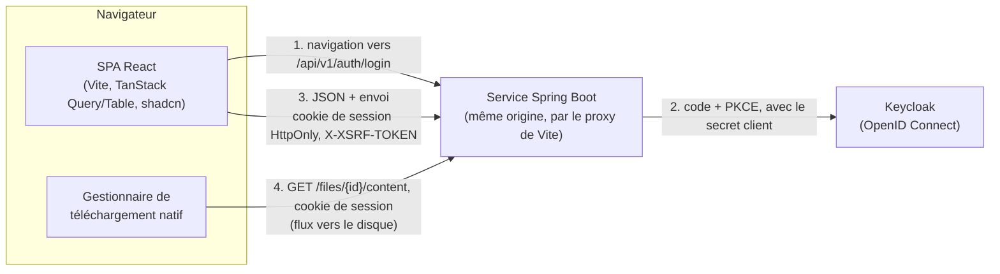
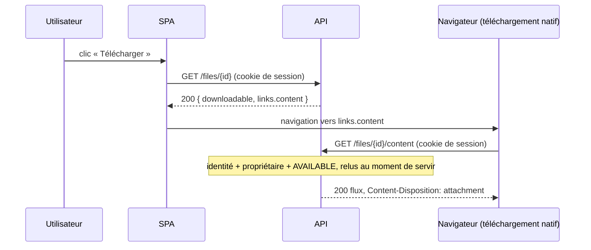
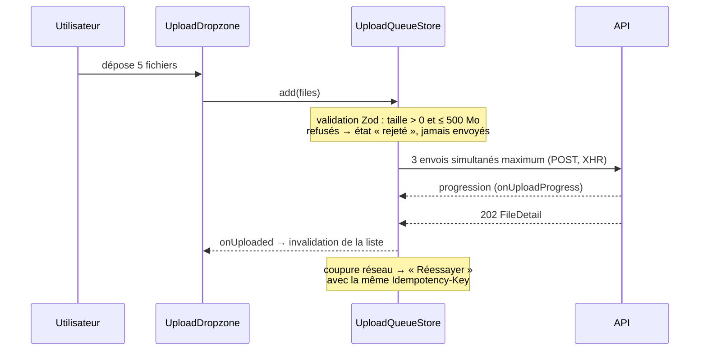

# Architecture du front-end

> **Statut : livré.** Analyse : Claude (Opus 5.5) — 2026-09-25 ; révisée les
> 28/09 ([ADR-0012](../docs/adr/0012-session-navigateur-client-confidentiel.md)),
> 29/09 ([ADR-0013](../docs/adr/0013-telechargement-par-l-identite-de-l-appelant.md),
> [ADR-0014](../docs/adr/0014-authentification-toujours-exigee.md)), 30/09 et
> 01/10 ; **relue contre le code le 02/10**.
>
> **Comment lire ce document.** Les §1 à §10 décrivent l'interface **telle
> qu'elle est livrée**. Les §11 à §13 gardent, datées, les demandes et les
> questions du 25/09 avec ce qu'elles sont devenues. Le §14 est le **journal
> des écarts** : chaque entrée dit ce qui était vrai à sa date (nombre de
> tests, composants, comptes), pas ce qui l'est aujourd'hui.
>
> Il n'existe **aucun mode sans authentification** : `session` est le défaut
> (Keycloak, par le service) ; `mock` sert les bouchons, qui exigent eux aussi
> un utilisateur connecté, et n'existe que hors d'un build.

---

## 0. Les décisions du 25/09, et ce qu'elles sont devenues

Décisions du porteur du projet (25/09), par rapport au premier plan :

| Sujet | Décision du 25/09 | Livré |
|---|---|---|
| Client HTTP | **axios** plutôt qu'`openapi-fetch` | axios ; envoi par l'adaptateur XHR (progression native) |
| Types d'API | **Schémas Zod**, types dérivés par `z.infer` | Idem ; test de dérive contre le contrat (§4.5) |
| Styles | **shadcn/ui + Tailwind CSS v4** plutôt que CSS Modules | Idem, plus deux feuilles d'habillage (§8) |
| Police | **Inter**, chargée par Google Fonts | Idem (une balise `<link>`) |
| Nom et marque | **Praxedo**, avec le logo | Idem (§10) |
| Authentification | **Keycloak**, client public dans le navigateur, téléchargement par lien signé | Keycloak, mais **par le service** : cookie de session `HttpOnly`, aucun jeton dans le navigateur (ADR-0012) ; **plus de lien signé** (ADR-0013) |
| Liste, recherche, pagination | **Cœur**, avec TanStack Table | Idem : le tableau est l'écran de suivi |
| `GET /api/v1/limits` | **Supprimé** | Limite en configuration du front ; le serveur reste l'autorité (`413`) |
| Bibliothèque i18n | Aucune | Aucune : deux modules de libellés français (`src/i18n/`) |
| Tests de bout en bout | **Playwright** | **Écartés le 01/10** : les tests de comportement sur bouchons MSW suffisent à l'exercice |

Le cadrage du 21/09 n'exigeait pas l'authentification : l'ajouter est un
**choix assumé**, présenté comme tel dans le README. Il se justifie par
l'énoncé lui-même : des fichiers déposés par « des utilisateurs **ou des
systèmes tiers** » supposent de savoir **qui** dépose et **qui** peut
télécharger.

---

## 1. Vue d'ensemble



Le navigateur ne parle jamais à Keycloak par programme : il y est **envoyé**
pour saisir le mot de passe, puis revient. Aucun jeton n'atteint JavaScript.

Trois principes gouvernent tout le reste :

1. **Le serveur décide, le front affiche.** Téléchargeabilité, fin du suivi,
   droits d'accès : tout vient de l'API (`downloadable`, `terminal`, `404`).
2. **Aucun contenu de fichier en mémoire JavaScript.** L'envoi part du `File`
   (le navigateur lit le disque en flux), le téléchargement passe par le
   gestionnaire natif du navigateur.
3. **Chaque dépendance externe est isolée derrière un module à nous** :
   axios derrière `api/api-client.ts`, l'authentification derrière
   `lib/auth/`. Le reste de l'application n'importe jamais `axios`
   directement, et ne sait pas comment la session est tenue.

---

## 2. Stack et versions

Versions figées par `package-lock.json`.

| Brique | Paquet | Version | Pourquoi |
|---|---|---|---|
| Build | `vite` + `@vitejs/plugin-react` | 8.3 / 6.1 | Proxy de dev vers l'API, démarrage instantané |
| UI | `react`, `react-dom` | 19.3 | Imposé |
| Langage | `typescript` | **6.0** | — |
| Routage | `react-router` | **7.18** | Ligne maintenue ; la 8 exige Node ≥ 22.22 sans rien apporter ici (décision du 01/10) |
| État serveur | `@tanstack/react-query` | 5.103 | Cache, polling conditionnel, états de chargement |
| Tableau | `@tanstack/react-table` | **9.2** | Tableau « headless » en mode serveur |
| HTTP | `axios` | 1.20 | Choix du porteur ; `onUploadProgress` natif, écho du jeton CSRF |
| Validation | `zod` | 4.6 | Réponses d'API, paramètres d'URL, configuration, sélection de fichiers |
| Auth | *aucune bibliothèque* | — | Le service est le client confidentiel (ADR-0012) : `lib/auth/session-adapter.ts` n'utilise que `fetch` |
| Composants | shadcn/ui (CLI 4.x), primitives **Base UI** | — | Composants copiés dans le dépôt, donc modifiables |
| Styles | `tailwindcss` + `@tailwindcss/vite` | 4.3 | Configuration dans le CSS (`@theme`), pas de `tailwind.config` |
| Utilitaires de style | `class-variance-authority`, `cn`, `tw-animate-css` | — | Installés par shadcn (variantes de composants, fusion de classes) ; `cn` remplace `clsx` + `tailwind-merge` (§14.2) |
| Icônes | `lucide-react` | — | Jeu d'icônes de shadcn |
| Notifications | `sonner` | — | Composant *toast* de shadcn |
| Tests | `vitest`, `@testing-library/react`, `@testing-library/user-event`, `jsdom` | Vitest 5.0 | Tests de comportement |
| Bouchons | `msw` | 2.15 | API simulée, en test et en développement — jamais dans un build |
| Bout en bout | *aucun* | — | Prévu au départ (Playwright, axe), écarté le 01/10 |
| Qualité | `eslint` 9 (flat config), `typescript-eslint`, `eslint-plugin-react-hooks`, `eslint-plugin-react-refresh`, `eslint-plugin-jsx-a11y`, `eslint-plugin-import-x`, `prettier` + `prettier-plugin-tailwindcss` | — | `import-x` impose les règles d'import (§3.3) ; le plugin Prettier trie les classes Tailwind |
| Test de dérive | `yaml` (dev) | — | Lit `contracts/openapi.yaml` dans un test (§4.5) |

**Écartés, avec la raison** :

| Écarté | Raison |
|---|---|
| Redux, Zustand | L'état serveur est dans TanStack Query ; les deux états locaux (file d'envois, session) sont des stores de quelques lignes lus par `useSyncExternalStore`, l'API officielle de React pour ce cas |
| react-hook-form | Un seul formulaire, celui de la connexion en mode bouchon, validé par Zod |
| i18next | Une seule langue ; un module de libellés typé suffit |
| react-dropzone | Glisser-déposer natif |
| date-fns, dayjs | `Intl.DateTimeFormat` suffit |
| TanStack Router | Argument réel (paramètres d'URL typés), mais React Router est plus répandu ; on type les paramètres d'URL avec Zod (§7.3) |
| `keycloak-js` | Prévu le 25/09, jamais installé : le service tient la session (§6) |

---

## 3. Organisation du code

### 3.1 Méthode : trois vérifications indépendantes

| Vérification | Sources | Conclusion |
|---|---|---|
| 1. Projet de référence | `bulletproof-react` (docs + code réel) | Dossiers par fonctionnalité ; flux d'import `shared → features → app` imposé par ESLint ; pas d'import entre fonctionnalités ; pas de fichiers baril |
| 2. Méthodologies | Feature-Sliced Design (docs officielles + critiques), blog de TkDodo (mainteneur de TanStack Query) | FSD est surdimensionné pour 2-3 fonctionnalités, et sa v2.1 recule elle-même (« le code non réutilisé reste dans sa page ») ; TkDodo : *« Code that changes together should live together »*, requêtes exprimées en `queryOptions` colocalisées |
| 3. Sources primaires | react.dev, docs shadcn/ui, docs React Router, `shadcn-admin` | React ne tranche pas ; shadcn impose `@/components/ui`, `@/lib`, `@/hooks` ; les applications réelles convergent sur `app/ features/ components/ lib/ hooks/ config/` |

**Verdict** : structure **par fonctionnalité façon bulletproof-react**, avec
les dossiers imposés par shadcn, **sans** les couches entities/widgets de
FSD.

### 3.2 Arborescence

```
frontend/
├── index.html                    ← <link> Google Fonts (Inter), theme-init.js
├── components.json               ← configuration shadcn
├── vite.config.ts                ← plugins React et Tailwind, alias @, proxy /api,
│                                   greffon « aucun bouchon dans un build »
├── eslint.config.js
├── public/                       ← favicon, theme-init.js, mockServiceWorker.js (retiré de tout build)
└── src/
    ├── main.tsx                  ← amorçage : MSW (développement seulement), auth, rendu
    ├── app/                      ← assemblage : ne contient aucune logique métier
    │   ├── app.tsx
    │   ├── provider.tsx          ← QueryClient, thème, région aria-live, Toaster
    │   ├── router.tsx            ← createBrowserRouter, routes chargées à la demande
    │   ├── require-auth.tsx      ← garde de route : sans session, vers /login
    │   └── routes/
    │       ├── login.tsx         ← page de connexion
    │       ├── files.tsx         ← compose upload + files
    │       ├── file-detail.tsx   ← route enfant : panneau de détail
    │       └── not-found.tsx
    ├── api/                      ← couche d'accès à l'API (partagée)
    │   ├── api-client.ts         ← instance axios + intercepteurs, parseResponse
    │   ├── api-error.ts          ← ApiError
    │   ├── problem-schema.ts     ← schéma Problem (RFC 9457), codes d'erreur
    │   ├── tolerant-enum.ts      ← énumérations tolérantes (règle F-2)
    │   ├── query-client.ts       ← options par défaut de TanStack Query
    │   └── files/
    │       ├── files-schemas.ts  ← schémas Zod + types dérivés
    │       ├── files-api.ts      ← fonctions d'appel (une par endpoint)
    │       └── files-queries.ts  ← fabrique queryOptions + délai de polling
    ├── features/
    │   ├── upload/
    │   │   ├── components/       ← upload-panel, upload-dropzone, upload-queue-item
    │   │   ├── hooks/            ← use-upload-queue
    │   │   └── lib/              ← upload-queue-store (classe pure), validate-selection
    │   ├── files/
    │   │   ├── components/       ← files-overview, status-tabs, files-search-input,
    │   │   │                       files-table, files-columns, files-pagination,
    │   │   │                       file-name-link, status-badge, download-button,
    │   │   │                       file-detail-sheet, file-detail-sections,
    │   │   │                       verdict-banner, analysis-timeline
    │   │   ├── hooks/            ← use-files-search-params, use-download-file,
    │   │   │                       use-status-announcements
    │   │   └── lib/              ← files-search, status-display, files-table-features
    │   └── auth/                 ← connexion en mode bouchon, et décor de la page
    │       ├── components/       ← mock-sign-in, login-form, demo-accounts,
    │       │                       secure-vault-scene
    │       ├── hooks/            ← use-sign-in
    │       ├── lib/              ← login-schema
    │       └── styles/           ← login.css
    ├── components/
    │   ├── ui/                   ← généré par shadcn, modifiable
    │   ├── layout/               ← app-layout, app-header, app-footer, page-intro, user-menu
    │   ├── brand/                ← praxedo-logo
    │   ├── theme/                ← theme-provider, theme-toggle
    │   ├── errors/               ← route-error
    │   ├── file-type-icon.tsx
    │   └── live-region.tsx       ← région aria-live unique
    ├── hooks/                    ← use-debounced-value, use-announce, use-theme (et leurs contextes)
    ├── i18n/
    │   ├── messages.ts           ← libellés français, messages par code d'erreur
    │   └── mock-messages.ts      ← libellés du seul mode bouchon, absents de tout build
    ├── lib/
    │   ├── utils.ts              ← cn() (shadcn)
    │   ├── auth/                 ← interface, adaptateur session, adaptateur bouchon, store, hook
    │   ├── format.ts             ← tailles, dates, durées (Intl, fr-FR)
    │   ├── browser-download.ts   ← déclenche le téléchargement natif
    │   ├── safe-redirect.ts      ← retour après connexion : un chemin du site, rien d'autre
    │   ├── safe-url.ts           ← contrôle des adresses reçues du serveur
    │   └── initials.ts
    ├── config/
    │   └── env.ts                ← variables VITE_* validées par Zod au démarrage
    ├── types/                    ← déclaration de types pour TanStack Table
    ├── testing/
    │   ├── mocks/                ← handlers MSW, base simulée, fournisseur d'identité simulé,
    │   │                           comptes, worker, server
    │   ├── test-utils.tsx        ← renderWithProviders
    │   └── setup-tests.ts
    └── styles/
        ├── globals.css           ← @import "tailwindcss", palettes, @theme inline
        └── workspace.css         ← habillage de l'espace de fichiers
```

**Trois fonctionnalités** : `upload`, `files` et `auth`. Le détail d'un
fichier et le bouton « Télécharger » servent au tableau comme au panneau : les
séparer en deux fonctionnalités obligerait l'une à importer l'autre. Le détail
fait donc partie de `files`.

**Pourquoi `api/` au niveau racine**, et non dans chaque fonctionnalité :
`upload` et `files` manipulent la même ressource (`FileDetail` est renvoyé par
l'envoi **et** par le suivi). `bulletproof-react` prévoit explicitement cette
variante quand les appels sont partagés.

### 3.3 Règles d'import (imposées par ESLint)

```
app ──▶ features ──▶ components, hooks, i18n ──▶ api ──▶ lib, config
```

| Règle | Mise en œuvre |
|---|---|
| Une fonctionnalité n'importe jamais une autre fonctionnalité | `import-x/no-restricted-paths`, une zone par fonctionnalité |
| Seul `app/` importe `app/` (les tests rendent les vrais fournisseurs) | idem |
| `components/`, `hooks/`, `i18n/`, `api/`, `lib/`, `config/` n'importent pas `features/` | idem |
| `api/`, `lib/` et `config/` n'importent ni `components/`, ni `hooks/`, ni `i18n/` ; `lib/` et `config/` n'importent pas `api/` | idem |
| `axios` n'est importé que dans `api/` | `no-restricted-imports`, levé pour `src/api/**` |
| `dangerouslySetInnerHTML` interdit | `no-restricted-syntax` (règle F-9) |
| Pas de cycle | `import-x/no-cycle` |
| Pas de fichier baril (`index.ts`) | Convention (tree-shaking de Vite, cycles) |
| Imports absolus `@/…` | Alias `@/*` → `src/*` (`paths`) |

### 3.4 Conventions

- Fichiers et dossiers en **kebab-case** (`files-table.tsx`), comme ce que
  génère shadcn ; composants exportés en PascalCase ; hooks en `use-…`.
- **Exports nommés** ; une seule exception, `mock-sign-in.tsx`, chargé à la
  demande par `React.lazy`.
- Les composants restent courts ; un composant qui grossit se découpe.
- Code, noms et commentaires en anglais ; libellés visibles en français, dans
  `src/i18n/` seulement.

---

## 4. Couche API

### 4.1 Client axios — `api/api-client.ts`

```ts
export const apiClient = axios.create({
  baseURL: '/api/v1',
  timeout: 15_000,                    // les appels JSON ont un délai explicite
  headers: { Accept: 'application/json' },
  paramsSerializer: { indexes: null }, // status=A&status=B, comme le contrat
  xsrfCookieName: 'XSRF-TOKEN',
  xsrfHeaderName: 'X-XSRF-TOKEN',
});
```

| Intercepteur | Rôle |
|---|---|
| Requête | Demande un jeton à l'adaptateur d'authentification, et pose `Authorization: Bearer …` **s'il y en a un**. En mode `session`, il n'y en a jamais : le cookie part tout seul. Seul le mode bouchon en rend un |
| Écritures | axios renvoie le cookie `XSRF-TOKEN` dans l'en-tête `X-XSRF-TOKEN`, pour la même origine seulement |
| Réponse, toute erreur | Conversion en `ApiError` (§4.3) : le reste du code ne voit jamais un objet d'erreur axios |
| Réponse, `401` | `auth.onUnauthorized()` : la session est finie (le service a déjà interrogé Keycloak). Pas de rafraîchissement, pas de nouvelle tentative : la garde de route renvoie à la connexion |

Le front et l'API partagent la même origine, par le proxy de Vite : pas de
CORS, des adresses relatives.

### 4.2 Schémas Zod — `api/files/files-schemas.ts`

Les schémas reflètent `contracts/openapi.yaml`. **Les types TypeScript en sont
dérivés** (`z.infer`), jamais écrits à côté.

```ts
// api/tolerant-enum.ts — une valeur inconnue devient 'UNKNOWN' au lieu de
// faire échouer la lecture (règle F-2). null et undefined restent des erreurs.
export function tolerantEnum<const T extends readonly [string, ...string[]]>(values: T) {
  return z.string().pipe(z.enum([...values, UNKNOWN]).catch(UNKNOWN));
}

export const FILE_STATUSES = ['PENDING', 'SCANNING', 'AVAILABLE', 'INFECTED', 'UNSCANNABLE', 'FAILED'] as const;
export const FileStatusSchema = tolerantEnum(FILE_STATUSES);

export const FileSummarySchema = z.object({
  id: z.uuid(),
  filename: z.string(),
  sizeBytes: z.number().int().nonnegative(),
  contentType: z.string(),
  status: FileStatusSchema,
  downloadable: z.boolean(),
  terminal: z.boolean(),
  uploadedAt: Timestamp,          // z.iso.datetime({ offset: true })
  statusChangedAt: Timestamp,
});
export type FileSummary = z.infer<typeof FileSummarySchema>;
```

Même tolérance pour `StatusReasonCode`, le résultat d'analyse et `ErrorCode`.
Schémas : `FileSummary`, `FileDetail`, `ScanVerdict`, `FileLinks`,
`PageMetadata`, `FilePage`, `FilesSummary` ; `Problem` dans
`api/problem-schema.ts` ; `Session` et `Logout` dans
`lib/auth/session-adapter.ts`.

`links.content` et `logoutUrl` sont **vérifiés avant d'être suivis** par le
navigateur (`lib/safe-url.ts`, audit S-14) : une adresse `javascript:` ne passe
pas.

**Point de vigilance** : un `z.enum` strict sur `status` violerait F-2, car un
nouveau statut ajouté par le back ferait tomber l'écran.

### 4.3 Erreurs — `api/api-error.ts`

```ts
export class ApiError extends Error {
  readonly kind: 'http' | 'network' | 'timeout' | 'canceled' | 'invalid-response';
  readonly status: number | null;
  readonly code: ErrorCode;                  // 'UNKNOWN' si absent ou inconnu
  readonly retryAfterSeconds: number | null;
  get reason(): ErrorReason { /* le code, ou NETWORK_ERROR, TIMEOUT… */ }
  get isRetryable(): boolean { /* réseau, délai, 429, 503… */ }
}
```

- Le corps `application/problem+json` est lu par `ProblemSchema`. **On branche
  sur `code`, jamais sur `title` ni `detail`.** Une erreur sans corps (proxy,
  passerelle) reçoit un code de repli d'après son statut HTTP.
- Une réponse `2xx` qui ne respecte pas son schéma donne `invalid-response`
  (`parseResponse`, règle F-15) : une dérive de contrat se voit immédiatement
  au lieu de produire un écran incohérent.
- `i18n/messages.ts` associe chaque raison à un message français. La table est
  typée `Record<ErrorReason, string>` : un code ajouté sans message **ne
  compile pas**.

### 4.4 Fonctions d'appel et requêtes

`files-api.ts` contient des fonctions `async` simples, qui valident leur
réponse :

| Fonction | Endpoint | Retour |
|---|---|---|
| `getFiles(params, { signal })` | `GET /files` | `FilePage` |
| `getFilesSummary(q, { signal })` | `GET /files/summary` | `FilesSummary` |
| `getFile(id, { signal })` | `GET /files/{id}` | `FileDetail` |
| `uploadFile(file, { idempotencyKey, signal, onProgress })` | `POST /files` | `FileDetail` |

`files-queries.ts` regroupe **une fabrique de `queryOptions`** : c'est
l'abstraction recommandée par TkDodo plutôt que des hooks maison, car elle sert
aussi bien à `useQuery` qu'à `invalidateQueries`, et elle garde la clé typée.

```ts
export const fileQueries = {
  all: () => ['files'] as const,
  lists: () => [...fileQueries.all(), 'list'] as const,
  list: (params: FilesListParams) => queryOptions({
    queryKey: [...fileQueries.lists(), params] as const,
    queryFn: ({ signal }) => getFiles(params, { signal }),
    placeholderData: keepPreviousData,        // pas de clignotement en changeant de page
    refetchInterval: (query) => pollDelay(query.state.data?.content ?? []),
  }),
  summary: (q: string | undefined) => queryOptions({ /* … */ }),
  detail: (fileId: string) => queryOptions({
    queryKey: [...fileQueries.all(), 'detail', fileId] as const,
    queryFn: ({ signal }) => getFile(fileId, { signal }),
    refetchInterval: (query) => pollDelay(query.state.data ? [query.state.data] : []),
  }),
};
```

`pollDelay` rend `false` quand tous les fichiers sont `terminal` (le suivi
s'arrête), sinon un délai **fondé sur l'ancienneté du dernier changement de
statut** : 2 s juste après un changement, jusqu'à 10 s pour un fichier qui
attend depuis longtemps. C'est une fonction simple et non un hook : la
documentation de React réserve le préfixe `use` aux fonctions qui appellent
des hooks.

Options globales (`api/query-client.ts`) :
- **nouvelle tentative seulement sur un échec transitoire** (réseau, délai
  dépassé, `429`, `503`), trois au plus, en respectant `retryAfterSeconds` ;
  un autre `4xx` est une réponse, pas un incident ;
- aucune nouvelle tentative automatique pour une mutation ;
- le polling se met en pause quand l'onglet est masqué, comportement par défaut
  de TanStack Query ;
- l'`ETag` est géré par le navigateur lui-même, l'API répondant
  `Cache-Control: no-cache`. Le front n'a pas une ligne de code pour ça.

### 4.5 Garde-fou contre la dérive du contrat

Les schémas Zod sont écrits à la main : il faut donc vérifier qu'ils suivent
le contrat. Un test Vitest (`files-schemas.contract.test.ts`) :

1. lit `../contracts/openapi.yaml` ;
2. vérifie que les valeurs de `FileStatus`, `StatusReasonCode`, `ErrorCode`,
   du résultat d'analyse et des tris du contrat sont **exactement** celles des
   schémas Zod ;
3. vérifie que les champs `required` de chaque schéma du contrat
   (`FileSummary`, `FileDetail`, `ScanVerdict`, `FilePage`, `PageMetadata`,
   `FilesSummary`, `FileLinks`, `Problem`, `Session`, `Logout`) existent dans
   le schéma Zod correspondant.

Toute évolution du contrat non répercutée fait donc échouer les tests. Les
bouchons MSW sont tenus au contrat de la même façon (`handlers.test.ts`).

---

## 5. Composition des composants

### 5.1 Écrans et arbre de composants

Deux pages — la connexion et l'espace de fichiers — et un panneau latéral
ouvert par l'URL.

```
<App>
└─ <AppProvider>                          QueryClientProvider, ThemeProvider,
   │                                      LiveRegionProvider, Toaster (sonner)
   └─ <RouterProvider>
      ├─ route "/login" → <LoginRoute>    bouton « Se connecter » vers Keycloak ;
      │                                   en mode bouchon : formulaire et comptes de démonstration
      └─ <RequireAuth>                    sans session : redirection vers /login?redirect=…
         └─ <AppLayout>                   lien d'évitement, en-tête, <Outlet/>, pied de page
            ├─ <AppHeader>
            │   ├─ <PraxedoLogo/>
            │   ├─ <ThemeToggle/>         clair / sombre
            │   └─ <UserMenu/>            nom de l'utilisateur, déconnexion
            │
            ├─ route "/"  → <FilesRoute>  app/routes/files.tsx : compose les fonctionnalités
            │   ├─ <PageIntro/>           titre et les trois étapes de la garantie
            │   ├─ <UploadPanel>          features/upload
            │   │   ├─ <UploadDropzone/>
            │   │   └─ <UploadQueueItem/> ×n   progression, annuler, réessayer, erreur
            │   ├─ <FilesOverview>        features/files
            │   │   ├─ <FilesSearchInput/>     recherche par nom (300 ms)
            │   │   ├─ <StatusTabs/>           onglets de statut avec compteurs (summary)
            │   │   └─ <FilesTable>            TanStack Table v9, mode serveur
            │   │       ├─ colonnes : Nom <FileNameLink/> · Taille · Statut <StatusBadge/> ·
            │   │       │             Déposé le · Actions <DownloadButton/>
            │   │       └─ <FilesPagination/>  page, taille de page
            │   └─ <Outlet/>              ← emplacement du panneau
            │
            │   └─ route enfant "files/:fileId" → <FileDetailRoute>
            │       └─ <FileDetailSheet>  Sheet shadcn (piège à focus, Échap)
            │           ├─ <VerdictBanner/>          sain / bloqué / en cours, et pourquoi
            │           ├─ <AnalysisTimeline/>       reçu → analysé → disponible ou bloqué
            │           ├─ <ScanVerdictSection/>     moteur, signatures, durée, menace
            │           ├─ <FileMetadataSection/>    taille, type détecté, SHA-256
            │           └─ <DownloadButton/>         seulement si downloadable
            │
            └─ route "*"  → <NotFoundRoute/>
```

**Pourquoi le panneau est une route enfant** : l'URL `/files/:id?page=2&q=…`
permet de partager ou recharger un fichier ouvert, et fermer le panneau
revient à la liste **avec ses filtres intacts**.

**Après un envoi réussi**, la route `files.tsx` invalide `fileQueries.all()` :
le fichier apparaît dans le tableau avec le statut `PENDING`, et le polling du
tableau prend le relais. C'est la route qui fait ce lien, pas la
fonctionnalité `upload`, qui n'importe rien de `files`.

### 5.2 Composants — responsabilités et propriétés

| Composant | Emplacement | Props principales | Responsabilité |
|---|---|---|---|
| `UploadPanel` | features/upload | `onUploaded` | Zone de dépôt et liste des envois de la session |
| `UploadDropzone` | features/upload | `onFilesSelected(files)` | Glisser-déposer + bouton de sélection (accès clavier) |
| `UploadQueueItem` | features/upload | `item`, `onCancel`, `onRetry`, `onDismiss` | Nom, barre de progression, état, actions |
| `FilesOverview` | features/files | `selectedFileId` | Recherche, onglets, tableau ; état vide et erreur de chargement |
| `FilesSearchInput` | features/files | `q`, `onSearchChange` | Recherche par nom, après 300 ms sans frappe |
| `StatusTabs` | features/files | `value`, `summary`, `onChange` | Tous · Disponibles · En cours · Bloqués, avec compteurs |
| `FilesTable` | features/files | `page`, `search`, `isLoading`, `onSortChange`, `onPageChange`, `onPageSizeChange` | Rendu du tableau ; tri par en-têtes ; lignes vides et squelettes |
| `filesColumns` | features/files/components/files-columns.tsx | — | Définition des colonnes |
| `FilesPagination` | features/files | `table`, `totalElements` | Navigation entre pages, taille de page |
| `StatusBadge` | features/files | `status` | Libellé + icône + couleur ; badge neutre pour `UNKNOWN` |
| `DownloadButton` | features/files | `file`, `variant` | **N'existe que si `downloadable`** ; relit le fichier puis déclenche le téléchargement |
| `FileDetailSheet` | features/files | `fileId`, `onClose` | Panneau de détail, suivi du fichier |
| `VerdictBanner` | features/files | `file` | Message factuel sur l'état du fichier |
| `AnalysisTimeline` | features/files | `file` | Frise du parcours |
| `UserMenu` | components/layout | — | Lit `useAuth()` ; bouton « Se déconnecter » |
| `LiveRegionProvider` | components | — | Région `aria-live="polite"` unique, alimentée par `useAnnounce()` |

Les composants shadcn utilisés (`components/ui/`) : `alert`, `badge`, `button`,
`card`, `dropdown-menu`, `input`, `progress`, `select`, `sheet`, `skeleton`,
`sonner`, `table`. Un composant qui n'est plus importé est retiré (§14.2).

### 5.3 Hooks

| Hook | Emplacement | Rôle |
|---|---|---|
| `useAuth` | lib/auth | État de session (`status`, `user`, `reason`), `loginMode`, `login`, `logout` ; lu par `useSyncExternalStore` sur le store d'auth. Aucun rôle |
| `useSignIn` | features/auth/hooks | Soumission du formulaire de connexion (mode bouchon) |
| `useUploadQueue` | features/upload/hooks | Expose la file d'envois (classe pure) à React par `useSyncExternalStore` : `items`, `add`, `cancel`, `retry`, `dismiss`, `clearFinished` |
| `useFilesSearchParams` | features/files/hooks | État du tableau (page, taille, tri, statuts, recherche) **dans l'URL**, lu et corrigé par Zod |
| `useDownloadFile` | features/files/hooks | Relit le détail au clic, puis navigation native vers `links.content` ; erreurs en toast |
| `useStatusAnnouncements` | features/files/hooks | Annonce « rapport.pdf : Disponible » quand un statut change |
| `useDebouncedValue` | hooks | Recherche après 300 ms sans frappe |
| `useAnnounce` | hooks | Écrit dans la région `aria-live` |
| `useTheme` | hooks | Thème clair ou sombre, mémorisé |

**Pas de hook maison pour les lectures simples** : les composants appellent
directement `useQuery(fileQueries.detail(id))`. Un hook maison n'apporterait
qu'une indirection de plus.

---

## 6. Authentification

**Le service est le client confidentiel de Keycloak ; le navigateur n'a qu'un
cookie `HttpOnly`** ([ADR-0012](../docs/adr/0012-session-navigateur-client-confidentiel.md)).
Côté front, c'est l'adaptateur `lib/auth/session-adapter.ts`
(`VITE_AUTH_MODE=session`, `npm run dev` — le défaut) :

| Point | Réalisation |
|---|---|
| Connexion | Navigation vers `/api/v1/auth/login?redirect=…` ; Keycloak héberge la page du mot de passe, qui ne transite jamais par l'application |
| Session | Cookie `HttpOnly` posé par le service ; `getAccessToken()` rend toujours `null` — aucun jeton en JavaScript, ni en mémoire ni ailleurs |
| Démarrage | `auth.init()` lit `GET /api/v1/auth/session` **avant le rendu** (`200` connecté, `401` non) : l'arbre React n'a jamais d'état « en cours d'initialisation » |
| Garde de route | `RequireAuth` : sans session, vers `/login`, en retenant la destination. Un confort, pas une protection : l'API refuse de toute façon |
| Écritures | axios renvoie le cookie `XSRF-TOKEN` dans `X-XSRF-TOKEN` (même origine seulement) |
| `401` | La session est vraiment finie (le service a déjà demandé à Keycloak) : retour à la connexion, « session expirée » |
| Retour après connexion | Un chemin du site, rien d'autre (`lib/safe-redirect.ts`) |
| Déconnexion | `POST /api/v1/auth/logout` : le service ferme sa session et répond l'adresse de fin de session Keycloak ; l'adaptateur y navigue, Keycloak ferme la sienne et ramène à `/login?signed-out`. Si le service ne confirme pas (jeton CSRF refusé, erreur, pas de réponse), l'utilisateur **reste connecté** et en est averti (revue du 01/10) |

### 6.1 L'interface que connaît le reste de l'application

```ts
// lib/auth/auth-adapter.ts
export interface AuthAdapter {
  readonly loginMode: 'form' | 'redirect';
  init: () => Promise<void>;                       // une fois, avant le rendu
  subscribe: (listener: () => void) => () => void;
  getSnapshot: () => AuthState;                    // { status, user, reason }
  getAccessToken: () => Promise<string | null>;    // null avec un cookie de session
  login: (credentials?: Credentials, returnTo?: string) => Promise<void>;
  logout: () => Promise<void>;                     // LogoutError si la session n'a pas pu être fermée
  onUnauthorized: () => void;                      // l'API a répondu 401
  demoAccounts?: () => Promise<DemoAccount[]>;     // mode bouchon seulement
}
```

Deux implémentations :

- `session-adapter.ts` : celle du §6, mode `redirect` ;
- `mock-adapter.ts` : formulaire identifiant / mot de passe vérifié par un
  fournisseur d'identité simulé (handlers MSW sous `/mock-idp`), avec des
  comptes de démonstration. Le front se développe **sans lancer Keycloak**
  (`npm run dev:mock`). Cet adaptateur n'existe **que hors d'un build**
  (`import.meta.env.DEV`), et `vite build` refuse tout autre mode que
  `session` (audit S-12).

Changer de façon de tenir la session ne touche que ce dossier.

### 6.2 Ce qui avait été proposé le 25/09, et pourquoi c'est écarté

La **RFC 10017** (*OAuth 2.0 for Browser-Based Applications*, BCP, août 2026)
classe trois architectures : **BFF** (jetons côté serveur, cookie de session
`HttpOnly`), *token-mediating backend*, et client 100 % navigateur. Elle
**recommande fortement le BFF**.

La proposition du 25/09 retenait pourtant le **client public dans le
navigateur** (`keycloak-js`, Authorization Code + PKCE, jetons en mémoire,
`Authorization: Bearer` posé par un intercepteur, rafraîchissement unique sur
`401`), avec le BFF en piste d'amélioration. Elle prévoyait aussi un rôle de
realm `files-user` et une rotation des jetons de rafraîchissement.

**Rien de cela n'est livré.** Le 28/09, le BFF est devenu la solution
(ADR-0012) : `keycloak-js` n'a jamais été ajouté, il n'y a ni jeton ni
rafraîchissement dans le navigateur, aucun rôle (un espace de fichiers par
utilisateur), et la rotation est désactivée dans le realm. La configuration de
Keycloak est décrite dans [`infra/README.md`](../infra/README.md).

### 6.3 Mode bouchon

`npm run dev:mock` : API simulée par MSW, connexion par formulaire. Les
comptes du fournisseur simulé sont dans `src/testing/mocks/users.ts` ; chacun
a son propre espace de fichiers. Le jeton du fournisseur simulé reste en
mémoire (règle F-13). Rien de ce mode n'entre dans un build.

### 6.4 Le téléchargement authentifié

**Révision du 2026-09-29 (ADR-0013)** : plus de lien signé.

Lire le contenu par `fetch` + `Blob` chargerait 500 Mo dans la mémoire de
l'onglet (règle F-4) : le téléchargement est une **navigation native**, que le
gestionnaire de téléchargement du navigateur écrit sur disque.

Tant que le projet prévoyait un jeton dans le navigateur, une navigation
native ne pouvait pas le porter (pas d'en-tête `Authorization`) : d'où un lien
signé HMAC de 60 s, demandé au clic. Depuis que le service tient la session
(ADR-0012), le navigateur n'a qu'un cookie `HttpOnly`, **qui part tout seul
avec la navigation** : le lien doublait l'authentification. Il est retiré.



- **La relecture au clic sert l'utilisateur, pas la sécurité** (règle F-5) :
  un fichier devenu non servable ou une session expirée s'expliquent par un
  message, au lieu d'un téléchargement en échec. Le serveur revérifie tout au
  moment de servir.
- Le téléchargement lui-même est géré par le navigateur : flux vers le disque,
  mémoire de l'onglet constante.
- Un système tiers appelle la même adresse avec son jeton `Bearer`.

---

## 7. Flux clés

### 7.1 Envoi de fichiers



**`UploadQueueStore`** (`features/upload/lib/`) est une **classe TypeScript
sans React** :

- elle gère les états `queued`, `uploading`, `succeeded`, `failed`,
  `canceled` et `rejected`, avec au plus 3 envois simultanés (le navigateur
  ne garde que 6 connexions par origine, qu'il faut partager avec le polling
  et les téléchargements) ;
- chaque fichier a une `Idempotency-Key` (`crypto.randomUUID()`), conservée
  pour toutes ses nouvelles tentatives ;
- la fonction d'envoi lui est **injectée**, ce qui permet de la tester avec
  un faux transport ;
- elle expose `subscribe` et `getSnapshot`, lus par `useUploadQueue` via
  `useSyncExternalStore`. Les objets `File` et `AbortController` ne passent
  jamais par un état React ;
- quitter la page pendant un envoi demande confirmation ; se déconnecter
  interrompt les envois en cours.

**`uploadFile`** envoie le fichier par axios, avec l'adaptateur `xhr` imposé
explicitement :

```ts
apiClient.post('/files', file, {
  adapter: 'xhr',                       // progression d'envoi : XHR obligatoire
  timeout: 0,                           // durée légitime longue ; annulation par signal
  signal,
  onUploadProgress,
  headers: {
    'Content-Type': 'application/octet-stream',
    'X-File-Name': encodeURIComponent(file.name),
    'Idempotency-Key': idempotencyKey,
  },
});
```

Le `File` est passé tel quel à `xhr.send()` : le navigateur lit le disque en
flux, sans rien charger en mémoire JavaScript. `Content-Length` est calculé
par le navigateur.

**Limite de taille** : `VITE_MAX_UPLOAD_BYTES` (500 Mo par défaut), validée par
Zod dans `config/env.ts`. Le serveur reste l'autorité (`413`). Le contrôle
côté client évite d'envoyer 500 Mo pour rien. Il y a aussi une raison
technique : quand le serveur répond `413` avant la fin de l'envoi, plusieurs
navigateurs signalent une coupure réseau au lieu du `413`, et l'utilisateur ne
saurait pas pourquoi son fichier a été refusé.

### 7.2 Suivi

- Le **tableau** relance sa requête de page tant qu'**une ligne visible** n'est
  pas `terminal` : une seule requête par intervalle, quel que soit le nombre de
  fichiers en cours.
- Le **panneau de détail** suit son fichier tant qu'il n'est pas `terminal`.
- Les **compteurs** des onglets sont relus toutes les 4 s tant qu'un fichier
  est en attente ou en cours d'analyse.
- Le délai va de 2 s à 10 s selon l'ancienneté du dernier changement de
  statut ; le suivi se met en pause quand l'onglet est masqué.
- `useStatusAnnouncements` compare les statuts d'une réponse à l'autre et
  annonce les changements dans la région `aria-live`.

Le suivi **survit à un rechargement de page** : c'est le serveur qui connaît
les fichiers de l'utilisateur. Rien n'est gardé dans `localStorage`, hors le
choix du thème.

### 7.3 Recherche, filtres, tri et pagination

L'**URL est la source de vérité** de l'état du tableau :

```
/?q=facture&status=PENDING&status=SCANNING&sort=filename,asc&size=50&page=2
```

```ts
// features/files/lib/files-search.ts
const FilesSearchFields = z.object({
  page: z.coerce.number().int().min(1).catch(1),
  size: z.coerce.number().pipe(z.union(PAGE_SIZES.map((size) => z.literal(size)))).catch(20),  // 10, 20, 50
  sort: z.enum(SORT_OPTIONS).catch('uploadedAt,desc'),
  status: z.array(z.enum(FILE_STATUSES)).catch([]),   // filtre : valeurs connues seulement
  q: z.string().trim().min(1).max(100).optional().catch(undefined),
});
```

- Une URL modifiée à la main ou périmée **se corrige** (`.catch`) au lieu de
  casser l'écran. Les valeurs par défaut ne sont pas écrites dans l'URL.
- La page est comptée **à partir de 1** dans l'URL et de 0 dans l'API. L'API
  ne sert pas une page qui commence au-delà de 10 000 fichiers : l'interface
  s'arrête à la dernière page servie, et ramène à la dernière page existante
  une URL qui la dépasse.
- TanStack Table v9 est en **mode serveur** : il ne trie ni ne pagine rien
  lui-même, il reflète l'état de l'URL.
- Changer un filtre, le tri, la recherche ou la taille de page **ramène à la
  page 1**.
- `placeholderData: keepPreviousData` : la page précédente reste affichée
  pendant le chargement de la suivante.

**Pagination par numéro de page (offset), et non par curseur.** Le choix
initial du curseur visait un « Charger plus » sur une liste globale. Mais :

- chaque utilisateur ne voit que ses fichiers, donc des volumes faibles ;
- un tableau paginé demande un nombre total et un accès direct aux pages ;
- Spring Data (`Pageable`, `PagedModel`) le fournit tel quel.

Le curseur reste en **piste d'amélioration**, avec son déclencheur : des
dizaines de milliers de fichiers par utilisateur, ou un défilement infini.

### 7.4 Téléchargement

`DownloadButton` → `useDownloadFile().mutate({ fileId, filename })` →
relecture de `GET /files/{id}` → navigation native vers `links.content`. Le
`Content-Disposition: attachment` de la réponse fait que le navigateur
télécharge **sans quitter la page**.

Si le fichier relu n'est plus téléchargeable, ou en cas d'erreur (`404`,
session expirée), un toast affiche le message correspondant au `code`, puis le
fichier et la liste sont relus pour que l'affichage se mette à jour.

---

## 8. Styles et thème

- **Tailwind v4** : classes utilitaires dans le JSX, configuration dans
  `styles/globals.css` (`@import "tailwindcss"`, `@theme inline`).
- **Variables de thème shadcn**, en deux palettes depuis le 30/09 (§14.8 à
  §14.10). `styles/globals.css` est la seule source des valeurs ; la charte
  Praxedo d'origine ne reste que pour le logo.

| Variable shadcn | Clair | Sombre | Usage |
|---|---|---|---|
| `--primary` | bleu pétrole `#077689` | cyan `#54E5D2` | Action principale, liens, focus |
| `--destructive` | rouge `#B3142A` | `#FF9CAB` | **Danger uniquement** (menace détectée) ; le rouge de marque `#E91B31` n'atteint que 4,5:1 de contraste sur blanc |
| `--accent` | `#E2F3F5` | `#193847` | Surfaces actives, survol |
| `--background`, `--muted`, `--border` | gris bleutés clairs | bleus nuit | Fonds et séparateurs |
| `--solid-foreground` | blanc | `#06212A` | Texte ou icône posé sur un aplat de statut |
| `--radius` | `0.625rem` | idem | Angles arrondis |

- **Statuts** : six tons (`pending`, `scanning`, `available`, `infected`,
  `warning`, `unknown`), en variantes `cva` dans `status-badge.tsx`. La couleur
  donne la famille ; l'**icône et le libellé** donnent le statut exact (WCAG :
  jamais la couleur seule).
- **Police** : Inter (Google Fonts), chiffres à chasse fixe (`tabular-nums`)
  dans les colonnes de taille et de date.
- Thème clair par défaut, thème sombre au choix (§14.8). Aucune couleur
  littérale dans les composants : une classe comme `text-white` ne suit pas le
  thème.
- `className` fusionné par `cn()`.
- **Deux feuilles d'habillage**, `styles/workspace.css` et
  `features/auth/styles/login.css`, avec une règle : une propriété, un seul
  endroit (§14.10).

---

## 9. Règles non négociables

| # | Règle |
|---|---|
| F-1 | « Télécharger » dépend **uniquement** de `downloadable`, jamais du statut |
| F-2 | Statut, raison ou code d'erreur inconnu → affichage neutre, **jamais d'erreur** (schémas Zod tolérants) |
| F-3 | Envoi : le `File` est passé tel quel (axios, adaptateur `xhr`). Jamais `FileReader`, `arrayBuffer()` ni `Blob` reconstruit |
| F-4 | Téléchargement : navigation native vers `links.content` ; jamais `fetch` + `Blob` |
| F-5 | L'état du fichier est relu **au moment du clic**, pour expliquer un refus ; la garantie reste au serveur |
| F-6 | Une `Idempotency-Key` par fichier, réutilisée telle quelle à chaque nouvelle tentative |
| F-7 | `X-File-Name` encodé par `encodeURIComponent` |
| F-8 | Taille vérifiée avant envoi (configuration) ; le serveur reste l'autorité |
| F-9 | Noms de fichiers en texte brut ; `dangerouslySetInnerHTML` interdit (règle ESLint) |
| F-10 | Aucune règle métier dans le front |
| F-11 | Toute chaîne visible est dans `src/i18n/` : `messages.ts`, et `mock-messages.ts` pour le seul mode bouchon |
| F-12 | WCAG 2.1 AA : clavier complet, focus visible, `aria-live` sur les changements de statut |
| **F-13** | Aucun jeton dans `localStorage`, `sessionStorage` ni dans une URL ; avec la session du service, **aucun jeton du tout** côté navigateur (cookie `HttpOnly`, ADR-0012) |
| **F-14** | `axios` n'est importé que dans `api/` ; les adaptateurs d'authentification restent dans `lib/auth/` |
| **F-15** | Toute réponse d'API est validée par son schéma Zod avant d'être utilisée |

---

## 10. Marque Praxedo

- Nom affiché : **Praxedo**, sous-titre « Fichiers sécurisés ».
- Logo : SVG officiel extrait de l'en-tête de praxedo.com (2026-09-25), son
  tracé repris dans `src/components/brand/praxedo-logo.tsx`.
- Le dépôt étant public, le **pied de page de l'interface** (et celui de la
  page de connexion) précise que la marque et le logo appartiennent à leur
  propriétaire et ne sont utilisés que dans le cadre d'un test technique.

---

## 11. Modifications du contrat demandées au back-end le 25/09

Le contrat appartient à la session back-end : ces changements lui ont été
**demandés**, pas appliqués depuis le front. Trace datée, avec ce que chaque
demande est devenue.

| # | Demande du 25/09 | Aujourd'hui au contrat |
|---|---|---|
| C-1 | `bearerAuth` (JWT) sur toutes les opérations ; réponses `401` et `403` | Deux façons de prouver son identité : cookie de session (navigateur) ou `Bearer` (système tiers). `401` partout ; le seul `403` est celui du jeton CSRF |
| C-2 | Fichiers **limités à leur propriétaire** (`sub`) ; un fichier d'autrui répond `404` | Appliqué |
| C-3 | **Supprimer** `GET /api/v1/limits` | Appliqué |
| C-4 | `GET /files` : `page`, `size` (10/20/50), `sort=champ,sens`, `status` multiple, `q` ; réponse `{ content, page: { number, size, totalElements, totalPages } }` | Appliqué ; `page` est compté **à partir de 0** dans l'API, et la profondeur est bornée (`page × size ≤ 10 000`) |
| C-5 | ~~Lien de téléchargement signé~~ | Retiré (contrat 1.6, ADR-0013) : `GET /files/{id}/content` avec l'identité de l'appelant |
| C-6 | `GET /files/{id}/content` : `Content-Disposition: attachment`, `Range` | Appliqué |
| C-7 | `Cache-Control: no-cache` + `ETag` sur `GET /files/{id}` et `GET /files` | Appliqué : `Cache-Control: no-cache` sur la liste et le détail, `ETag` et `304` sur le détail |
| C-8 | `GET /files/summary` conservé, restreint au propriétaire | Appliqué |

---

## 12. Points à valider le 25/09

Questions posées au porteur du projet le 25/09 ; les décisions sont au §14.3.

| # | Question | Recommandation d'alors | Décision |
|---|---|---|---|
| 1 | React Router 8 exige Node ≥ 22.22 ; le poste a Node 22.16 | Passer à Node 24 et à React Router 8 | **React Router 7** maintenu (01/10) |
| 2 | Pagination par numéro de page au lieu du curseur (§7.3) | Oui | Oui |
| 3 | Client public + lien de téléchargement signé plutôt que BFF | Oui, BFF en piste | **BFF** (ADR-0012), puis **plus de lien signé** (ADR-0013) |
| 4 | Base UI ou Radix | Base UI | Base UI |
| 5 | Logo Praxedo | Le fournir, ou autoriser à le récupérer | Récupéré sur praxedo.com |
| 6 | Service du front en livraison | Spring Boot sert le build statique | **Pas de mise en production** (01/10) : l'interface est servie par Vite |
| 7 | Budget | +1,5 jour front, +1,5 jour back | — |

---

## 13. Ordre de réalisation

Lots prévus le 25/09 ; l'état de chacun est au §14.1.

| Lot | Contenu |
|---|---|
| **F0** Socle | Vite, TS strict, Tailwind v4, `shadcn init`, thème, ESLint (règles d'import), Vitest, `config/env.ts`, `AppLayout` |
| **F1** Couche API + bouchons | `api-client`, `ApiError`, schémas Zod, `fileQueries`, handlers MSW, adaptateur d'auth des bouchons, test de dérive du contrat |
| **F2** Authentification | Adaptateur de session, amorçage, `UserMenu`, page de connexion |
| **F3** Envoi | `UploadQueueStore`, `uploadFile`, zone de dépôt, file d'envois |
| **F4** Tableau | TanStack Table, recherche, filtres, tri, pagination, état dans l'URL, polling |
| **F5** Détail + téléchargement | Panneau, verdict, téléchargement natif |
| **F6** Bout en bout | Playwright, axe — **non fait** : écarté le 01/10, comme l'intégration continue |

---

## 14. Implémentation v1 : état et écarts avec la proposition

### 14.1 Réalisé

| Lot | État |
|---|---|
| F0 Socle | ✅ Vite 8, React 19.3, TS 6.0 strict, Tailwind 4.3, shadcn (Base UI), ESLint (règles d'import), Prettier, Vitest 5 |
| F1 Couche API + bouchons | ✅ axios, `ApiError`, schémas Zod tolérants, `fileQueries`, MSW (six statuts, erreurs, progression simulée), test de dérive du contrat |
| F2 Authentification | ✅ Session Keycloak par le service (défaut) et fournisseur simulé des bouchons ; l'adaptateur anonyme de la v1 est supprimé (29/09, ADR-0014) |
| F3 Envoi | ✅ `UploadQueueStore`, 3 envois simultanés, annulation, relance avec la même clé, refus avant envoi |
| F4 Tableau | ✅ TanStack Table v9 en mode serveur, recherche, filtre avec compteurs, tri, pagination, état dans l'URL, polling |
| F5 Détail + téléchargement | ✅ Panneau (route enfant), verdict, états bloqués, téléchargement natif (sans lien signé depuis le 29/09) |
| F6 Bout en bout | ❌ Écarté le 01/10 (Playwright, axe) : les tests de comportement sur bouchons MSW suffisent à l'exercice |

Vérifications de la v1 (25/09) : `typecheck`, `lint`, 77 tests et `build`
passaient — 159 tests le 02/10. Parcours contrôlé dans le navigateur, sur bureau et en largeur mobile (375 px) :
dépôt → suivi → verdict, EICAR bloqué, tri, filtre, recherche, pagination,
URL invalide corrigée, polling arrêté quand tout est terminal (0 requête
en 15 s d'inactivité).

### 14.2 Écarts, et pourquoi

| Proposition | Implémentation | Raison |
|---|---|---|
| `lib/messages.ts`, `lib/query-client.ts` | `i18n/messages.ts`, `api/query-client.ts` | Les deux dépendent de `ApiError` : les laisser dans `lib/` aurait inversé le sens des couches (`lib` sous `api`) |
| — | `api/problem-schema.ts`, `api/tolerant-enum.ts` | Les erreurs RFC 9457 ne sont pas propres à la ressource « fichiers » |
| `UploadQueue` séparé | `UploadPanel` (zone + liste) | Un seul consommateur : un composant de moins |
| — | `FilesOverview`, `FileNameLink`, `file-detail-sections` | Découpage apparu à l'écriture (composants < 150 lignes, règle Fast Refresh) |
| Adaptateur d'auth factice | Adaptateur **anonyme** — supprimé le 29/09 (ADR-0014) | En v1 il n'y avait pas d'utilisateur : l'adaptateur anonyme jouait ce rôle |
| Délai de polling fondé sur `dataUpdateCount` | Fondé sur l'**ancienneté du dernier changement de statut** | Le compteur ne se remet jamais à zéro : un fichier déposé après un long moment aurait été suivi toutes les 10 s au lieu de 2 s |
| — | Page hors limites → dernière page | Un lien périmé (`?page=99`) affichait « Aucun fichier » |
| React Router 8 | **React Router 7.18** | Node 22.16 installé ; RR 8 exige Node ≥ 22.22. Tranché le 01/10 : on garde la 7 (§14.3) |
| `clsx` + `tailwind-merge` | Paquet **`cn`** | Désormais généré par shadcn (dépôt `shadcn-ui/cn`, même auteur) ; il remplace les deux |
| Sonner avec `next-themes` | Sans `next-themes` | En v1, pas de mode sombre : `next-themes` retiré. Depuis le 30/09, le thème vient de notre `ThemeProvider` (§14.8) |
| Barre de progression d'envoi écrite à la main | Composant partagé **`Progress`** (Base UI) | Il était installé et inutilisé à côté d'une copie : il fournit le rôle, les valeurs ARIA et un texte formaté comme le texte visible |
| Libellés de statut dans `status-display.ts` | **`statusLabels`** dans `i18n/messages.ts` | Règle F-11 ; la bannière de verdict réutilise ces libellés, ses tons et son animation au lieu de les recopier |
| `tooltip`, `separator` (shadcn) | Retirés | Jamais importés ; `TooltipProvider` enveloppait l'application sans aucune infobulle |
| Téléchargement bouchon vers `/api/v1/files/{id}/content` | URL `blob:` donnée par le bouchon dans `links.content` | Le service worker de MSW n'intercepte pas les navigations ; le code de l'interface est identique dans les deux cas |
| ESLint 9 | ESLint 9 (marqué « non supporté » par npm) | `eslint-plugin-jsx-a11y` ne déclare pas encore ESLint 10 ; à relever dès que possible |

### 14.3 Décisions du §12

| # | Décision |
|---|---|
| 1 | ✅ **React Router 7 maintenu** (01/10) : la ligne 7 reçoit toujours ses correctifs (7.18.4 le 15/09, le jour de la 8.4.0) ; la 8 exigerait Node ≥ 22.22 sans rien apporter |
| 2 | ✅ Pagination par numéro de page |
| 3 | ~~Lien signé plutôt que BFF~~ → **session tenue par le service** (ADR-0012), puis **plus de lien signé** (ADR-0013) |
| 4 | ✅ Base UI (défaut shadcn) |
| 5 | ✅ Logo officiel récupéré sur praxedo.com |
| 6 | ✅ **Pas de mise en production** (01/10) : l'interface est servie par Vite, lancé par `scripts/start` ou l'IDE. Le build de production existe, sans aucun bouchon ; qui le servirait est hors périmètre |
| 7 | Budget : lots front faits, Keycloak compris (28/09) ; Playwright écarté (01/10) |

### 14.4 Contrat

Le 25/09, les modifications C-1 à C-8 du §11 ont été **appliquées** dans
`contracts/openapi.yaml` (alors en 1.1.0-draft) et justifiées dans
`contracts/README.md` §2.5, §2.6, §2.10, §2.11 ; le back-end n'avait pas
encore de code. Le contrat est aujourd'hui en `1.10.0-draft`, et le service
le met en œuvre ; ce que chaque demande est devenue est au §11.

### 14.5 Enrichissement du design (2026-09-25, demande du porteur du projet)

L'interface v1 était jugée trop minimaliste. Ajouts, sans changer la couche
API ni les règles F-1 à F-15 :

| Élément | Détail |
|---|---|
| En-tête bleu nuit | Logo Praxedo redessiné en composant (`components/brand/praxedo-logo.tsx`, lettres en `currentColor`, point rouge de marque) ; badge « API simulée » en mode bouchon |
| Bandeau de page | Dégradé bleu nuit, titre, et **les trois étapes de la garantie** (déposer → analyse antivirus → télécharger) |
| Cartes de synthèse | Tous / Disponibles / En cours d'analyse / Bloqués, alimentées par `/files/summary` ; **un clic filtre le tableau** (`FilesStats`, testé) |
| Mise en page | Deux colonnes sur grand écran : dépôt (fixe au défilement) et fichiers ; `max-w-7xl` |
| Icônes de type | `components/file-type-icon.tsx` : tuile colorée par famille (document, image, archive, tableur, présentation) |
| Tableau | Dans une carte, en-têtes en capitales, ligne entière cliquable, indicateur « Suivi en direct » pendant les analyses, colonne du nom qui absorbe la largeur et tronque |
| Panneau de détail | Bandeau de verdict (sain / bloqué / en cours), **frise du parcours** (reçu → analysé → disponible ou bloqué), détails en cartes, empreinte SHA-256 copiable |
| Pied de page | Mention de propriété de la marque Praxedo |
| Mobile | Étapes réduites à leur titre, libellés des cartes sur deux lignes, panneau pleine largeur |

`blocked-status-callout.tsx` est remplacé par `verdict-banner.tsx`. La frise
et le bandeau sont dérivés du statut **pour l'affichage uniquement**, comme
le badge : aucune décision n'en dépend.

### 14.6 Ergonomie des filtres et haut de page (2026-09-25, retour du porteur du projet)

Retour : le haut de page manquait de lisibilité, on ne voyait pas quel filtre
était sélectionné ; il fallait une sélection en un clic, et visible.

| Avant | Après | Pourquoi |
|---|---|---|
| Bandeau bleu nuit, trois étapes en cartes, cartes de synthèse en chevauchement | **En-tête de page compact** sur fond clair : titre, une phrase, et la garantie en **pipeline d'une ligne** (Déposez › Analyse antivirus › Téléchargez) | Le bandeau prenait la moitié de l'écran pour un message ; le tableau remonte au-dessus de la ligne de flottaison |
| Cartes de synthèse cliquables **et** menu « Statut » à cases à cocher | **Onglets de statut** au-dessus du tableau : `Tous · Disponibles · En cours · Bloqués`, avec compteurs | Un seul mécanisme, **un clic**, et exactement un onglet sélectionné, **rempli en bleu nuit** : ce que montre le tableau se voit d'un coup d'œil |
| — | Recherche active signalée (bordure et halo) ; filtre hors onglet (URL écrite à la main) affiché en pastille supprimable | Aucun filtre invisible |
| État vide sans action | Bouton **« Voir tous les fichiers »** qui efface recherche et filtre | Sortir d'un résultat vide en un clic |

`FilesStats`, `StatusFilter` et `PageHero` sont supprimés, tout comme les
composants shadcn `popover` et `checkbox` devenus inutiles. `StatusTabs`,
`FilesSearchInput` et `PageIntro` les remplacent.

**Défaut trouvé par un nouveau test** : après une réinitialisation, la
recherche se réappliquait toute seule. La valeur « debouncée » restait
l'ancienne pendant 300 ms, et l'effet se relançait dès que le rappel changeait
d'identité. Corrigé avec `useEffectEvent` (React 19.2+) : seule une **nouvelle**
saisie déclenche une recherche.

**Environnement** : le serveur de développement écoute désormais
explicitement sur `127.0.0.1`. Sous Windows, Node résout `localhost` en `::1`
seulement, et les clients qui tentent `127.0.0.1` (proxys, Playwright,
certains navigateurs intégrés) échouaient par intermittence. Si le service
worker de MSW ne peut pas démarrer, l'application s'affiche quand même, avec
ses états d'erreur, au lieu d'une page blanche.

### 14.7 Connexion et espace de fichiers par utilisateur (2026-09-25, décisions du porteur du projet)

> « Travaille sur la login page, username / password, et mocke l'ensemble. »
> Puis : « Je veux l'authentification, mais uniquement utilisateur, pas de
> rôle : c'est juste un cloisonnement par utilisateur, par espace de
> fichiers. »

Une première version avait quatre profils (utilisateur, superviseur,
auditeur) et un endpoint `GET /me` de permissions. Elle est **retirée** :
aucun rôle, un seul droit. **Chaque utilisateur possède un espace de
fichiers privé.**

**Règle (contrat 1.3)** : tout utilisateur authentifié dépose, liste, suit et
télécharge **ses propres fichiers**, et rien d'autre. Un fichier déposé par
quelqu'un d'autre répond `404`, exactement comme un fichier inconnu : l'API
ne révèle même pas son existence. Aucun `403` d'autorisation, aucun rôle
Keycloak à vérifier : le `sub` désigne le propriétaire de l'espace. (Depuis
la session par cookie, le seul `403` du contrat est celui du jeton CSRF.)

**Principe de la page de connexion.** Le formulaire identifiant / mot de
passe est réel **en mode simulé** : il interroge un fournisseur d'identité
simulé (handlers MSW sous `/mock-idp`). Avec Keycloak (v2), le même écran
sera le **thème Keycloak** (par exemple avec Keycloakify) : le mot de passe
ne transite jamais par l'application, parce que le grant « password » est
exclu par OAuth 2.1 et la RFC 10017. L'adaptateur expose
`loginMode: 'form' | 'redirect'`. **Réalisé le 28/09** en mode `redirect`
(adaptateur `session`, ADR-0012) : un bouton unique mène à Keycloak par le
service ; un retour en échec (`?error=sign-in-failed`) est expliqué sans dire
quelle vérification a échoué.

**Comptes de démonstration du mode bouchon** (mot de passe `demo`) : `alice`,
`bob`, `claire` (`src/testing/mocks/users.ts`). Chacun a son propre espace ;
les fichiers de démonstration sont répartis entre eux. Ce sont les comptes du
fournisseur simulé, pas ceux de Keycloak.

**L'interface ne décide rien.** Elle n'a aucune connaissance des droits : le
cloisonnement est appliqué par l'API (listes, compteurs, détail, dépôt,
téléchargement). L'interface se contente de prouver qui elle est : le jeton
du fournisseur simulé en mode bouchon, le cookie de session sinon.

**Sécurité côté interface**

| Mesure | Détail |
|---|---|
| Jeton en mémoire uniquement (F-13) | Le fournisseur simulé garde sa « session SSO » (comme le cookie de Keycloak) : un rechargement redonne un jeton sans ressaisir le mot de passe |
| Pas d'énumération de comptes | Même message pour un identifiant inconnu et pour un mauvais mot de passe |
| Verrouillage | 5 échecs → compte bloqué 30 s (`429` + `Retry-After`, message avec le délai) |
| Redirection sûre après connexion | `?redirect=` n'accepte qu'un chemin du site (`lib/safe-redirect.ts`, testé contre `//evil`, `https://…`, `/\…`, `javascript:`) |
| Cache vidé à chaque changement d'identité | À la connexion et à la déconnexion : aucun fichier d'un utilisateur n'est montré au suivant |
| `401` de l'API | L'adaptateur termine la session ; la garde de route renvoie vers la connexion avec « Votre session a expiré » et l'adresse de retour |
| Déconnexion | Révoque les jetons de l'utilisateur côté fournisseur, interrompt les envois en cours |
| Clés d'idempotence | Limitées à leur utilisateur côté serveur |
| Formulaire accessible | Libellés, erreurs liées aux champs, focus sur le premier champ invalide, alerte « Verr. Maj », `autocomplete` pour les gestionnaires de mots de passe |

**Organisation** : fonctionnalité `features/auth/` (formulaire, comptes de
démonstration, `useSignIn`), `app/require-auth.tsx` (garde de route),
`app/routes/login.tsx`, `lib/auth/mock-adapter.ts`,
`components/layout/user-menu.tsx`. Côté bouchons : `testing/mocks/users.ts`
et `testing/mocks/idp-handlers.ts`.

**Tests** (103 au total) : adaptateur simulé (connexion, verrouillage,
restauration de session, déconnexion avec révocation, expiration),
redirection sûre, et cloisonnement : Bob ne voit que ses fichiers (compteurs
compris), ne peut pas ouvrir un fichier d'Alice même par lien direct, un
fichier déposé par Alice arrive dans son seul espace, la déconnexion vide le
cache.

### 14.8 Design de connexion et apparence (2026-09-30)

La page de connexion utilise une composition futuriste avec une illustration
SVG de coffre sécurisé, des orbites animées et un panneau de connexion.
Après la première proposition sombre, le porteur du projet demande un rendu
clair, simple et confortable : **le thème clair est le défaut**, avec un fond
blanc cassé et des accents bleu pétrole. La variante sombre reste disponible.

`components/theme/ThemeProvider` et `ThemeToggle` portent une préférence
commune à la connexion et à l’espace de fichiers, lue par `useTheme`.
Le choix est mémorisé dans `localStorage` sous `praxedo-theme` ; il ne
contient aucune donnée d’authentification. Un stockage bloqué ne bloque pas
le changement d’apparence. Les couleurs du reste de l’application passent
par les variables sémantiques du thème, y compris les couleurs de statut
et les notifications. La page de connexion utilise la même palette ; seules
les trois couleurs propres à l’illustration sont définies dans
`features/auth/styles/login.css` (révisé le 01/10, §14.10).

L’illustration et le mouvement utilisent seulement SVG et CSS, sans ajout
de dépendance. Un bouton permet de mettre le décor en pause ;
`prefers-reduced-motion` arrête les animations et les transitions.
Le décor disparaît sur les petits écrans pour donner la priorité à la
connexion. Les comportements d’authentification et de retour à la page
demandée utilisent les adaptateurs existants.

Vérification : 125 tests front, TypeScript, ESLint et compilation de
production passent. Le choix du thème au clavier, sa restauration et le
stockage bloqué sont couverts ; les deux palettes sont inspectées dans le
navigateur, ainsi que les largeurs de téléphone.
Journal : [`F-006`](../docs/prompts/F-006-design-connexion-et-themes.md).

### 14.9 Apparence de l’espace de fichiers (2026-09-30)

À la demande du porteur du projet, la liste reprend les deux ambiances de
la connexion : fond blanc cassé et accents bleu pétrole en clair, surfaces
bleu nuit et accents cyan en sombre. **Les composants existants sont
conservés** : dépôt, file d’envoi, recherche, filtres, tableau paginé et
panneau de détail.

Les couleurs sémantiques communes sont dans `styles/globals.css` ;
`styles/workspace.css` apporte les fonds discrets, bordures, espacements,
surfaces et états visuels des composants. L’en-tête et le menu utilisateur
suivent maintenant le thème choisi. Les couleurs des badges continuent de
porter les statuts, avec leur libellé et leur icône. Les icônes de fichiers
utilisent aussi des couleurs adaptées aux deux palettes.

Sur téléphone, le dépôt reste au-dessus du tableau ; le défilement
horizontal reste dans le conteneur du tableau. Les noms accessibles du
sélecteur Clair / Sombre restent présents lorsque seuls les pictogrammes
sont affichés. Le décor de la liste est statique ; les préférences de
mouvement réduit et de transparence réduite sont respectées. Aucune
dépendance n’est ajoutée.

Vérification : les 125 tests front, TypeScript, ESLint et la compilation de
production passent. Inspection des deux thèmes sur ordinateur et mobile,
filtre des fichiers bloqués et ouverture du détail. Les largeurs 390 et
320 pixels ne provoquent pas de débordement horizontal de la page.
Journal : [`F-007`](../docs/prompts/F-007-themes-liste-fichiers.md).

### 14.10 Relecture du design et corrections (2026-10-01)

Une relecture du design du 30/09 a relevé sept défauts, corrigés le jour
même. Journal : [`F-008`](../docs/prompts/F-008-relecture-et-corrections-du-design.md).

**Une propriété, un seul endroit.** Les feuilles d’habillage écrasaient des
classes Tailwind restées dans le JSX : le JSX disait une chose, le rendu une
autre. La règle est désormais écrite en tête des deux feuilles :

- les classes utilitaires portent la structure et le comportement (flex,
  grille, position, visibilité, états) ;
- la feuille porte ce que le design ajoute : surfaces, bordures, rayons,
  échelle de texte ;
- un élément ne reçoit jamais la même propriété des deux côtés ;
- une règle vise une classe nommée (`workspace-*`, `login-*`) posée sur
  l’élément, ou le `data-slot` d’une primitive shadcn dans un bloc nommé,
  jamais une position dans le DOM (`> span:first-child`, `a + span`,
  `:has()`).

Les feuilles restent hors couche (`@layer`) à dessein : elles doivent
l’emporter sur les classes que portent les primitives shadcn. La palette
n’est plus définie qu’une fois, dans `styles/globals.css`.

**Contrastes.** En thème sombre, les pastilles du parcours et la pastille du
verdict posaient du blanc sur des couleurs pastel (1,1 à 1,7:1) ; elles
utilisent maintenant `--solid-foreground` et `bg-card`. En thème clair,
`--primary` passe de `#087D91` à `#077689` : 4,9:1 sur le fond (4,48
auparavant). Le survol d’un bouton d’action s’éloigne de la couleur de son
texte (`--hover-brightness`) au lieu d’éclaircir dans les deux thèmes, ce qui
faisait tomber le blanc à 4,1:1.

**Tailles de texte.** Aucun texte sous 12 px (il y en avait de 8 à 11 px).
Sur téléphone, les trois étapes du parcours tiennent sur une ligne sans leurs
chevrons : l’ordre de la liste dit la séquence.

**Thème avant le premier affichage.** L’application ne se dessine qu’après la
réponse de l’authentification : une préférence sombre montrait le thème clair
pendant tout ce temps. `public/theme-init.js`, chargé de façon bloquante par
`index.html`, pose la classe avant le premier affichage. C’est un fichier et
non un script en ligne, pour qu’une `Content-Security-Policy` sans
`'unsafe-inline'` reste possible (audit S-13). Un test l’exécute avec la clé
qu’écrit `ThemeProvider` : les deux ne peuvent pas diverger.

**Ordre des titres.** Le slogan de la page de connexion était un `h2` placé
avant le `h1` « Connexion » ; c’est maintenant un paragraphe.

Vérification : 128 tests (trois nouveaux), TypeScript, ESLint et compilation
de production passent, ainsi que Prettier sur les fichiers modifiés. Le nettoyage des feuilles a été contrôlé
par comparaison des styles calculés et des dimensions de chaque élément,
avant et après, sur dix états (connexion, liste et détail ; clair et sombre ;
1280, 800 et 375 px) : aucun écart hors ceux voulus. Contrastes recalculés
sur les deux palettes ; aucun texte sous 12 px et aucun débordement horizontal
à 1280, 800, 375 et 320 px.
